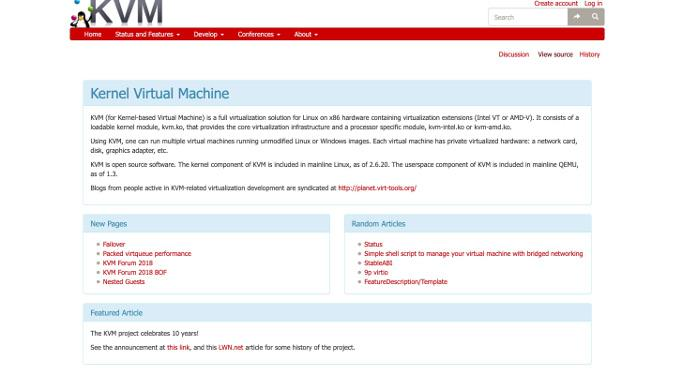

# Guide d'installation de la machine virtuelle openKylin-x86 avec virt-manager

## Contexte
Ce guide utilise le gestionnaire de machines virtuelles virt-manager sur un serveur Fedora comme exemple pour installer le système openKylin et effectuer les configurations associées.

## Processus d'installation

### 1. Téléchargement de virt-manager
Installez virt-manager sur votre serveur local ou distant configuré :

`dnf install virt-manager libvirt qemu-kvm -y
service libvirtd start`

NB : Les privilèges `sudo` peuvent être nécessaires.
Après l'installation, saisissez `virt-manager` dans le shell pour vérifier si l'installation a réussi.
NB2 : Si configuré sur un serveur, la connexion ssh nécessite le paramètre -X : `ssh -X username@x.x.x.x`. Cette commande nécessite la configuration d'un proxy X11, voir [ce document](../其他/ssh-X11代理配置.md) pour les détails.

### 2. Préparation de l'ISO
Téléchargez l'image ISO depuis le [site officiel](https://www.openkylin.top/downloads/index-cn.html)
Vous pouvez également utiliser la commande wget pour télécharger directement :

`wget https://mirror.lzu.edu.cn/openkylin-cdimage/yangtze/openkylin-0.9.5-x86_64.iso `

### 3. Début de l'installation
Lancez `virt-manager`, sélectionnez Fichier - Nouvelle machine virtuelle

Choisissez "Importer une image disque existante"

Sélectionnez le chemin de stockage de l'ISO et choisissez "Generic OS" comme système d'exploitation

Ensuite, choisissez une mémoire et un nombre de CPU appropriés

Allouez une taille de disque dur appropriée à la machine virtuelle, de préférence supérieure à 20G

Entrez dans ce menu et choisissez d'installer openKylin

Ensuite, choisissez "Chinois simplifié" comme langue et cliquez sur Suivant

Choisissez "Shanghai" comme fuseau horaire et cliquez sur Suivant

Après avoir configuré les informations utilisateur, cliquez sur Suivant

Choisissez l'installation sur tout le disque et cliquez sur l'emplacement du disque

Formatez tout le disque, cliquez sur Démarrer l'installation. Après le redémarrage, l'installation est terminée.

## Connaissances étendues — Logiciels de gestion de machines virtuelles largement utilisés sous Linux

#### KVM
KVM est une solution de virtualisation complète pour Linux sur un matériel contenant des extensions de virtualisation. KVM fournit une virtualisation matérielle pour une variété de systèmes d'exploitation, y compris Linux, Windows, macOS, ReactOS et Haiku. Avec KVM, vous pouvez exécuter plusieurs machines virtuelles sur des images Linux ou Windows non modifiées. Chaque machine virtuelle a son propre matériel virtuel : carte réseau, disque dur, carte graphique, etc.

#### QEMU
QEMU est un émulateur de machine générique et open source. Lorsqu'il est utilisé comme émulateur, QEMU peut exécuter des systèmes d'exploitation et des programmes sur une autre machine (comme votre propre PC x86_64). Lorsqu'il est utilisé comme virtualiseur, QEMU atteint des performances presque natives en exécutant directement le code invité sur le CPU hôte en utilisant KVM.

#### Libvirt
Libvirt est une bibliothèque et un démon qui fournissent une API open source stable pour la gestion des hôtes virtualisés. Il cible plusieurs hyperviseurs, y compris QEMU, KVM, LXC, Xen, OpenVZ, VMWare ESX, VirtualBox, etc.

#### Virt-manager
Virt-manager est une interface utilisateur de bureau pour gérer les machines virtuelles via libvirt. Il cible principalement les machines virtuelles KVM, mais gère également Xen et LXC. Il comprend également l'outil de configuration en ligne de commande virt-install. En fait, virt-manager est un outil de gestion facile à utiliser dédié aux machines virtuelles. Par exemple, vous pouvez utiliser virt-manager pour exécuter un environnement Windows sous Linux, et vice versa.
