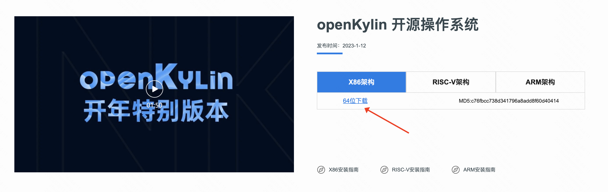
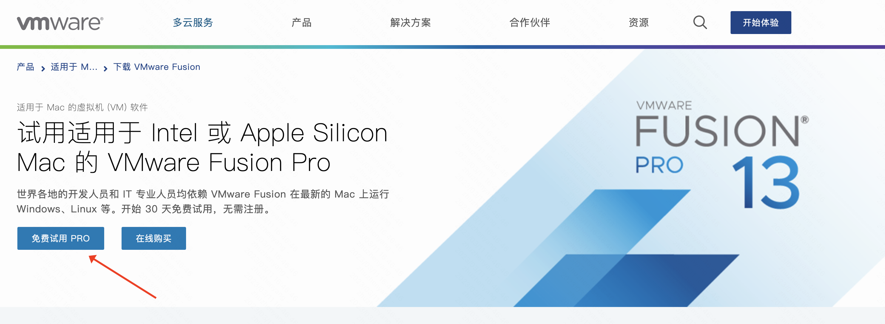

# Guide d'installation (Pour MacOS)

Ce guide s'applique aux ordinateurs portables Mac équipés de puces Intel et Apple Silicon. Il détaille le processus d'installation du système d'exploitation open source openKylin via une machine virtuelle sous macOS. (Pour les guides d'installation Windows et Linux, veuillez consulter [Guide d'installation du système openKylin](./openKylin系统安装指南.md))

# Preparation

La première étape pour installer et utiliser le système d'exploitation open source openKylin est d'obtenir le fichier image d'openKylin. Nous pouvons le télécharger directement depuis le site officiel d'openKylin.
Lien de téléchargement : https://www.openKylin.top/downloads Choisissez la version appropriée (en prenant l'exemple de l'architecture x86 64 bits)

# I. Installation de VMware Fusion

VMware Fusion offre le meilleur moyen d'exécuter Windows, Linux et d'autres systèmes d'exploitation sur un Mac Apple sans avoir à redémarrer.
Fusion 13 prend en charge les Mac Intel et Apple Silicon fonctionnant sous macOS 12 et versions ultérieures, offrant des fonctionnalités pour les développeurs, les administrateurs IT et les utilisateurs quotidiens.
Utilisez le lien suivant pour commencer à utiliser gratuitement une version d'essai complète de 30 jours (sans inscription nécessaire)
Lien de téléchargement : https://www.vmware.com/cn/products/fusion/fusion-evaluation.html

# II. Installation du système d'exploitation open source openKylin

Ouvrez le logiciel de machine virtuelle VMware Fusion, cliquez sur Nouveau dans le menu Fichier ;

Faites glisser le fichier ISO téléchargé lors du travail préparatoire dans la fenêtre pour créer une machine virtuelle ;

Après être entré dans l'interface de démarrage de la machine virtuelle, suivez les options par défaut et cliquez sur Continuer ;
Sélectionnez "Installer le système d'exploitation plus tard" et cliquez sur Suivant ;
Pour le système d'exploitation invité, choisissez "Linux", et pour la version, sélectionnez Ubuntu 64 bits, puis cliquez sur Suivant ;
Entrez le nom de la machine virtuelle et choisissez le chemin d'installation, puis cliquez sur Suivant ;
Ensuite, vous pouvez configurer la mémoire, le processeur, etc. dans l'interface de configuration du matériel. Une fois la configuration terminée, cliquez sur le bouton Fermer en bas à droite pour revenir à l'assistant de création de nouvelle machine virtuelle, puis cliquez sur Terminer. Vous serez alors automatiquement redirigé vers l'interface de démarrage de la machine virtuelle. Cliquez sur "Démarrer cette machine virtuelle" pour commencer l'installation du système.

Choisissez "Chinois simplifié" comme langue et cliquez sur Suivant ;
Sélectionnez "Shanghai" comme fuseau horaire et cliquez sur Suivant ;
Après avoir configuré les informations utilisateur, cliquez sur Suivant ;
Attendez que l'installation soit terminée, cliquez sur le bouton "Redémarrer maintenant", et vous pourrez alors utiliser le système d'exploitation open source openKylin sur votre machine virtuelle.