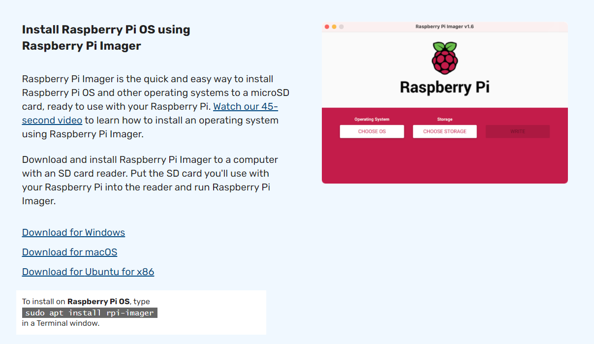
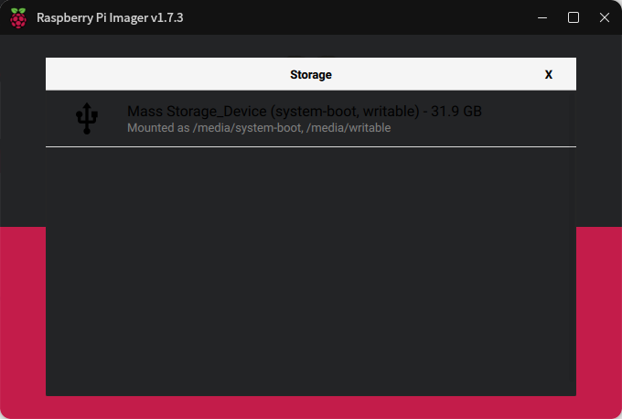
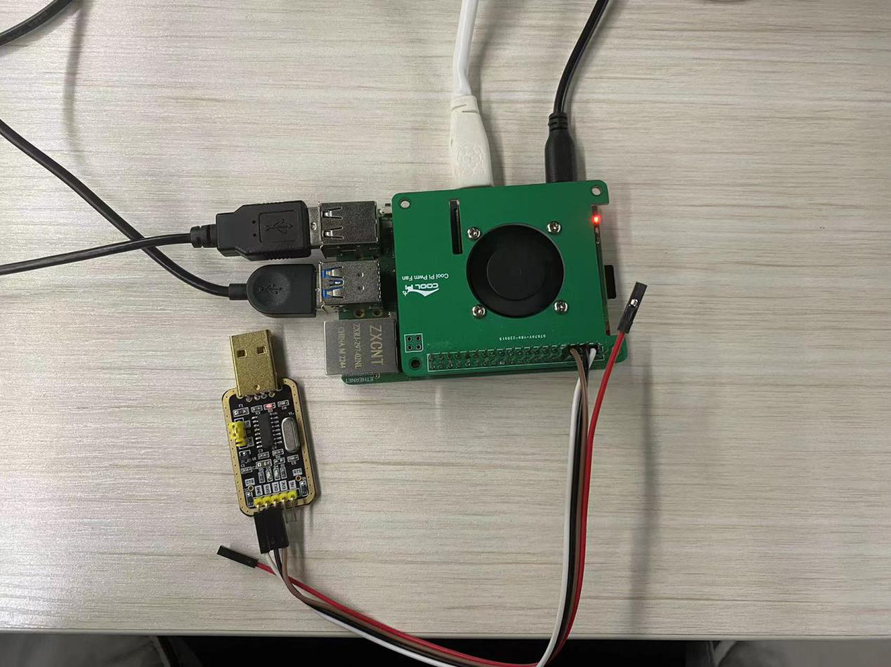
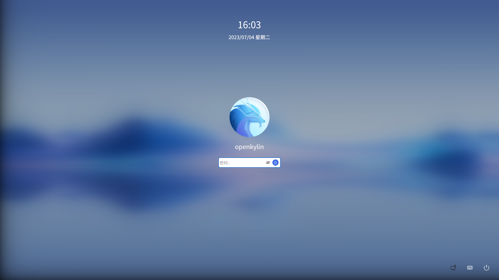
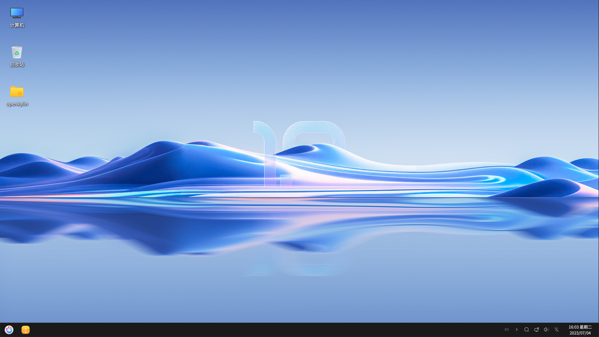
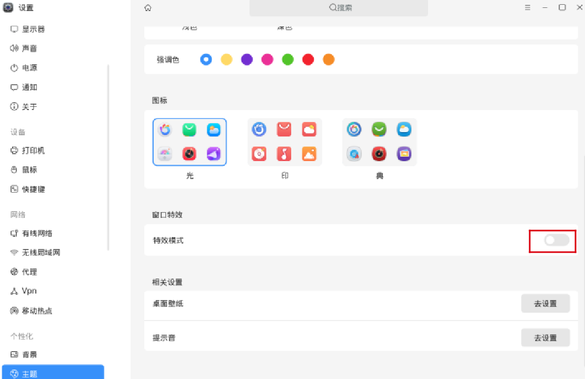
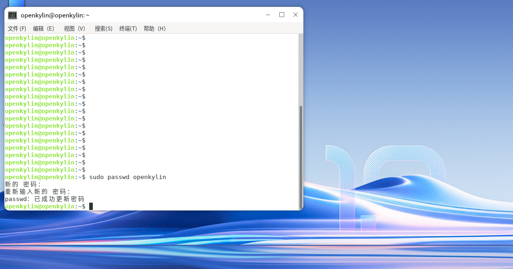

# Guide Installation pour CoolPi

## I. Téléchargement de l'image

Téléchargez via le lien suivant :
https://www.openkylin.top/downloads
Après le téléchargement, faites un clic droit pour décompresser et obtenir le fichier .img. Les fichiers image avec l'extension .xz peuvent être utilisés directement sans décompression.

## II. Gravure de l'image

Installation du programme de gravure : https://www.raspberrypi.com/software/

Insérez la carte SD, ouvrez rpi-imager, sélectionnez une image personnalisée, puis choisissez le fichier image .img installé

Sélectionnez la carte SD, cliquez sur WRITE, et attendez que la création soit terminée

## III. Démarrage d'openKylin sur Coolpi

Connectez le câble d'alimentation et le câble d'affichage de la carte de développement Coolpi, branchez le clavier et la souris, et insérez la carte SD

Au démarrage de Coolpi, il peut y avoir un écran noir continu ou un démarrage soudain d'un système d'exploitation Kylin problématique (ceci est dû à une erreur de chargement de la carte SD par la carte Coolpi). Il suffit de débrancher et rebrancher le câble d'alimentation pour redémarrer.

Arrivé à l'interface de connexion, cliquez sur connexion pour accéder au bureau

## IV. Autres considérations

### 1. Système lent
Ce problème est causé par une utilisation élevée du CPU par le gestionnaire de fenêtres. Après être entré sur le bureau, allez dans le panneau de contrôle pour désactiver le mode effets spéciaux, ce qui peut efficacement atténuer les ralentissements

### 2. Modification du mot de passe
Comme le système n'a pas d'installation guidée, le système fraîchement installé n'a pas de mot de passe défini. L'utilisateur doit configurer manuellement un mot de passe après l'installation pour pouvoir l'utiliser lorsque le système demande un mot de passe
