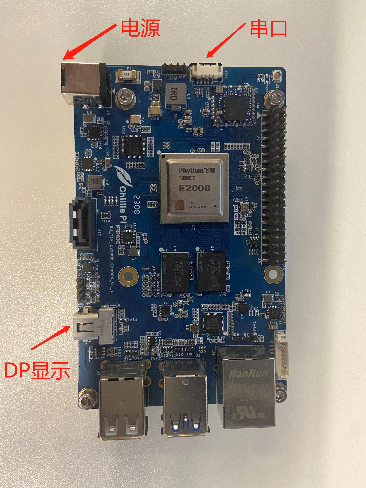
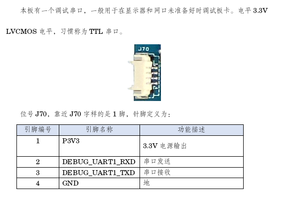
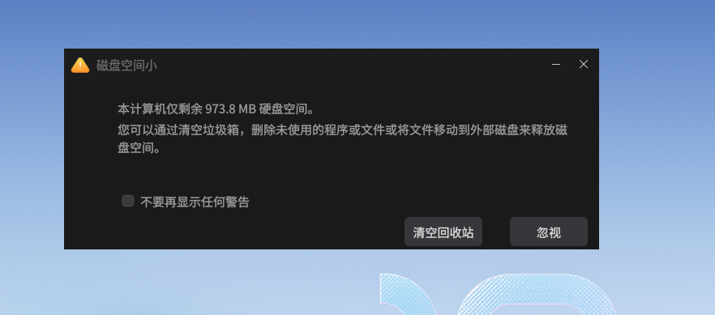
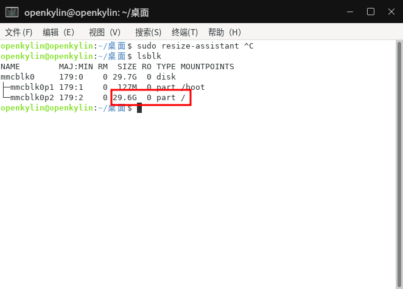
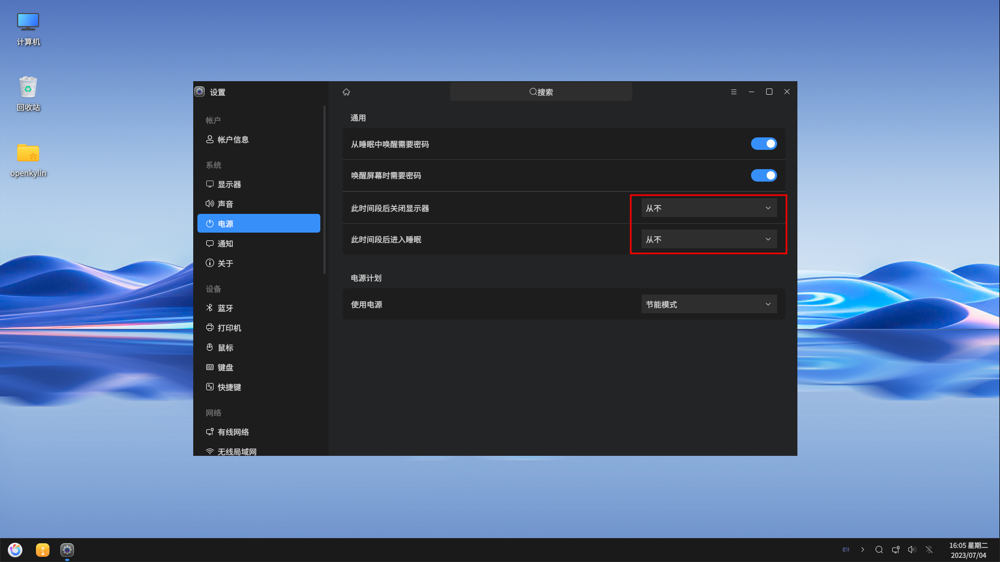

# Guide Installation Pour ChilliePi :


## I. Téléchargement de l'image

Téléchargez via le lien suivant :
https://www.openkylin.top/downloads
Vous obtiendrez le fichier openKylin-1.0-chilliepi-arm64.img.xz

## II. Informations sur la carte

### 1. Informations sur les interfaces


### 2. Informations sur le port série


## III. Gravure de l'image

Note : <font color='red'>**Il est recommandé d'utiliser une carte SD Kingston sur le Chilliepi**</font>

### Méthode 1 : Utilisation de la commande dd
- Graver l'image
```
 xz -k -d -v openKylin-1.0-chilliepi-arm64.img.xz
 sudo dd if=openKylin-1.0-chilliepi-arm64.img of=/dev/<your sdcard> status=progress
```

### Méthode 2 : Utilisation de l'outil rpi-imager
Installation du programme de gravure : https://www.raspberrypi.com/software/


Insérez la carte SD, ouvrez rpi-imager, sélectionnez une image personnalisée, puis choisissez le fichier image


Sélectionnez la carte SD, cliquez sur WRITE, et attendez que la création soit terminée


## IV. Démarrage d'openkylin sur chilliepi

- Connectez le clavier et la souris ; insérez la carte SD ; connectez la carte de développement chilliepi à un moniteur via un câble DP. Il est recommandé de se connecter directement à un moniteur prenant en charge l'interface DP via un câble. L'utilisation d'un convertisseur peut entraîner des problèmes d'incompatibilité et d'absence d'affichage.


- Connectez la carte de développement via le port série, branchez l'alimentation, appuyez rapidement sur n'importe quelle touche pour entrer dans l'interface de ligne de commande u-boot
- Configurez les paramètres de démarrage U-boot
```sh
setenv bootargs console=ttyAMA1,115200 audit=0 earlycon=pl011,0x2800d000 root=/dev/mmcblk1p2 rootdelay=3 rw;
setenv bootcmd 'mmc dev 1;fatload mmc 1:1 0x90000000 e2000d-chilli.dtb;fatload mmc 1:1 0x90100000 Image;booti 0x90100000 - 0x90000000;'
saveenv
```
- Débranchez l'alimentation, retirez la carte SD ; insérez la carte SD, puis rebranchez l'alimentation pour démarrer le système. Le nom d'utilisateur/mot de passe par défaut est
```
 > username：openkylin
 > password：openkylin
```


## V. Autres considérations

### 1. Taille du disque
Lors de la création de l'image, la taille par défaut de la partition racine est basée sur la taille du système de fichiers avec un espace supplémentaire. Si vous rencontrez un manque d'espace disque


Vous pouvez utiliser la commande suivante pour ajuster la taille de la partition racine. Ouvrez un terminal et exécutez la commande suivante pour étendre la partition racine au maximum
```sh
sudo resize-assistant
```


### 2. Écran noir après la mise en veille ou l'extinction de l'écran
Il est recommandé aux utilisateurs de régler dans le panneau de contrôle de l'alimentation pour ne jamais éteindre l'écran ni mettre en veille, afin d'éviter ce problème



