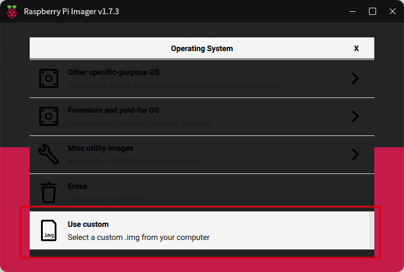

# Guide Installation pour PhytiumPI :
## I. Téléchargement de l'image

Téléchargez via les liens suivants :
- Version 4G : https://www.openkylin.top/downloads/download-smp.php?id=39
- Version 2G : https://www.openkylin.top/downloads/download-smp.php?id=40

Téléchargez la version correspondant à vos besoins. L'exemple ci-dessous utilise la version 2G, qui donne le fichier openKylin-1.0.1-phytiumpi-2G-arm64.img.xz

## II. Gravure de l'image

### Méthode 1 : Utilisation de la commande dd
- Graver l'image
```
 xz -k -d -v openKylin-1.0.1-phytiumpi-2G-arm64.img.xz
 sudo dd if=openKylin-1.0.1-phytiumpi-2G-arm64.img of=/dev/<your sdcard> status=progress
```

### Méthode 2 : Utilisation de l'outil rpi-imager
Installation du programme de gravure : https://www.raspberrypi.com/software/


Insérez la carte SD, ouvrez rpi-imager, sélectionnez une image personnalisée, puis choisissez le fichier image


Sélectionnez la carte SD, cliquez sur WRITE, et attendez que la création soit terminée


## III. Démarrage du système

- Insérez la carte SD, branchez l'alimentation, démarrez le système. Le nom d'utilisateur/mot de passe par défaut est :
``` 
username : openkylin
password : openkylin
```