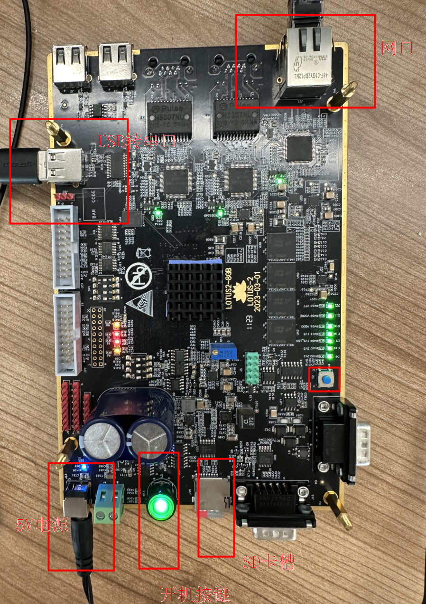

# Guide Installation pour Lotus2 :


## Téléchargement de l'image

L'image openKylin adaptée au Lotus2 peut être téléchargée via le lien suivant :
> https://www.openkylin.top/downloads

Téléchargez le fichier openKylin-1.0-embedded-lotus2-riscv64.tar.gz sur votre machine locale.

## Création d'un disque de démarrage SD

Tout d'abord, formatez la partition de la carte SD, puis décompressez le système de fichiers sur la carte SD.

Prenons l'exemple où le nœud de périphérique de la carte SD est /dev/sdb :

```sh
# Partitionnement et formatage
sudo parted -s /dev/sdb mktable gpt
sudo parted -s /dev/sdb mkpart primary 1 100%
sudo mkfs.ext4 -L system /dev/sdb1
sudo mount /dev/sdb1 /mnt

# Copie du système de fichiers
sudo tar xf openKylin-1.0-embedded-lotus2-riscv64.tar.gz -C /mnt
sync
sudo umount /mnt

# Éjection de la carte SD
sudo eject /dev/sdb
```

## Démarrage du système

Le Lotus2 n'a pas d'interface d'affichage graphique, il est donc nécessaire de se connecter via le port série pour l'opérer. Comme illustré dans l'image ci-dessous, utilisez un câble USB à double tête mâle pour connecter le convertisseur USB-série à l'ordinateur.



Branchez l'alimentation. Après la mise sous tension, l'ordinateur devrait reconnaître le port série, à travers lequel vous pourrez vous connecter au système. Le nom d'utilisateur et le mot de passe par défaut sont :

```
> username : openkylin
> password : openkylin
```
