# Introduction à OpenKylin

La communauté openKylin (Kylin ouvert) est une communauté open source fondée conjointement par des entreprises de matériel et logiciel de base, des organisations à but non lucratif, des associations, des établissements d'enseignement supérieur, des instituts de recherche et des développeurs individuels. Elle vise à créer un écosystème de partenariat avec les entreprises à travers des méthodes open source et ouvertes, sur la base de l'open source, du volontariat, de l'égalité et de la collaboration. L'objectif est de construire ensemble une communauté de premier plan pour les systèmes d'exploitation de bureau et de promouvoir le développement prospère de la technologie open source Linux et de son écosystème matériel et logiciel.

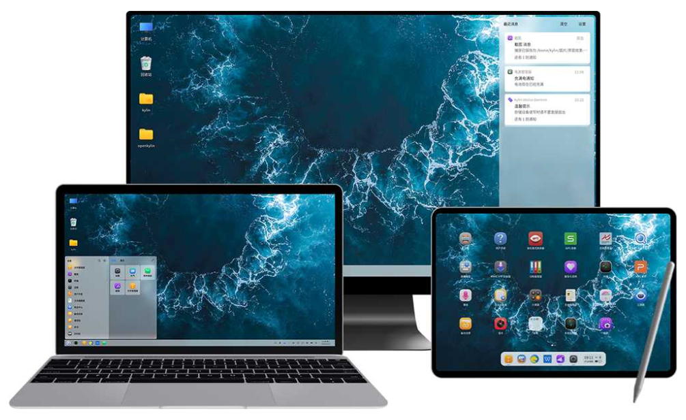

# Adresse de téléchargement de l'image

[https://www.openkylin.top/downloads](https://www.openkylin.top/downloads)

Nous choisissons la version appropriée à télécharger en fonction des spécifications CPU de notre appareil. Pour les PC ou ordinateurs portables courants, veuillez choisir l'image pour la plateforme x86.

# Création d'un lecteur d'installation USB bootable

Sous Windows, nous pouvons généralement utiliser des logiciels tels que Rufus, UltraISO, balenaEtcher, unetbootin pour créer un lecteur d'installation bootable.

**Exemple avec Rufus :**
- Création d'un lecteur d'installation bootable avec rufus
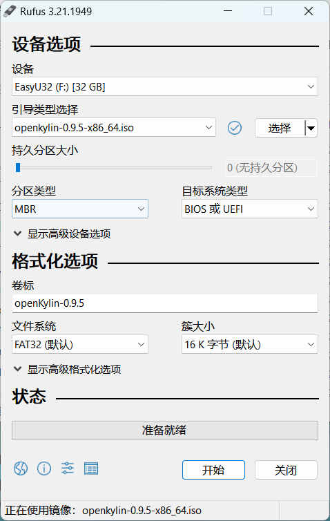

Sous Linux, nous recommandons d'utiliser des logiciels tels que balenaEtcher, unetbootin, Deepin Boot Maker pour graver l'image téléchargée sur une clé USB.

# Installation du système

Comme le système OpenKylin prend en charge le mode tablette, il offrira une meilleure expérience sur un ordinateur portable doté d'une fonction tactile.

L'appareil utilisé dans cet article est un `ThinkPad x380 Yoga`, un ordinateur portable professionnel très portable. Bien que le modèle soit un peu ancien, ses performances sont suffisantes pour faire fonctionner le système OpenKylin.

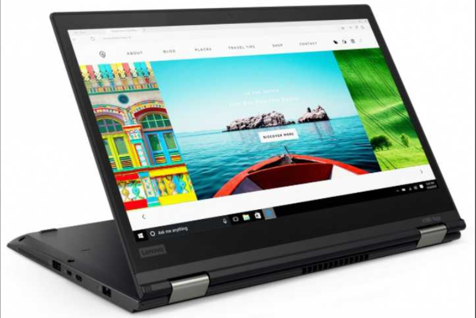

### 1. Insérer le lecteur d'installation bootable
Insérez le lecteur d'installation du système bootable que vous avez créé dans le port USB
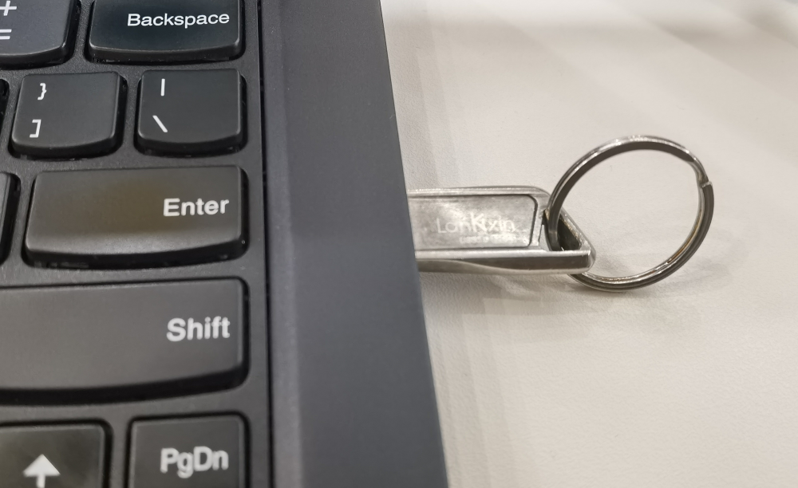

### 2. Démarrage à partir de l'USB
[Lenovo] Appuyez sur `F12` au démarrage pour entrer dans l'interface de sélection du périphérique de démarrage, choisissez de démarrer à partir du périphérique USB
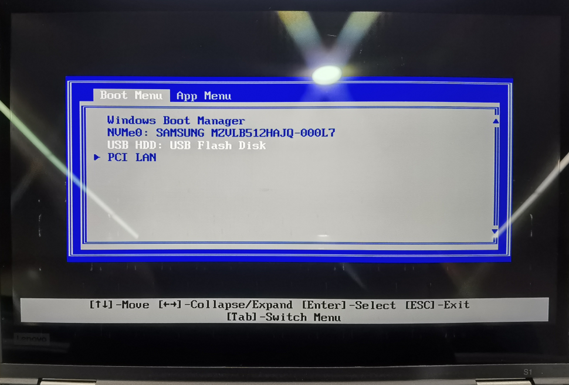
> Pour les appareils d'autres marques et modèles, vous pouvez essayer d'accéder à l'option de démarrage USB en appuyant sur F9, F2 ou la touche Del.

### 3. Interface d'installation
Après être entré dans l'interface d'installation, nous pouvons utiliser les touches haut et bas du clavier pour sélectionner l'option de démarrage. Si aucune action n'est effectuée, le système entrera automatiquement en mode d'essai après quelques secondes. Bien sûr, nous pouvons également installer le système en mode d'essai.
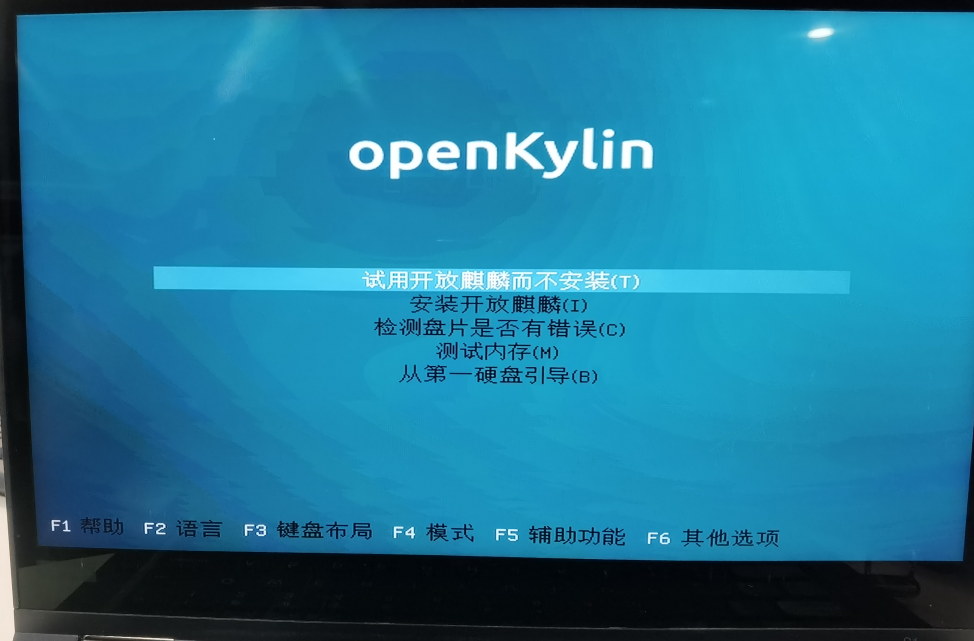

### 4. Commencer l'installation
Exécutez l'icône `Installer OpenKylin` sur le bureau pour commencer l'installation du système.
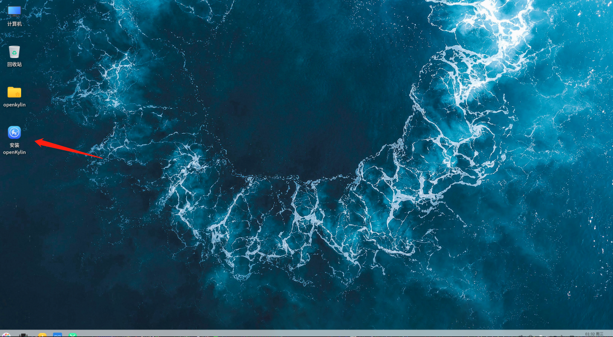

- **Choisir la langue**
Après être entré dans l'interface d'installation, la première étape est de choisir la langue. La langue par défaut est le `chinois simplifié`. Les utilisateurs novices n'ont pas besoin de faire de modifications, ils peuvent passer directement à l'étape suivante.

- **Choisir le fuseau horaire**
Cliquez sur l'emplacement correspondant sur la carte du monde pour déterminer le fuseau horaire actuel, puis passez à l'étape suivante. Généralement, on clique sur la région Asie/Shanghai.

- **Créer un utilisateur**
Dans cette interface, créez un nom d'utilisateur, un nom d'ordinateur et un mot de passe de connexion. Le mot de passe doit être vérifié deux fois avant de pouvoir passer à l'étape suivante.
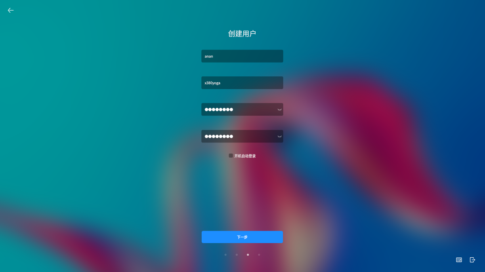

- **Choisir la méthode d'installation**
Cochez directement le disque bloc par défaut pour commencer l'installation.

- **Confirmer l'installation**
À cette étape, confirmez la situation de partitionnement du disque. Si vous souhaitez personnaliser les partitions, vous pouvez revenir en arrière pour effectuer un partitionnement manuel.
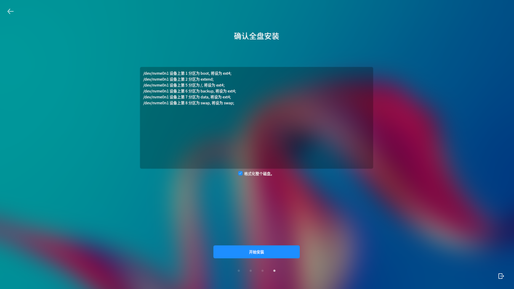

- **Terminer l'installation**
Une fois l'installation terminée, suivez les instructions pour retirer la clé USB d'installation, puis appuyez sur `Enter` pour redémarrer le système.

# Commencer à utiliser

Après le redémarrage du système, nous pouvons nous connecter au système et commencer à l'utiliser. Au premier démarrage d'OpenKylin, l'interface utilisateur est presque identique à celle de Windows, et certains raccourcis clavier couramment utilisés sont également compatibles.
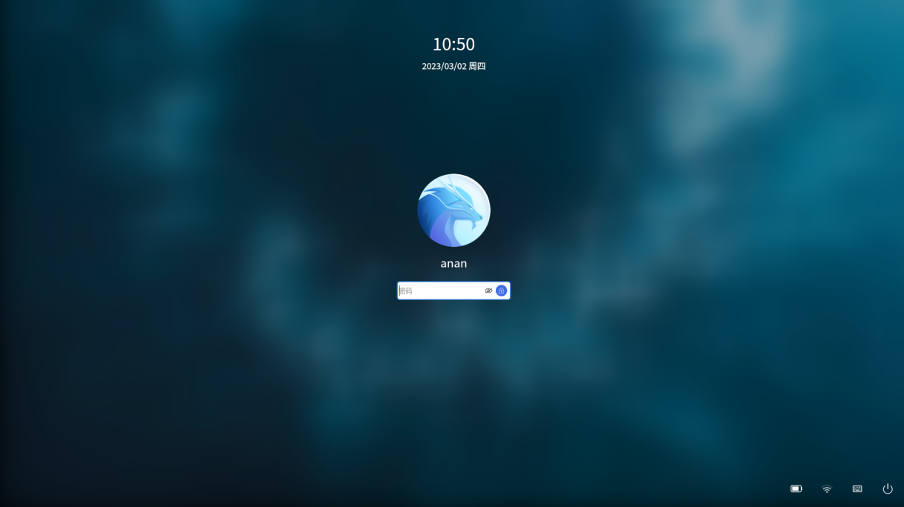

### Basculement entre les modes PC/tablette
Le système openKylin prend en charge la commutation entre deux modes d'interface système

- **Mode PC**
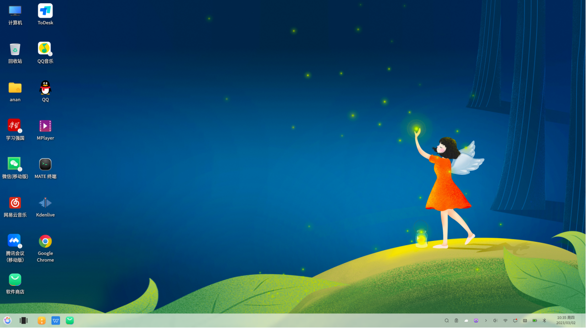
Cliquez sur l'icône de bulle dans la barre de navigation pour passer en mode tablette

- **Mode tablette**
Cette machine passe automatiquement en mode tablette lorsque le clavier est replié derrière l'écran, ce qui est très pratique.

Cliquez sur l'icône de fonction à droite de la barre de navigation pour revenir au mode PC

### Installation d'applications
Ouvrez l'App Store pour installer des logiciels. Actuellement, le dépôt de logiciels n'est pas complet, nous attendons avec impatience que davantage de logiciels soient adaptés. Le système openKylin prend également en charge les applications mobiles, résolvant ainsi le problème du manque de logiciels sur les systèmes Linux.
