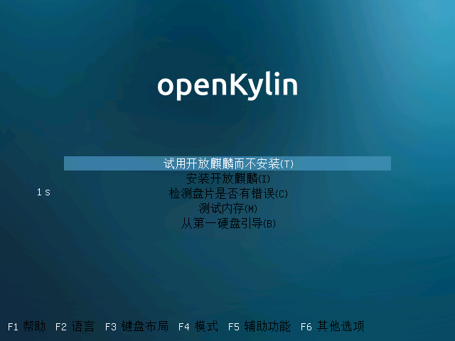
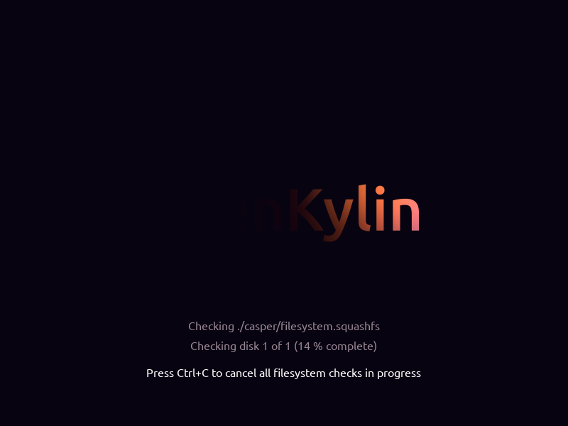
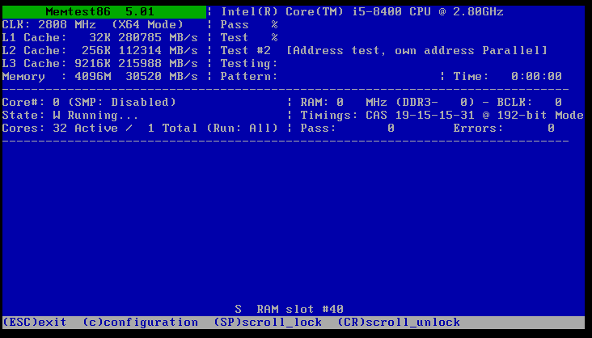

# Note Breve concernant l'installation de OpenKylin
#### Auteur : Shi Wanwu
#### Traduction : Zeima
#### 2022-11-21 22:38:16

#### openKylin-0.7.5-x86_64
&emsp;

Écran d'accueil et de sélection



Vérification des erreurs sur le disque


Test de la mémoire


Si vous utilisez VMware, définissez la taille par défaut du disque alloué à la machine virtuelle à 50 Go

Installation complète et installation personnalisée


Notez les systèmes de fichiers de chaque partition, il y a des points de connaissance ici, les étudiants intéressés peuvent étudier en détail


Points de montage
``` c
/
/boot
/data
/backup
/home
/tmp
```
&emsp;