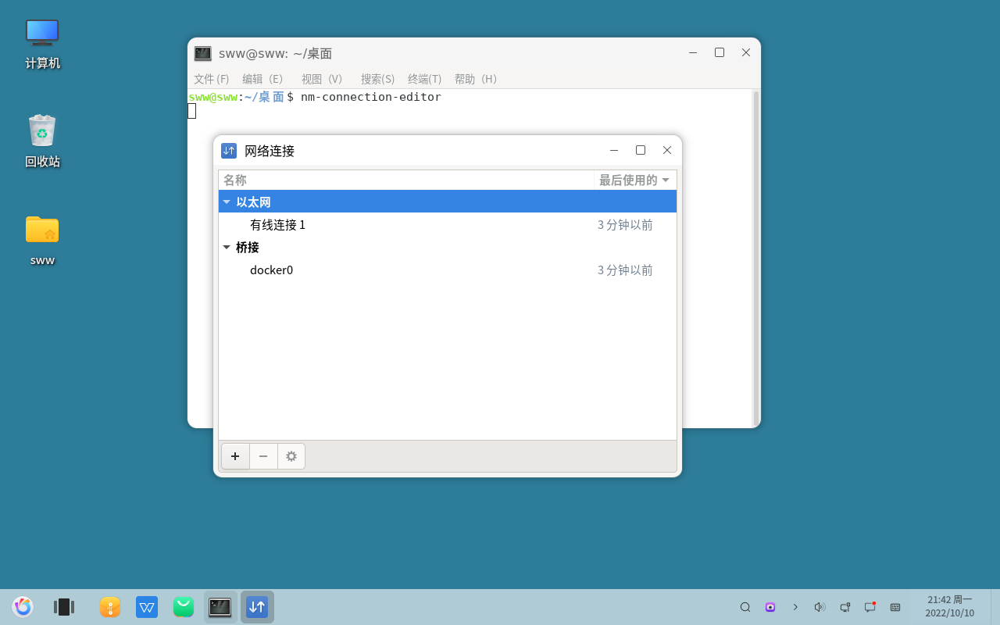

# nm-connection-editor : Ouvrir l'outil de configuration des connexions réseau
#### Auteur : Shi Wanwu
#### 21-11-2022 22:38:16
#### openKylin-0.7.5-x86_64

&emsp;

```bash
nm-connection-editor
```



Dans cette interface, vous pouvez configurer des connexions réseau spécifiques.

&emsp;