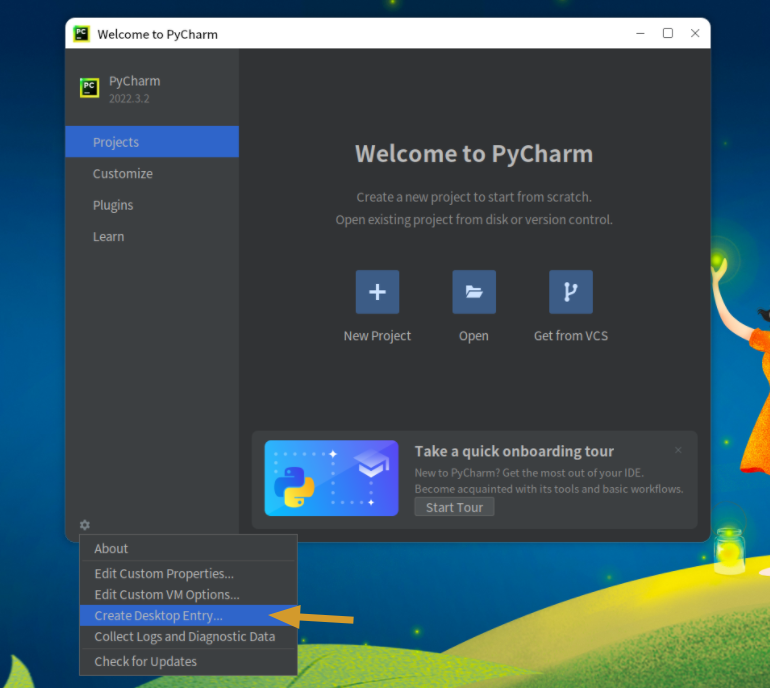

**Auteur : Anan**
**Date de publication : 13 mars 2023**

Comme OpenKylin est encore en phase de test, la boutique d'applications n'est pas complète, donc l'installation de nombreux logiciels est très compliquée. Voici une liste de méthodes d'installation pour certains logiciels courants.

Les utilisateurs intéressés peuvent copier directement les commandes pour installer. L'installation des logiciels nécessite des privilèges root, donc il faut ajouter la commande `sudo` avant chaque commande. La liste des logiciels sera mise à jour progressivement.

Nous pouvons utiliser la combinaison de touches <kbd>Ctrl</kbd> + <kbd>Alt</kbd> + <kbd>T</kbd> pour lancer le terminal.

# I. Installation via les sources Apt

### Navigateur 360
```
sudo apt install browser360-cn-stable
```

### Navigateur Google Chrome
```
sudo apt install google-chrome-stable
```

# II. Installation de paquets DEB

- Accéder au répertoire de téléchargement
```
cd ~/Download
```

### WeChat
```
wget http://archive.ubuntukylin.com/software/pool/partner/weixin_2.1.1_amd64.deb
sudo dpkg -i weixin*.deb
```

### Tencent Meeting
```
wget https://updatecdn.meeting.qq.com/cos/e078bf97365540d9f0ff063f93372a9c/TencentMeeting_0300000000_3.12.0.400_x86_64_default.publish.deb
sudo dpkg -i TencentMeeting*.deb
```

### Tencent Docs
Allez sur la page de téléchargement officielle [https://docs.qq.com/](https://docs.qq.com/) pour télécharger le fichier deb X64
```
cd ~/Download
sudo dpkg -i LinuxTencentDocsAmd64.deb
```

### Logiciel de contrôle à distance ToDesk
```
wget https://newdl.todesk.com/linux/todesk-v4.3.1.0-amd64.deb
sudo dpkg -i todesk*.deb
```

### Client VPN EasyConnect
```
wget http://download.sangfor.com.cn/download/product/sslvpn/pkg/linux_01/EasyConnect_x64.deb
sudo dpkg -i EasyConnect*.deb
```

### Notepad--
```
wget https://gitee.com/cxasm/notepad--/releases/download/v2.0/com.hmja.notepad_2.0.0_amd64.deb
sudo dpkg -i com.hmja.notepad_2.0.0_amd64.deb
```

# III. Autres installations ou compilation

### Pycharm
```
wget https://download.jetbrains.com.cn/python/pycharm-community-2022.3.2.tar.gz
sudo tar xzvf pycharm-*.tar.gz -C /opt/
cd /opt/pycharm-community-2022.3.2/bin
sudo sh pycharm.sh
```

- Créer un raccourci
Dans la page d'accueil de Pycharm, cliquez sur Configure -> Create Desktop Entry
Cliquez sur le menu principal du système, recherchez l'application Pycharm -> clic droit sur l'application -> Ajouter un raccourci sur le bureau

