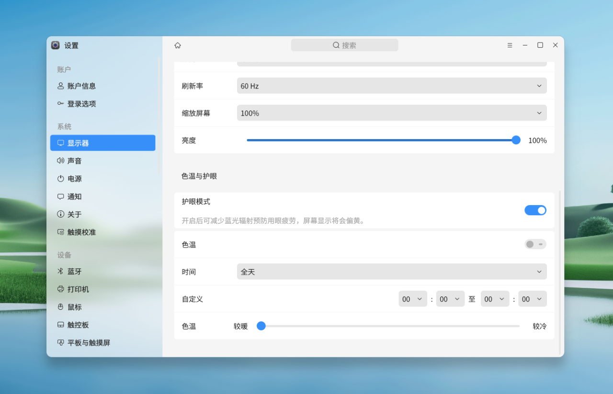

# Introduction aux fonctions et principes de mise en œuvre du mode de protection des yeux d'openKylin

## 1- Contexte

Des études scientifiques ont révélé que pendant la journée, la lumière bleue améliore notre concentration, notre réactivité et notre humeur, et qu'elle joue un rôle important dans les schémas de sommeil naturels. Cependant, la nuit, l'énergie élevée de la lumière bleue a une forte capacité de pénétration et peut toucher directement la rétine. En cas d'exposition prolongée à une lumière bleue de forte intensité, les cellules rétiniennes risquent d'être endommagées et, dans le même temps, de perturber l'horloge biologique interne du corps, entraînant une baisse de la qualité du sommeil. Le système d'exploitation openKylin offre aux utilisateurs un mode de protection des yeux, qui vise à réduire les dommages potentiels pour la vue des utilisateurs en ajustant la température de couleur et la luminosité de l'écran. En même temps, il permet aux utilisateurs d'ajuster l'affichage de l'écran en fonction de leurs préférences personnelles et des besoins de l'environnement, en protégeant efficacement la lumière bleue à haute énergie, réduisant ainsi la fatigue visuelle et améliorant le confort des yeux.

## 2- Comment activer et régler le mode de protection des yeux

**2.1 Réglage de la température de couleur**

Il existe de nombreuses façons d'ouvrir le panneau de configuration, par exemple en appuyant sur Win+i, en faisant un clic droit sur le bureau et en sélectionnant « Paramètres d'affichage ». Dans l'écran Paramètres d'affichage du panneau de configuration, vous trouverez l'option Mode de protection des yeux. **Le mode de protection des yeux réduit le rayonnement de la lumière bleue de l'écran afin de réduire l'irritation des yeux. **

** Le mode de protection des yeux est plus intelligent et plus intime que le simple allumage de la température de couleur et l'utilisation d'une valeur brute de température de couleur tout au long de la journée. **

Dans le mode Protection des yeux d'Openkylin 2.0, nous avons introduit le concept de plages horaires basées sur les habitudes humaines et fourni différentes températures de couleur pour chaque plage horaire afin d'obtenir une légère réduction de la lumière bleue, une réduction moyenne de la lumière bleue et une forte réduction de la lumière bleue.

Les trois plages horaires sont les suivantes

Journée : après le lever du soleil ~ avant le coucher du soleil

Soirée : après le coucher du soleil jusqu'à 13 heures

Fin de soirée : de 13 heures à 15 heures

Aube : après 3 heures avant le lever du soleil

Les valeurs de température de couleur correspondantes pour chaque période sont les suivantes

Journée : 4500k

Soirée : 3500k

Fin de nuit : 2800k

Aube : 3500k

Lorsque l'utilisateur utilise l'ordinateur, le système ajuste activement le contenu de l'écran, ce qui ne correspond pas aux habitudes d'utilisation de l'utilisateur, ce qui est très gênant, afin d'obtenir l'effet « silencieux, à l'insu de l'utilisateur, de sorte que l'utilisateur ne se sente pas ». Afin d'obtenir un effet « silencieux, imperceptible, non convivial », nous suivons la pratique courante de la communauté Linux et utilisons une heure pour dépasser la température de couleur d'un soixantième de degré par minute. Par exemple :

Journée : une heure avant le coucher du soleil pour passer à la température de couleur du soir.

Soirée d'accompagnement : le gradient de température de couleur vers la fin de la nuit commence à 12 heures.

Fin de nuit : gradient de température de 2 heures vers l'aube.

Aube : une heure avant le lever du soleil, passage à la température de couleur de la journée.

Bien entendu, les données que nous fournissons ne représentent que les conclusions de nos recherches et analyses. La valeur des trois niveaux n'est pas une valeur morte, elle est stockée dans Gsettings et peut être personnalisée par l'utilisateur. Nous pouvons définir notre propre jour et notre propre nuit en suivant les méthodes suivantes, afin que « le jour comprenne aussi l'obscurité de la nuit ».

Requête :

Réglage :

Bien entendu, si le réglage est erroné et que vous souhaitez le rétablir, vous pouvez utiliser la commande suivante pour rétablir la valeur prédéfinie.

**2.2 Principe de mise en œuvre**

La solution actuelle adoptée par le système openkylin consiste à ajuster la température de couleur en ajustant la courbe gamma du moniteur. Selon le tableau de comparaison des températures de couleur et des RVB de redshift, la température de couleur est divisée en une échelle de 100K, et chaque échelle correspond à un ensemble de valeurs RVB. Un exemple :

{

 { 1.**0000**, 0.**0425**, 0.**0000** }, /\* 1000K \*/

 { 1.**0000**, 0.**066**8, 0.**0000** }, /\* 1100K \*/

 { 1.**0000**, 0.0911, 0.**0000** }, /\* 1200K \*/

 { 1.**0000**, 0.1149, 0.**0000** }, /\* ... \*/

 /\* ... \*/

 { 1.**0000**, 0.2630, 0.**0062** },/\* 2000K \*/

 { 1.**0000**, 0.4859, 0.1505 },/\* 3000K \*/

 { 1.**0000**, 0.6727, 0.3739 },/\* 4000K \*/

 { 1.**0000**, 0.8250, 0.6272 },/\* 5000K \*/

 { 1.**0000**, 0.9478, 0.8795 },/\* 6000K \*/

 { 1.**0000**, 1.**0000**, 1.**0000** }, /\* 6500K \*/

 { 0.5944, 0.7414, 1.**0000** } /\* 10000K \*/

};

（https://gitee.com/openkylin/ukui-settings-daemon/blob/upstream/plugins/gamma-manager/rgb-gamma-table.h）

Lorsque vous devez régler la température de couleur, convertissez la température de couleur en un ensemble de rgb, puis réglez la courbe gamma en fonction du rgb. Ce système permet non seulement de régler la température de couleur de l'écran, mais aussi de régler la luminosité du moniteur.

Code de base :

 **for**(**int** k = 0; k < m\_pScreenRes->noutput; k++) {

 RROutput outputId = m\_pScreenRes->outputs[k];

 XRROutputInfo \*outputInfo = XRRGetOutputInfo (QX11Info::display(), m\_pScreenRes, outputId);

 QString outputname = QString::fromLatin1(outputInfo->name);

 **if** (outputInfo->connection != RR\_Connected) {

 XRRFreeOutputInfo(outputInfo);

 **continue**;

 }

 **if** (!outputInfo->crtc) {

 ret = true;

 USD\_LOG(LOG\_ERR,"crtc size is 0.\n");

 **goto** FREEOUTPUT;

 }

 size = XRRGetCrtcGammaSize(QX11Info::display(), outputInfo->crtc);

 **if** (!size) {

 ret = false;

 USD\_LOG(LOG\_ERR,"Gamma size is 0.\n");

 **goto** FREEOUTPUT;

 }

 /\*

 \* The gamma-correction lookup table managed through XRR[GS]etCrtcGamma

 \* is 2^n in size, where 'n' is the number of significant bits in

 \* the X Color. Because an X Color is 16 bits, size cannot be larger

 \* than 2^16.

 \*/

 **if** (size > 65536) {

 ret = false;

 USD\_LOG(LOG\_ERR,"Gamma correction table is impossibly large.\n");

 **goto** FREEOUTPUT;

 }

 pCrtcGamma = XRRAllocGamma(size);

 **if** (!pCrtcGamma) {

 USD\_LOG(LOG\_ERR,"Gamma allocation failed.\n");

 **continue**;

 }

 m\_colorRGB.R == m\_colorRGB.R ? m\_colorRGB.R : **1.0**;

 m\_colorRGB.G == m\_colorRGB.G ? m\_colorRGB.G : **1.0**;

 m\_colorRGB.B == m\_colorRGB.B ? m\_colorRGB.B : **1.0**;

 gammaRed = 1 / m\_colorRGB.R;

 gammaGreen = 1 / m\_colorRGB.G;

 gammaBlue = 1 / m\_colorRGB.B;

 **for** (**int** i = 0; i < size; i++) {\

 uint value = (i \* **0xffff**) / (size - 1);

 pCrtcGamma->red[i] = value \* m\_colorRGB.R \* brightness;

 pCrtcGamma->green[i]= value \* m\_colorRGB.G \* brightness;

 pCrtcGamma->blue[i] = value \* m\_colorRGB.B \* brightness;

 }

 XRRSetCrtcGamma(QX11Info::display(), outputInfo->crtc, pCrtcGamma);

 XSync(QX11Info::display(), NULL);

 XRRFreeGamma(pCrtcGamma);

FREEOUTPUT:

 XRRFreeOutputInfo(outputInfo);

 }

## 3- Resume : 

De nos jours, la vie des gens est remplie de diverses sources de lumière, notamment les ordinateurs, les téléphones portables et les dispositifs d'éclairage. Certaines personnes sont exposées à des sources lumineuses pendant de longues périodes sans que cela n'affecte leur vue, tandis que d'autres sont dans l'impossibilité de le faire. En fait, la température de couleur n'est qu'un des aspects qui déterminent les caractéristiques de la lumière, et le lumen est également un facteur important à prendre en compte. Pour protéger votre vue, outre le choix de la bonne température de couleur et du bon flux lumineux, il est également important de prendre l'habitude de regarder au loin et de détendre vos muscles oculaires.

Le mode « Eye Care » d'openKylin OS est une fonction pratique qui réduit le fardeau que l'utilisation prolongée d'un ordinateur peut représenter pour les yeux en ajustant scientifiquement et raisonnablement les couleurs de l'écran. Dans le même temps, les utilisateurs peuvent également personnaliser les paramètres en fonction de leurs habitudes quotidiennes et de leur expérience visuelle afin de mieux protéger leur vue.