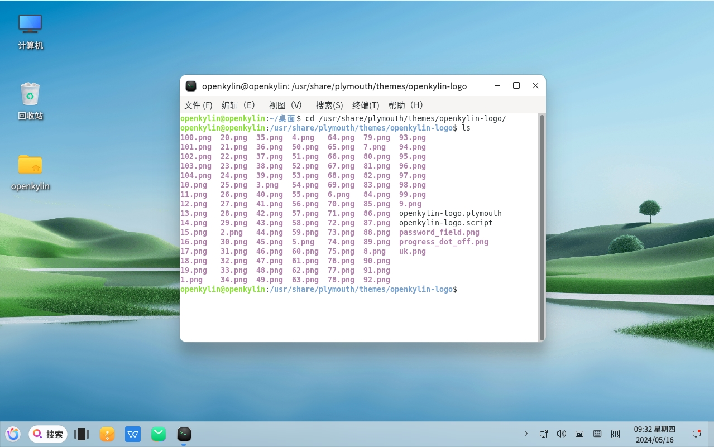
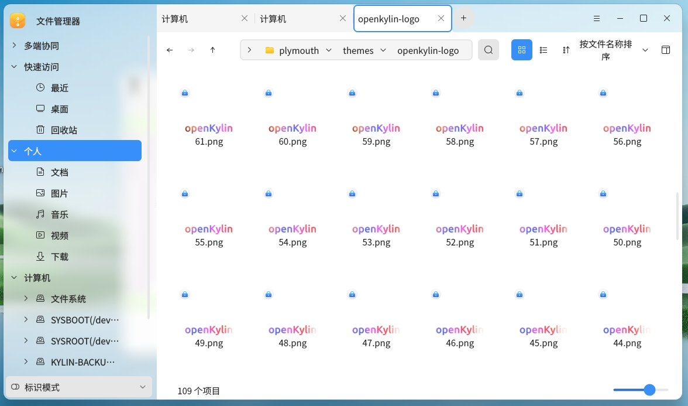
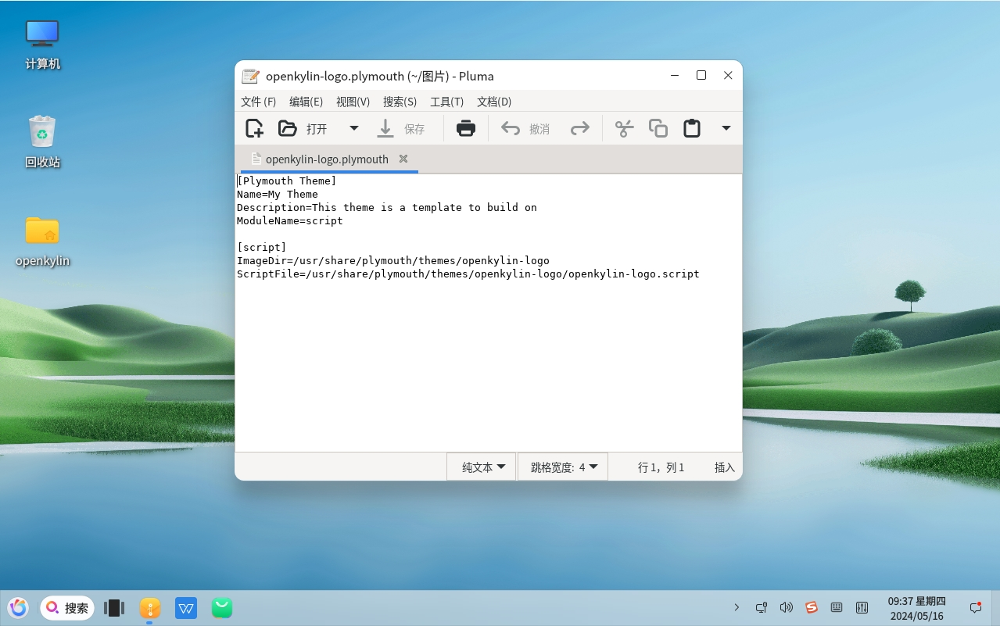
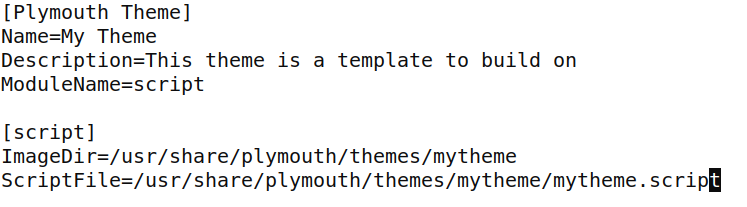
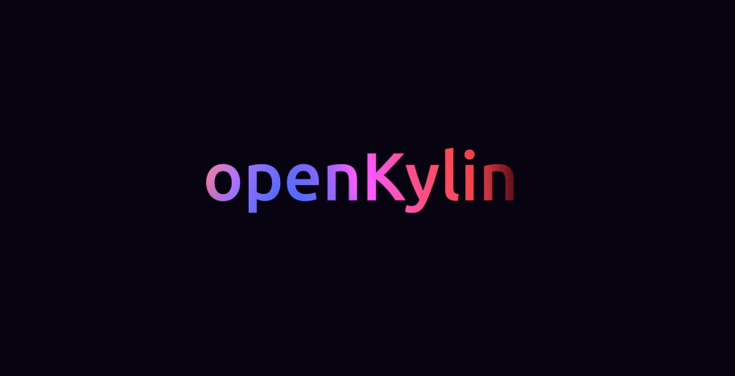

# Comment personnaliser l’animation de démarrage et d’arrêt sur openKylin

L’animation de démarrage et d’arrêt est une partie importante du système openKylin. Sa fonction principale est de masquer les journaux d’impression du noyau au début du démarrage du noyau Linux et d’assurer la fluidité de l’affichage de l’écran lorsque le noyau rafraîchit la résolution de l’écran. openKylin utilise le composant plymouth comme programme d’affichage des animations de démarrage et d’arrêt. Lors du démarrage du système Linux, de nombreuses rafraîchissements d’écran se produisent entre le chargement du noyau et l’entrée dans l’écran de connexion, ce qui affecte l’expérience visuelle. Plymouth, grâce à la “configuration du mode noyau” (Kernel Mode-Setting) dans le noyau, offre une expérience visuelle de démarrage et d’arrêt plus fluide et continue.

## Fonctionnalités de plymouth

Plymouth prend en charge la personnalisation des animations de démarrage et d’arrêt. En ajoutant des images et des scripts personnalisés, les utilisateurs peuvent créer leurs propres animations de démarrage et d’arrêt, offrant une expérience variée. De plus, lorsque des opérations de fond de longue durée sont nécessaires (comme l’installation ou la sauvegarde du système), vous pouvez exécuter manuellement des commandes pour lancer le programme plymouth et afficher une interface d’animation, montrant en temps réel la progression et évitant toute interférence avec les opérations de fond.

## Comment personnaliser votre propre animation de démarrage et d’arrêt

### Emplacement des fichiers liés aux thèmes plymouth

Le répertoire /usr/share/plymouth/themes/ contient les matériaux de chaque paquet de thèmes. Prenons l’exemple du thème openKylin, voici le contenu du répertoire /usr/share/plymouth/themes/openkylin :

Tous les fichiers png sont les images nécessaires pour l’affichage des animations plymouth et les matériaux nécessaires pour afficher d’autres informations :

Le fichier openkylin.plymouth enregistre les chemins des images et des scripts nécessaires pour le thème openKylin, comme illustré ci-dessous :

Le fichier openkylin.script est le script d’exécution du thème openKylin, contenant toute la logique d’affichage de ce thème.

### Créer votre propre répertoire de thème

Créez un répertoire : mkdir /usr/share/plymouth/themes/mytheme

### Ajouter vos propres matériaux dans le nouveau répertoire de thème

Ajoutez les images png nécessaires pour l’animation, créez mytheme.plymouth avec un contenu similaire à celui-ci :

Créez mytheme.script, dont le contenu peut être basé sur celui de openkylin.script.

### Modifier les fichiers de configuration et les scripts d’affichage

Dans mytheme.plymouth, spécifiez /usr/share/plymouth/themes/mytheme comme chemin de stockage des images et /usr/share/plymouth/themes/mytheme.script comme script d’affichage.

Modifiez le script mytheme.script selon les besoins réels.

### Enregistrer les informations de configuration文件信息

Exécutez les commandes suivantes ：

sudo update-alternatives --install /usr/share/plymouth/themes/default.plymouth default.plymouth /usr/share/plymouth/themes/mytheme/mytheme.plymouth 160

sudo update-alternatives --set default.plymouth /usr/share/plymouth/themes/mytheme/mytheme.plymouth

### Mettre à jour initramfs

Exécutez la commande suivante :

sudo update-initramfs -u

### Redémarrer le système

Après le redémarrage du système, le nouveau thème personnalisé prendra effet.

### Comparaison avant et après modification

Animation de démarrage et d’arrêt avant modification :

Si vous avez besoin de modifier rapidement le thème de démarrage et d’arrêt du système, vous pouvez simplement copier les images de séquence personnalisées 1.png à 72.png dans /usr/share/plymouth/themes/openkylin/, en remplaçant les images d’origine (notez que le nombre et les numéros des images personnalisées doivent correspondre à ceux des fichiers d’origine. Si le thème d’origine contient 100 images de 1.png à 100.png, les images personnalisées doivent également en contenir 100). Ensuite, exécutez la commande sudo initramfs -u, et après le redémarrage, le nouveau thème prendra effet. Il est important de noter qu’après cette modification, le contenu de l’ancien thème sera écrasé et ne pourra pas être restauré.

## References : 

### Site officiel de plymouth：

<https://www.freedesktop.org/wiki/Software/Plymouth/>

### Syntaxe des scripts plymouth：

<https://www.freedesktop.org/wiki/Software/Plymouth/Scripts/>

### Code source de plymouth：

<https://gitlab.freedesktop.org/plymouth/plymouth>

