# Recherche sémantique intelligente de l'UKUI basée sur la technologie de recherche vectorielle

La recherche globale est l'une des fonctions essentielles de l'environnement de bureau UKUI, avec des fonctions de recherche agrégées pour les fichiers locaux, le contenu textuel, les applications, les éléments de configuration, les notes autocollantes, les images, etc. Ce numéro présente principalement la manière dont le groupe SIG UKUI utilise la technologie de recherche vectorielle pour réaliser une recherche floue sémantique plus précise et plus intelligente et améliorer l'expérience de l'utilisateur.

# 1. Contexte

## 1.1 Qu'est-ce que la recherche vectorielle ?

 Dans l'apprentissage profond, les vecteurs sont utilisés pour la représentation des caractéristiques des données non structurées, en utilisant des modèles d'IA pour effectuer des opérations d'extraction de vecteurs de caractéristiques sur des données non structurées telles que des images, du texte, des vidéos et de la parole.

 L'une des propriétés des vecteurs est que la similarité entre les vecteurs, c'est-à-dire la similarité des éléments qu'ils représentent, peut être déterminée par certains calculs de distance tels que la distance euclidienne. Le calcul de la similarité permet de réaliser la fonction de recherche de base.

 La recherche vectorielle est utilisée dans divers scénarios d'application, tels que les systèmes de recommandation, la reconnaissance d'images, le traitement du langage naturel, etc.

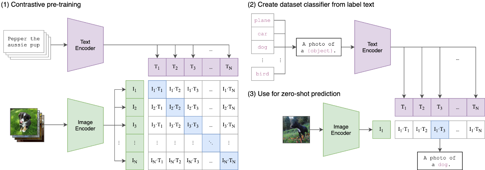

## 1.2 Pourquoi la recherche vectorielle ?
Les fonctions actuelles de recherche de texte et d'image de l'application de recherche globale de l'UKUI (ukui-search) sont basées sur l'extraction traditionnelle de mots-clés chinois (les images extraient le texte par OCR), et la base de données est une base de données Xapian basée sur l'indexation inversée, et la recherche est basée sur la recherche de « mots-clés ». Fondamentalement, la recherche est toujours basée sur la correspondance des mots-clés, même si nous prenons en charge la « recherche floue » dans une certaine mesure, c'est-à-dire que lorsque l'utilisateur saisit plus d'un mot-clé, une partie de la correspondance des mots-clés peut être rappelée, mais fondamentalement, nous n'avons pas résolu le problème de la corrélation « floue » entre l'entrée de l'utilisateur et le contenu de sa recherche.« Par exemple, supposons que l'utilisateur dispose de nombreux fichiers décrivant le « temps », y compris des fichiers texte contenant des descriptions du temps et des photos liées au temps, mais que chaque fichier ne contienne que des descriptions du temps, telles que Par exemple, supposons que l'utilisateur dispose de nombreux fichiers décrivant le « temps », y compris des fichiers texte contenant des descriptions du temps et des photos liées au temps, mais que chaque fichier ne contienne que des descriptions du temps, telles que « nuageux à bruine », mais ne contienne pas le mot « temps », notre fonction de recherche actuelle ne pourra rechercher aucun des documents ; un autre exemple est que si les mots-clés saisis par l'utilisateur ne sont pas cohérents avec les mots-clés extraits par nous, même si l'utilisateur saisit les mêmes mots-clés que les documents, les mots-clés extraits par nous ne seront pas cohérents avec les mots-clés extraits par l'utilisateur. Autre exemple : si le mot clé saisi par l'utilisateur ne correspond pas au mot clé extrait au cours du processus d'extraction de mots clés, même si le contenu saisi par l'utilisateur est similaire à celui du document, le document correspondant ne pourra pas être recherché.

 La recherche vectorielle est basée sur la « sémantique ». Nous convertissons le contenu de chaque fichier en vecteurs de caractéristiques décrivant leur « sémantique » à l'aide du modèle de caractéristiques et nous les stockons dans la base de données de l'index. Lorsque l'utilisateur effectue une recherche, nous générons des vecteurs à partir des données fournies par l'utilisateur, puis nous calculons la distance entre les vecteurs dans la base de données et nous renvoyons les vecteurs Topk présentant une plus grande similarité, de manière à réaliser une recherche floue basée sur la sémantique et à rendre les résultats obtenus par l'utilisateur plus « humains ».

# 2 Qu'allons-nous faire ?

## 2.1 Déterminer le modèle approprié

 Le type de modèle à utiliser dépend de nos exigences fonctionnelles et de nos scénarios d'utilisation. Par exemple, pour effectuer une recherche de contenu textuel, nous devons utiliser le modèle de vecteur de direction de texte, pour effectuer une recherche d'image, nous avons besoin du modèle de vecteur d'image, en même temps, nous devons également prêter attention à la prise en charge de la langue par le modèle, la plupart des modèles ne prennent en charge qu'une seule langue.

 En même temps, le besoin de scénarios d'application spécifiques, nous avons également certaines exigences sur la performance du modèle, comme dans le matériel ne supporte pas l'accélération gpu, comment s'assurer que la performance de l'index et la consommation de ressources ne sont pas trop élevés, en même temps, la taille du modèle détermine également la taille de l'emballage de notre paquet de logiciels.

 Si le modèle open source peut difficilement répondre à nos besoins, ou si nous devons adapter le modèle aux scénarios des utilisateurs, nous devons alors former notre propre modèle, mais la formation du modèle nécessite beaucoup de main-d'œuvre et de ressources, et nous ne disposons pas de suffisamment de ressources pour le moment.

 Si le modèle open source peut répondre à nos besoins, mais que le processus d'indexation consomme trop de ressources, nous devrons peut-être envisager une certaine compression du modèle, telle que la distillation du modèle.

## 2.2 Construction d'une base de données

 La recherche vectorielle ne repose pas nécessairement sur des bases de données vectorielles. Les bases de données relationnelles traditionnelles peuvent également assurer la fonction de recherche de base, mais les bases de données vectorielles présentent certaines caractéristiques que les bases de données traditionnelles ne peuvent pas atteindre, par exemple, lorsque les performances de la recherche indexée à plat ne sont pas suffisantes, vous pouvez optimiser les performances de la recherche au moyen de l'indexation partitionnée, etc.

 Lorsque les dimensions vectorielles sont nombreuses, et que le nombre est également élevé, afin que la base de données d'indexation n'occupe pas trop d'espace disque, nous devons également envisager la compression des données vectorielles ou la réduction de la dimensionnalité.

 Parallèlement, compte tenu de notre scénario d'application, la base de données doit également prendre en charge les opérations de mise à jour unique ou par lots.

## 2.3 Indexation et recherche de fichiers

Après avoir fixé le modèle et la base de données, la prochaine chose à faire est de construire un service d'indexation de fichiers basé sur la recherche vectorielle. En se basant sur le mécanisme d'indexation de fichiers de ukui-search, nous pouvons facilement mettre en œuvre le balayage de fichiers, l'écoute de fichiers, l'ajout et la suppression de répertoires, la gestion de bases de données, etc. Avec cette base, nous devons mettre en œuvre la fonction de construction du service de données d'indexation de fichiers et le déployer sur UKUI.

Sur la base du service de données indexées, nous devons mettre en œuvre la fonction de recherche, en nous concentrant sur deux étapes : la première consiste à convertir les données de l'utilisateur en vecteurs, et la seconde à effectuer une recherche sur la base de l'interface de recherche de la base de données vectorielle. Sur la base du modèle à deux tours, nous pouvons ajouter à la recherche l'analyse de certaines données relatives aux caractéristiques de l'utilisateur, par exemple en formulant des recommandations sur les résultats de la recherche en fonction des habitudes de l'utilisateur.

# 3.Nos tentatives actuelles

Nous avons commencé à expérimenter des modèles open source pour les techniques de recherche vectorielle dans l'UKUI. Pour la recherche de contenu textuel, nous avons choisi des modèles de traitement du langage naturel tels que BERT, qui peuvent convertir le texte en vecteurs à haute dimension. Pour la recherche d'images, nous avons essayé d'utiliser le modèle CLIP pour extraire les caractéristiques des images.

En ce qui concerne les bases de données, nous avons testé certaines bases de données pour la recherche vectorielle, telles que Faiss et Milvus. Ces bases de données offrent de riches caractéristiques de recherche vectorielle et prennent également en charge la compression des vecteurs et la réduction de la dimensionnalité. Lors de nos tests préliminaires, nous avons constaté que ces bases de données offraient de bonnes performances et une bonne précision.

Afin de mettre en œuvre la fonction d'indexation et de recherche de fichiers, nous étendrons ukui-search en convertissant le contenu des fichiers en vecteurs et en les stockant dans la base de données vectorielle. Parallèlement, nous adaptons l'interface de recherche pour prendre en charge la recherche basée sur la similarité vectorielle. Nous essayons également d'utiliser le modèle à deux tours combiné aux données des caractéristiques de l'utilisateur pour recommander et optimiser les résultats de la recherche.

Actuellement, nous avons achevé le prototypage et le test de certaines fonctionnalités. Dans la pratique, la fonction de recherche basée sur la récupération vectorielle peut effectivement permettre une recherche floue plus précise et améliorer l'expérience de l'utilisateur par rapport à la recherche traditionnelle par correspondance de mots-clés.

## 3.1 Recherche vectorielle de contenu textuel

Le programme de démonstration pour la recherche de vecteurs de contenu textuel utilise le modèle open source SBERT et la base de données vectorielle faiss.

SBERT (Sentence-BERT) est un modèle d'apprentissage profond pour générer des représentations d'intégration de phrases, qui vise à fournir des représentations textuelles de haute qualité pour différentes tâches de traitement du langage naturel. Le modèle SBERT génère des vecteurs d'intégration de phrases en utilisant un encodeur bidirectionnel pour capturer les informations sémantiques et contextuelles dans une phrase, de sorte que les similitudes entre différentes phrases peuvent être représentées avec précision.

FAISS (Facebook AI Similarity Search) est une base de données vectorielles haute performance pour le traitement d'ensembles de données vectorielles à grande échelle. FAISS utilise une série de structures d'indexation et d'algorithmes d'approximation pour réaliser une recherche vectorielle efficace. FAISS utilise une série de structures d'indexation et d'algorithmes d'approximation pour réaliser une recherche vectorielle efficace.

Actuellement, ukui-search utilise la désambiguïsation pour le contenu textuel chinois, où une phrase est divisée en plusieurs mots-clés différents, puis déposée dans la base de données à index inversé xapian pour fournir la fonction de recherche par mot-clé correspondante. La recherche vectorielle, quant à elle, peut sauter l'étape de la division des mots et calculer des vecteurs à haute dimension dans leur ensemble grâce au modèle sbert et les déposer dans la base de données vectorielles faiss, qui fournira diverses structures d'index et algorithmes d'approximation pour produire efficacement des informations approximatives relatives aux vecteurs.

## 3.1.1 Recherche de contenu textuel similaire

Utilisez pandas pour charger un ensemble de textes de test comme données de recherche locale. Le contenu du texte a été prétraité pour enregistrer les phrases individuelles sur une seule ligne. Les structures d'indexation et les algorithmes d'approximation sont utilisés pour produire efficacement des informations approximatives sur les vecteurs.

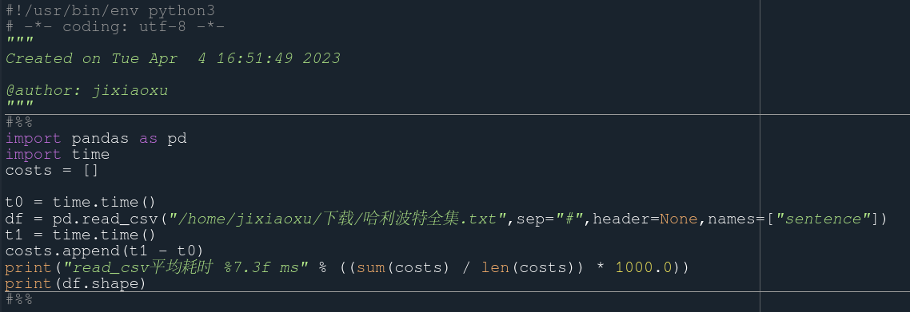

exécute la sortie correspondante :

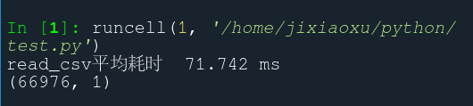

Utilisez sentence_transformers pour charger le modèle open source, puis entrez le contenu du texte test dans le modèle pour obtenir les vecteurs correspondants.

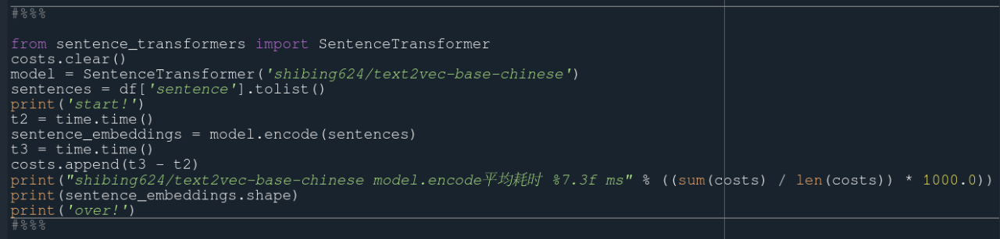

exécute la sortie correspondante :

Utilisez la base de données vectorielles faiss pour stocker les données converties en vecteurs dans un conteneur d'index.

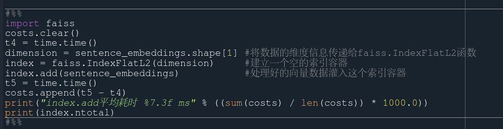

exécute la sortie correspondante :

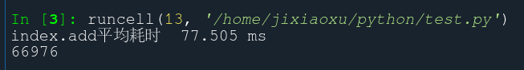

Utilisez à nouveau sentence_transformers pour charger le modèle open source et transformer le contenu à rechercher (pas de contenu textuel identique dans l'ensemble de données de test) en vecteurs, puis utilisez le conteneur d'index pour rechercher les 5 meilleures approximations.

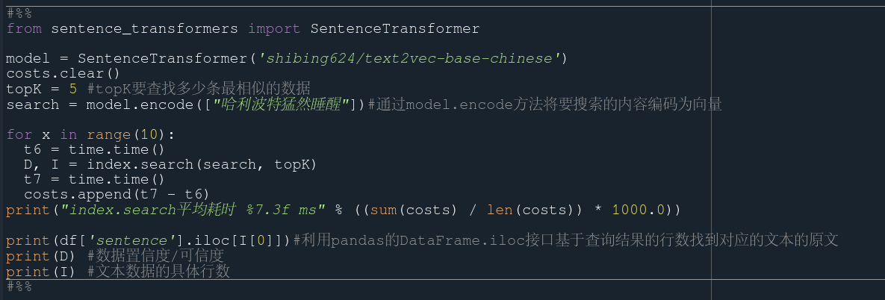

exécute la sortie correspondante :

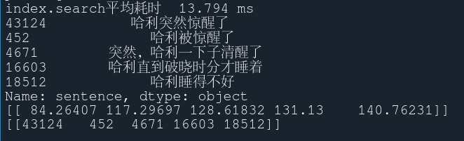

Les résultats de la recherche montrent que la recherche vectorielle peut produire des résultats très similaires pour la recherche d'un contenu qui n'existe pas.

## 3.1.2 Recherche de contenu textuel exact

Les recherches vectorielles sont également précises pour le contenu existant, par exemple en remplaçant la recherche par le texte test : « Harry s'est réveillé soudainement », puis en effectuant une recherche vectorielle.

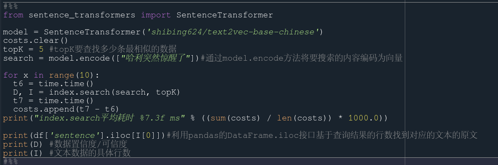

exécute la sortie correspondante :

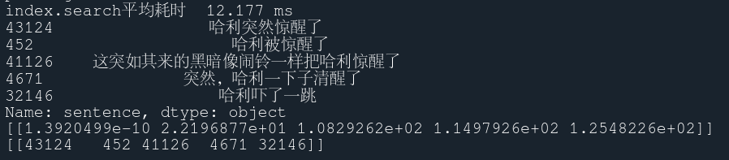

On peut constater que pour la recherche d'un contenu textuel précis, la base de données vectorielles faiss est toujours en mesure de fournir des résultats de recherche précis. 

## 3.1.3 Validation de la technologie de l'interface C++

Les étapes essentielles de la recherche vectorielle sont un modèle pour convertir le contenu des fichiers en vecteurs et une base de données vectorielle pour stocker les vecteurs en grandes quantités. Actuellement, nous avons mis en œuvre le modèle pytorch dans le modèle open source et l'avons converti en modèle de classe libtorch sous forme de script, qui peut être utilisé par C++ et permet aux applications de bureau d'être appelées directement par C++. En outre, nous avons utilisé la base de données vectorielles faiss écrite en C++ comme noyau, et nous avons lié la base de données vectorielles faiss au projet de démonstration en modifiant certains fichiers cmake.

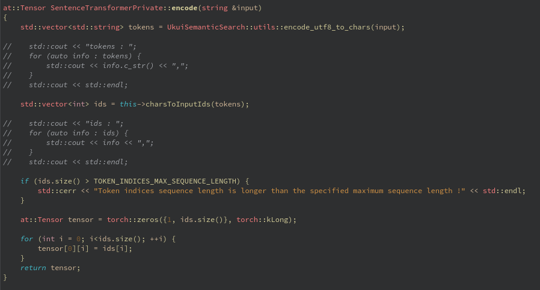

Le fichier de données est ensuite chargé et la transformation vectorielle est achevée pour être stockée dans la base de données :

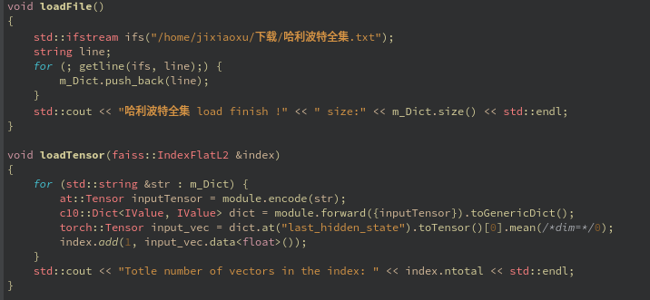

Enfin, la recherche est convertie en vecteur et recherchée dans la base de données pour le contenu TOP5 :

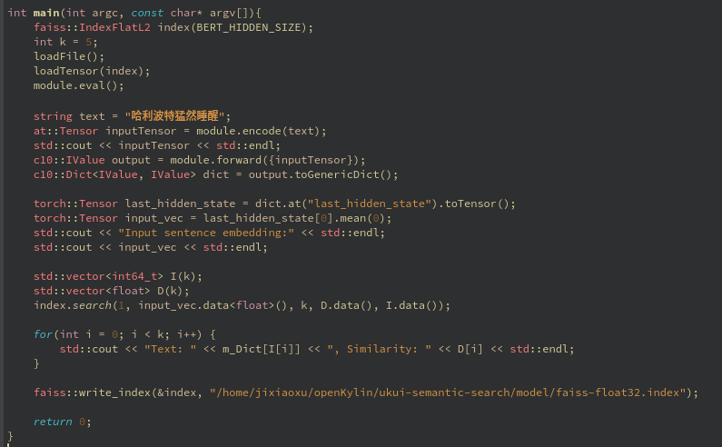

Le résultat du programme est le suivant :

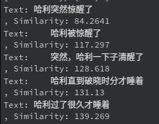

Comparez la sortie du programme de démonstration utilisant python avec la sortie de la version c++ du programme pour différents modèles :

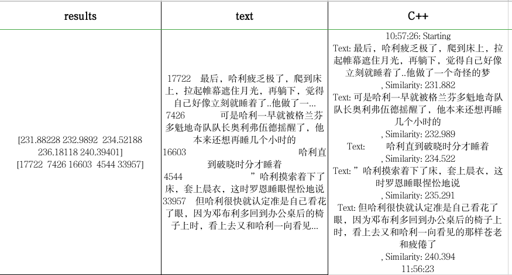

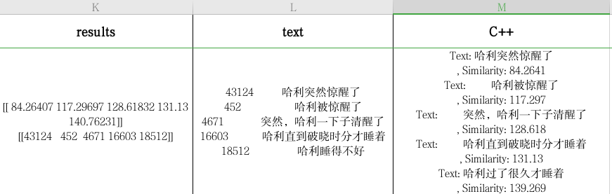

Nous pouvons voir que les résultats de la recherche sont fondamentalement les mêmes, et que les résultats du calcul de la similarité sont également fondamentalement les mêmes. La dernière petite différence est due au fait que la version c++ de libtorch a une précision par défaut de float32, alors que la version python de pytorch a une précision par défaut de float64.

## 3.2 Recherche multimodale

En transformant différents types de données structurées en un même espace sémantique grâce au modèle CLIP, il est possible de réaliser des fonctions telles que la recherche de texte et la recherche de cartes, ce qui accroît considérablement la flexibilité de la recherche sur ordinateur. Le déploiement de la recherche sémantique sur une seule machine sera en avance sur les produits concurrents pour ce qui est de la première version et de la première application.

TODO

## 3.3 Problèmes rencontrés jusqu'à présent

1. modèles open source, les modèles auto-entraînés peuvent être plus applicables
2. adaptation du GPU, la configuration de l'hôte varie
3. problèmes d'efficacité du modèle, la conversion vectorielle est lente, la distillation du modèle, l'élagage et d'autres optimisations techniques sont nécessaires ; le CPU d'Intel peut être accéléré à l'aide d'OpenVino, le GPU de NVIDIA peut être accéléré à l'aide de TensorRT ; technologie ncnn open-source, le modèle pytorch est converti en onnx, puis converti en modèle ncnn chargé pour être utilisé.
4. le modèle occupe un grand espace de stockage, l'intégration dans l'emballage du projet est affectée
5. à indexer : sélection de contenu, images, documents, vidéo, voix... Impliquer le support du modèle multimodal
6. déploiement de services de modèles multimodaux, cadres de services tels que le serveur d'inférence triton, etc.

# 4.Projets futurs

1) Continuer à optimiser le modèle et le schéma de la base de données afin d'améliorer l'efficacité et la précision de la recherche.
2. envisager la prise en charge de la recherche multilingue pour répondre à un plus large éventail de besoins des utilisateurs
3. optimiser les algorithmes de tri et de recommandation des résultats de recherche afin que ces derniers correspondent davantage aux attentes des utilisateurs ; 4. améliorer la qualité de la recherche.
4. pour les différents types de fichiers (par exemple vidéo et audio), essayer d'introduire le modèle d'extraction de caractéristiques correspondant afin d'obtenir une fonction de recherche multimédia complète.
5. prédiction du comportement de l'utilisateur, vectorisation de diverses opérations de l'utilisateur dans l'environnement de bureau UKUI, et prédiction des comportements de l'utilisateur par le biais du contenu des entrées de l'utilisateur.

# 5. Résumé

L'application de la technologie de recherche vectorielle* dans l'UKUI devrait offrir aux utilisateurs une expérience de recherche plus intelligente et plus humaine. En optimisant continuellement le modèle, la base de données et l'algorithme de recherche, nous pouvons fournir aux utilisateurs des services de recherche plus efficaces et plus précis. Il peut même être utilisé comme point d'entrée unifié pour l'ensemble de l'environnement de bureau de l'UKUI, en prédisant les comportements des utilisateurs par le biais d'informations d'entrée et en fournissant des opérations scriptées « à guichet unique » correspondantes. *

## Documents connexes :

https://github.com/milvus-io/milvus

https://jina.ai/news/hype-and-hybrids-multimodal-search-means-more-than-keywords-and-vectors-2/

https://github.com/openai/CLIP

