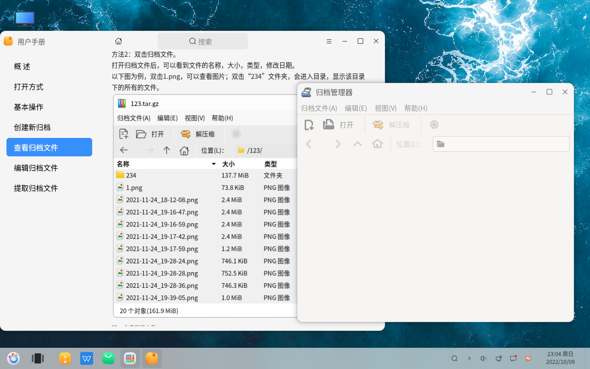
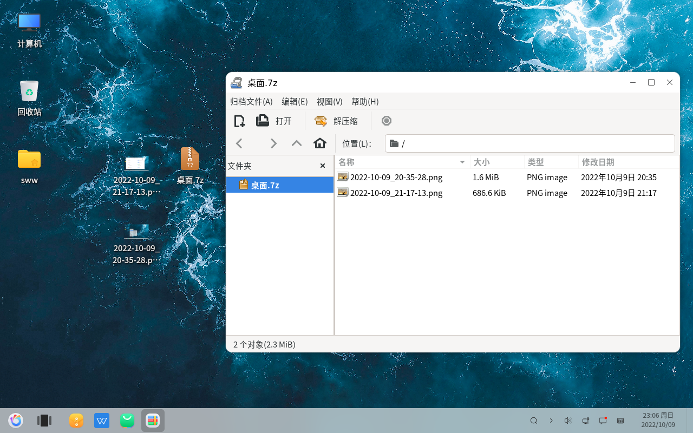
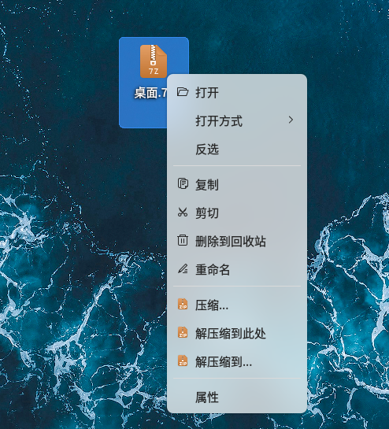
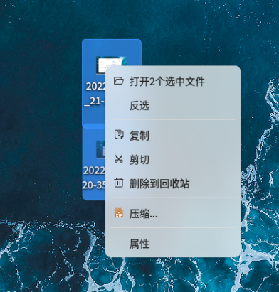
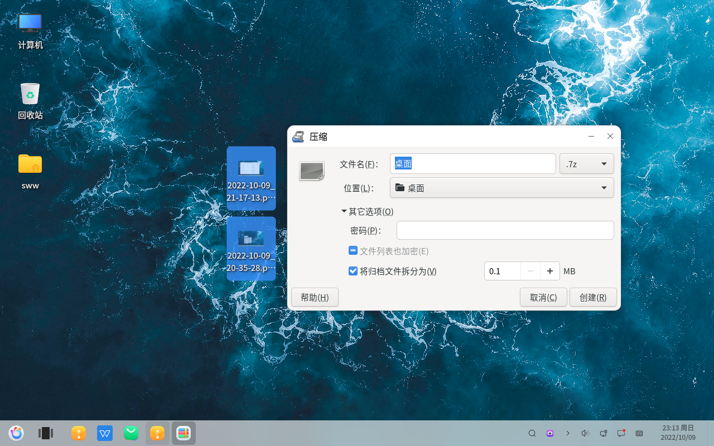

#Gestionnaire d'archives - Compression et décompression
#### Auteur : Shi Wanwu
#### 21-11-2022 22:38:16
#### openKylin-0.7.5-x86_64

&emsp;

Le gestionnaire d'archives est un outil de compression et de décompression.

Décompression d'une archive individuelle

Compression de plusieurs fichiers

Configuration du mot de passe et du fractionnement

&emsp;