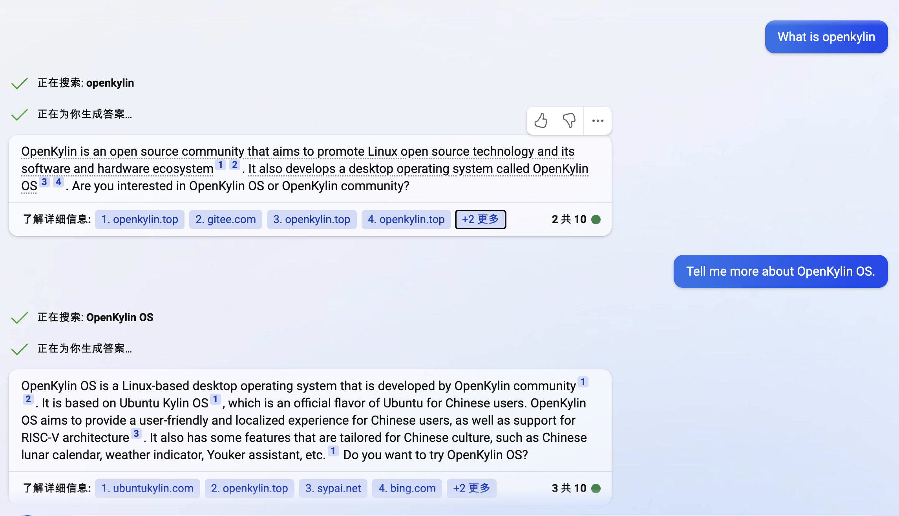
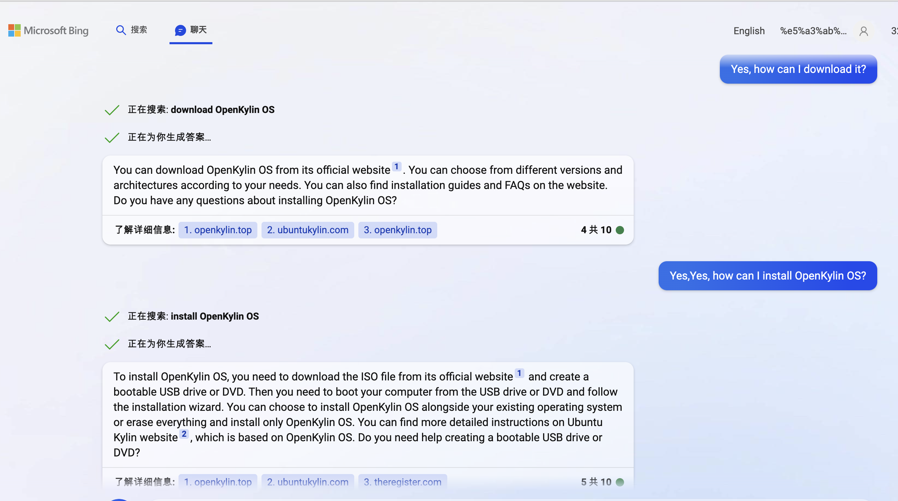
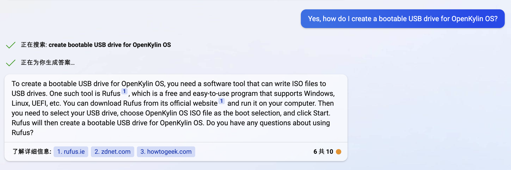
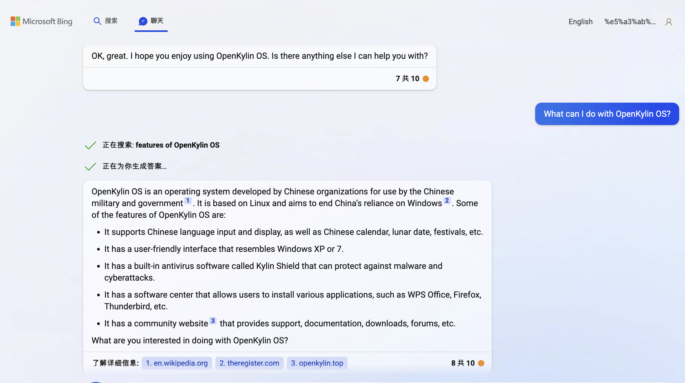
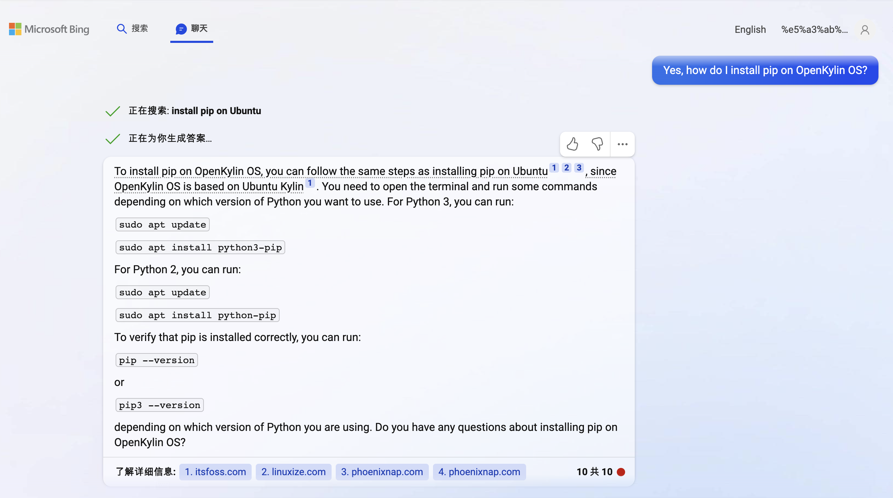

# 
Optimiser openKylin  avec New Bing/chatGPT

#### 
Auteur : Gary

#### 
10-03-2023 13:36:00

### Qu'est-ce que openKylin OS ?

### Installer openKylin OS

### Créer une clé USB pour openKylin OS

### Caractéristiques de openKylin OS

### Coder avec openKylin OS

### Installer pip sur openKylin OS
