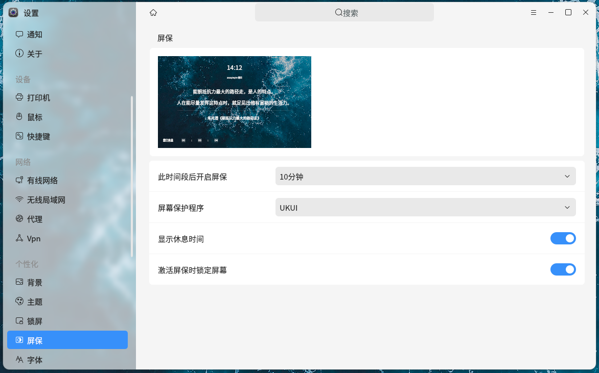
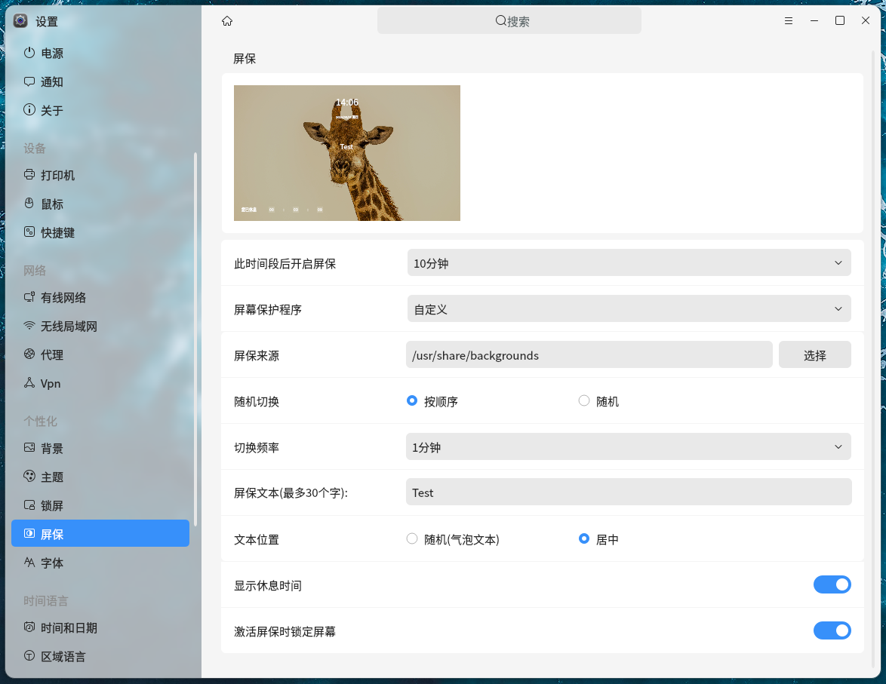

# 
Parametres de l'economiseur d'ecran

#### 
Auteur：hyjin123

#### 
2023-05-07

&emsp;

Depuis le menu de démarrage de la barre des tâches, sélectionnez "Paramètres", puis dans le panneau qui s'ouvre, choisissez "Personnalisation", et enfin dans la barre latérale, sélectionnez "Économiseur d'écran" pour accéder au panneau de configuration de l'économiseur d'écran.

&emsp;

## Paramètres par défaut de l'économiseur d'écran

La vignette en haut du panneau permet de prévisualiser l'économiseur d'écran avec les paramètres actuels. En cliquant sur la vignette et en ne faisant plus d'autres actions, vous pouvez effectuer une prévisualisation en plein écran. Les paramètres par défaut de l'économiseur d'écran sont les suivants :

+ **Activer l'économiseur d'écran après ce délai**: Définissez le temps d'inactivité du clavier et de la souris avant que l'économiseur d'écran ne s'active.
+ **Économiseur d'écran** : Choisissez "UKUI" ou "Personnalisé". "UKUI" est l'effet d'économiseur d'écran par défaut du système. En choisissant "Personnalisé", vous pouvez accéder à davantage de paramètres de personnalisation.
+ **Afficher le temps de repos : Lorsque cette option est activée, le temps de repos** (durée d'activation de l'économiseur d'écran) sera affiché en bas à gauche de l'écran.
+ **Verrouiller l'écran lors de l'activation de l'économiseur d'écran** : Lorsque cette option est activée, l'écran sera verrouillé lorsque l'économiseur d'écran est activé, nécessitant une reconnexion pour revenir au bureau.

&emsp;

## Paramètres personnalisés de l'économiseur d'écran

Après avoir sélectionné "Personnalisé" dans les économiseurs d'écran, le panneau affichera des options de personnalisation :
+ **Source de l'économiseur d'écran** : Choisissez le répertoire contenant les images de fond de l'économiseur d'écran. Vous pouvez y placer les images que vous souhaitez utiliser comme arrière-plan de l'économiseur d'écran.
+ **Changement aléatoire** : L'économiseur d'écran fera défiler les images de fond, avec la possibilité de définir l'ordre de changement, soit séquentiel, soit aléatoire.
+ **Fréquence de changement** : Déterminez la fréquence à laquelle l'image de fond de l'économiseur d'écran change.
+ **Texte de l'économiseur d'écran** : Contenu textuel affiché sur l'économiseur d'écran, avec un maximum de 30 caractères.
+ **Position du texte** : Position d'affichage du texte sur l'économiseur d'écran, soit sous forme de bulle à un emplacement aléatoire, soit centré par défaut.

&emsp;