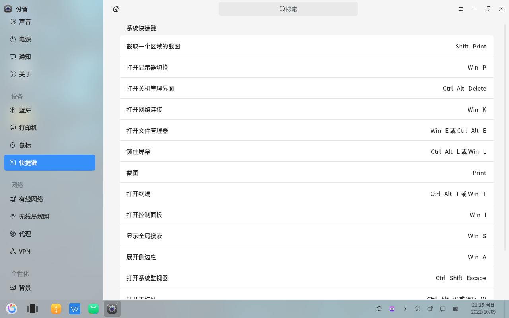
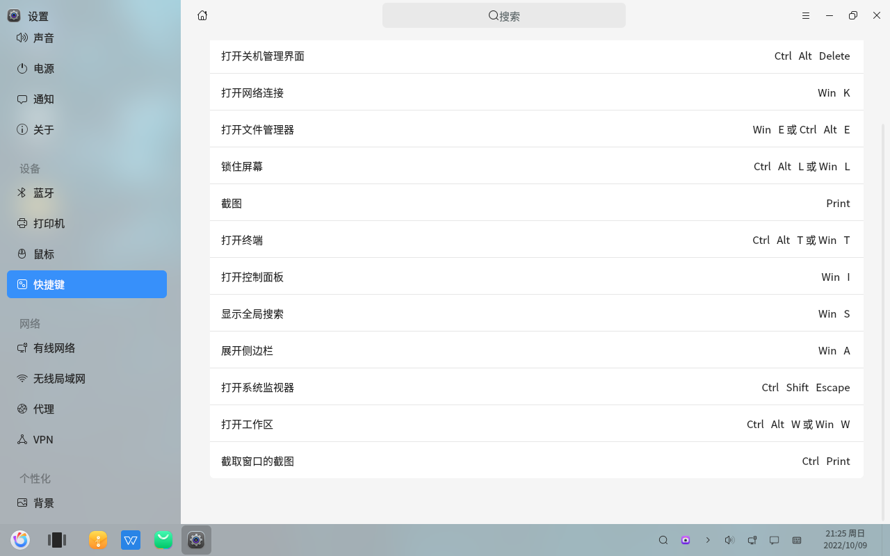

# Paramètres - Consulter les raccourcis clavier par défaut du système
#### Auteur : Shi Wanwu
#### 2022-11-21 22:38:16
#### openKylin-0.7.5-x86_64

&emsp;

Paramètres - Périphériques - Raccourcis clavier

Raccourcis clavier

J'utilise principalement les raccourcis "Capture d'écran" et "Capture d'une zone de l'écran".

&emsp;