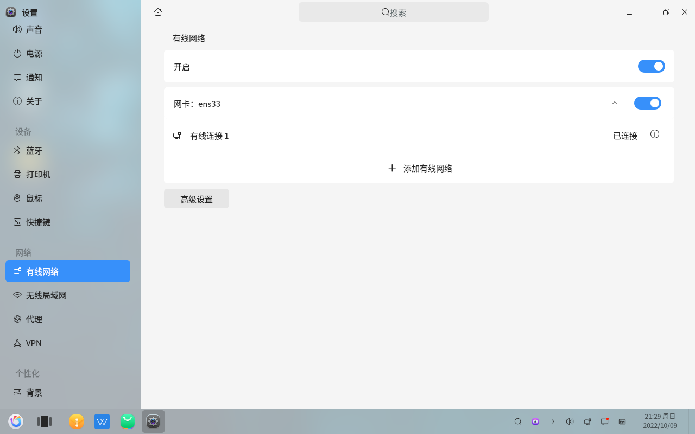
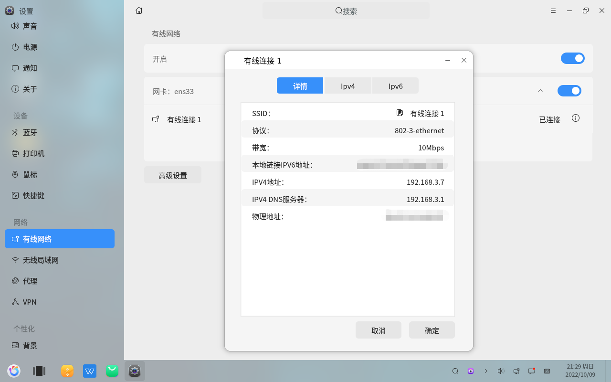
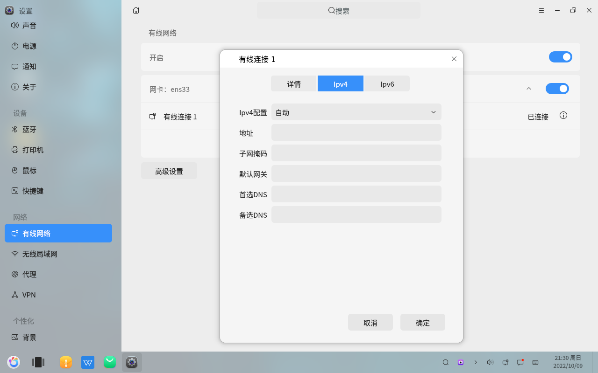
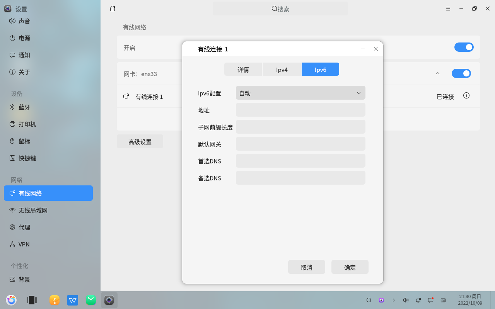
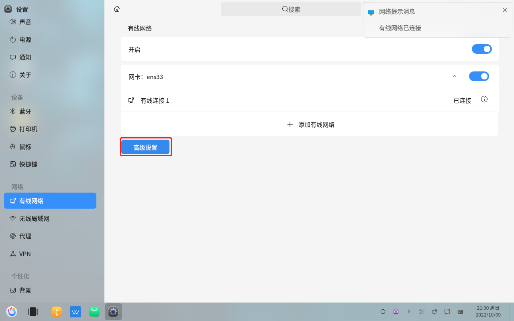
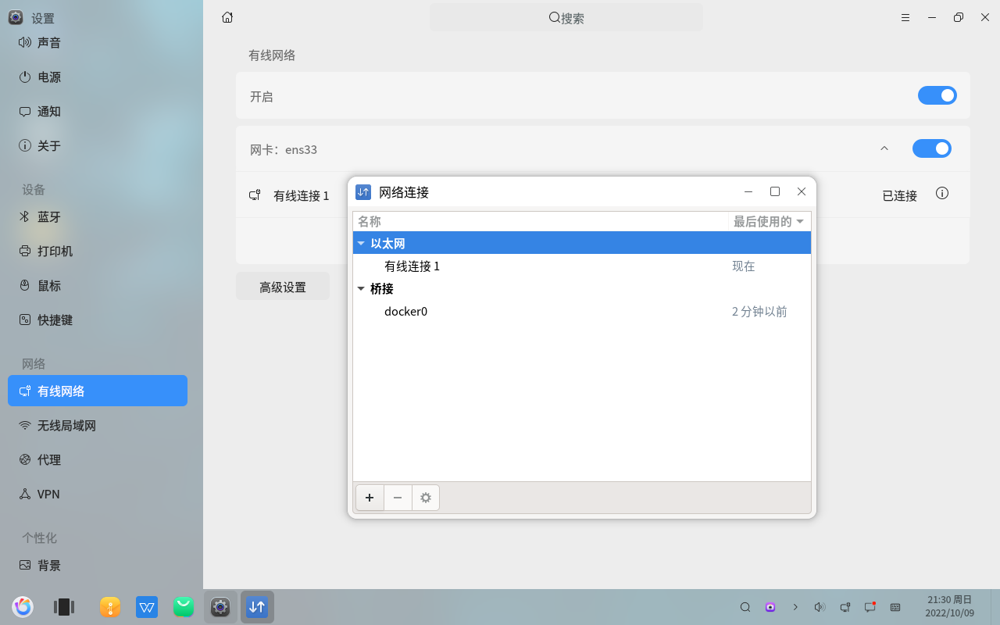
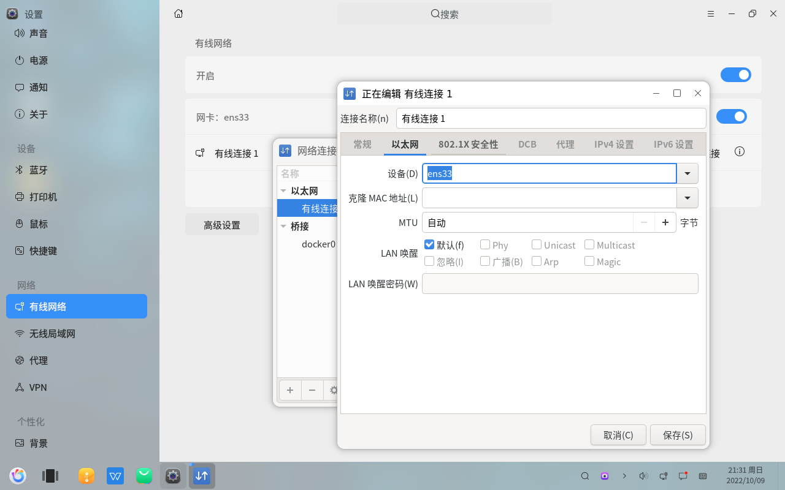

# Paramètres - Consulter la configuration réseau
#### Auteur : Shi Wanwu
#### 2022-11-21 22:38:16
#### openKylin-0.7.5-x86_64

&emsp;

Paramètres - Réseau - Réseau filaire

Consulter les informations de configuration du réseau en cours d'utilisation

Informations de configuration réseau IPv4

Informations de configuration réseau IPv6

Retour à l'interface principale - Paramètres avancés

Consulter les informations générales, Ethernet, sécurité 802.1X, etc.

&emsp;