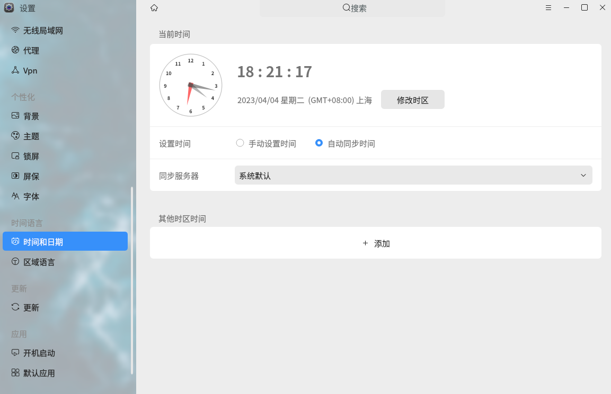
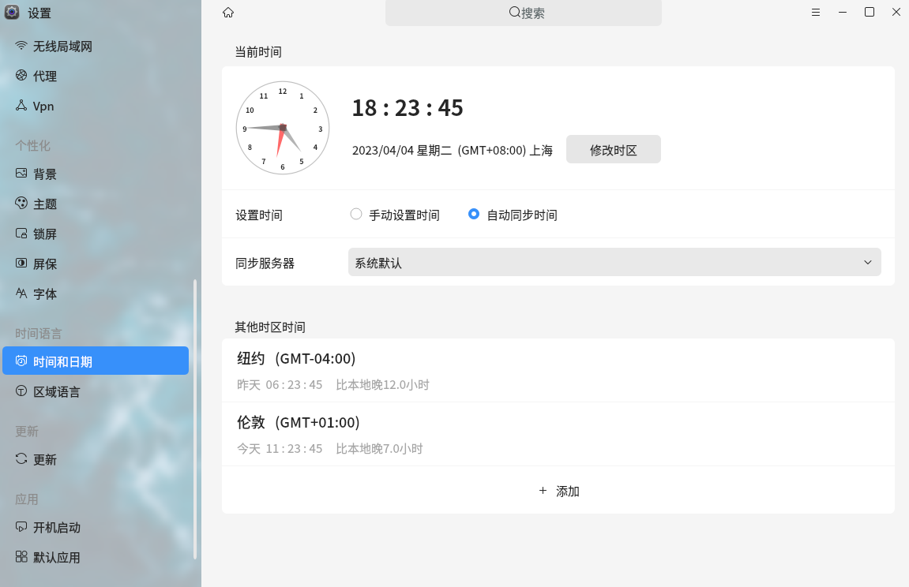

# Consulter le fuseau horaire et le serveur de synchronisation de l'heure
&emsp;
Version actuelle du système d'exploitation : openKylin-0.9.5-x86_64

### I. Ajouter d'autres fuseaux horaires
Paramètres - Langue et heure - Date et heure


Ajouter d'autres fuseaux horaires


Grâce à la fonction "Ajouter", vous pouvez consulter l'heure d'autres fuseaux horaires, mais elle n'est pas visible sur le bureau. Elle ne peut être consultée que dans la fenêtre Date et heure.

### II. Consulter l'heure système
L'heure sous Linux se divise en heure système et heure matérielle. L'heure système fait référence à l'heure actuelle dans le noyau Linux, tandis que l'heure matérielle fait référence à l'heure du BIOS sur la carte mère, alimentée par la batterie de la carte mère pour maintenir son fonctionnement. Parfois, l'heure système et l'heure matérielle peuvent ne pas être synchronisées.

Pour consulter l'heure système :
```
$ date
```

Pour consulter l'heure matérielle :
```
$ sudo hwclock
```

### III. Activer ou désactiver la synchronisation de l'heure via le réseau
```
$ time datectl set_ntp true/false
```
Entrez le mot de passe dans la boîte de dialogue qui apparaît.

### IV. Modifier l'heure système
1. Modifier l'heure système :
```
 $ sudo date -s mois/jour/année heure:minute:seconde
```

2. Mettre à jour l'heure matérielle (écrire l'heure système dans l'heure matérielle) :
```
 $ sudo hwclock -w
```

3. Ou mettre directement à jour l'heure système avec l'heure matérielle :
```
 $ sudo hwclock -s
```
&emsp;
