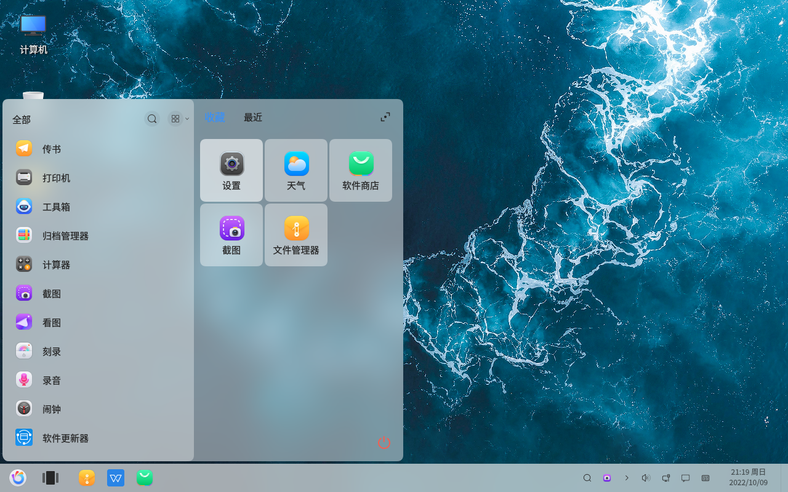
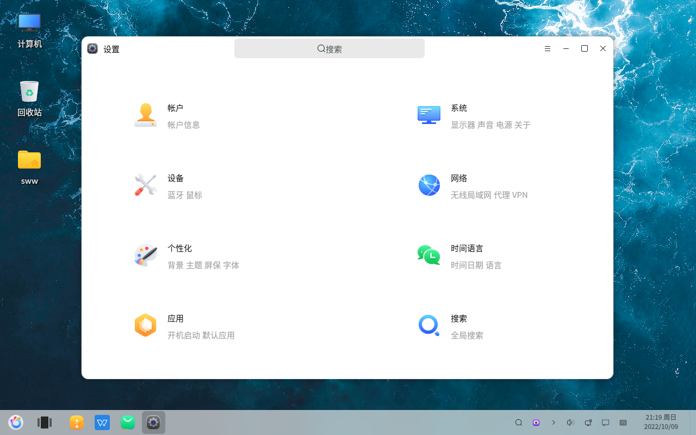
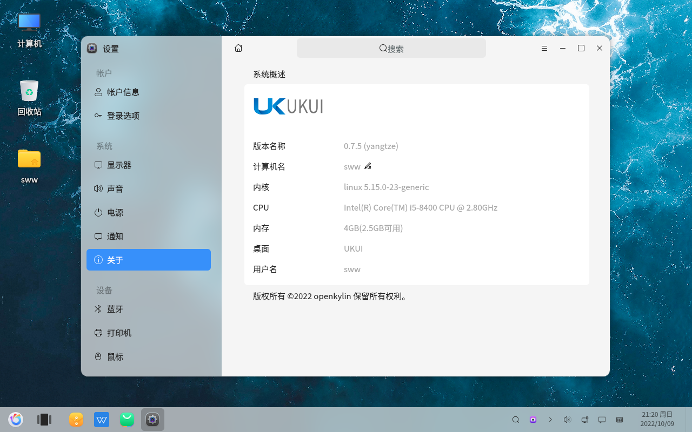

# Paramètres - Consulter les informations de version du système
#### Auteur : Shi Wanwu
#### 2022-11-21 22:38:16
#### openKylin-0.7.5-x86_64

&emsp;

Logo en bas à gauche - Paramètres

Paramètres - Système

Système - À propos

Dans cette interface, vous pouvez consulter les informations relatives au nom de la version, au nom de l'ordinateur et au noyau.

&emsp;