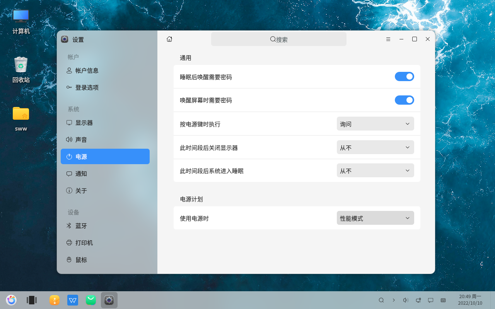

#  Paramètres de mise en veille
#### Auteur : Shi Wanwu
#### 2022-11-21 22:38:16
#### openKylin-0.7.5-x86_64

&emsp;

Paramètres - Système - Alimentation

Dans l'interface Alimentation, vous pouvez voir les paramètres de mise en veille

&emsp;