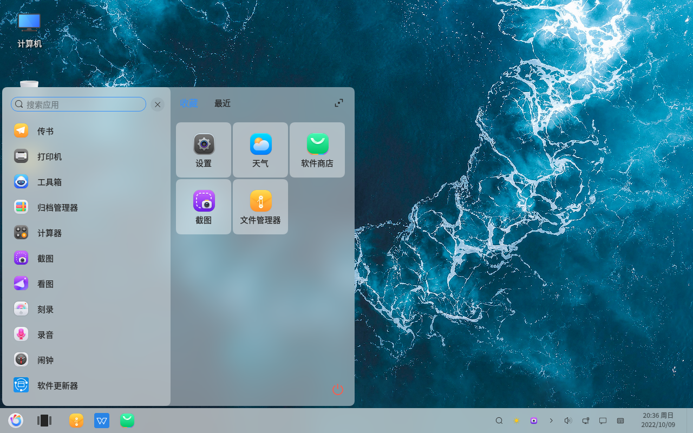
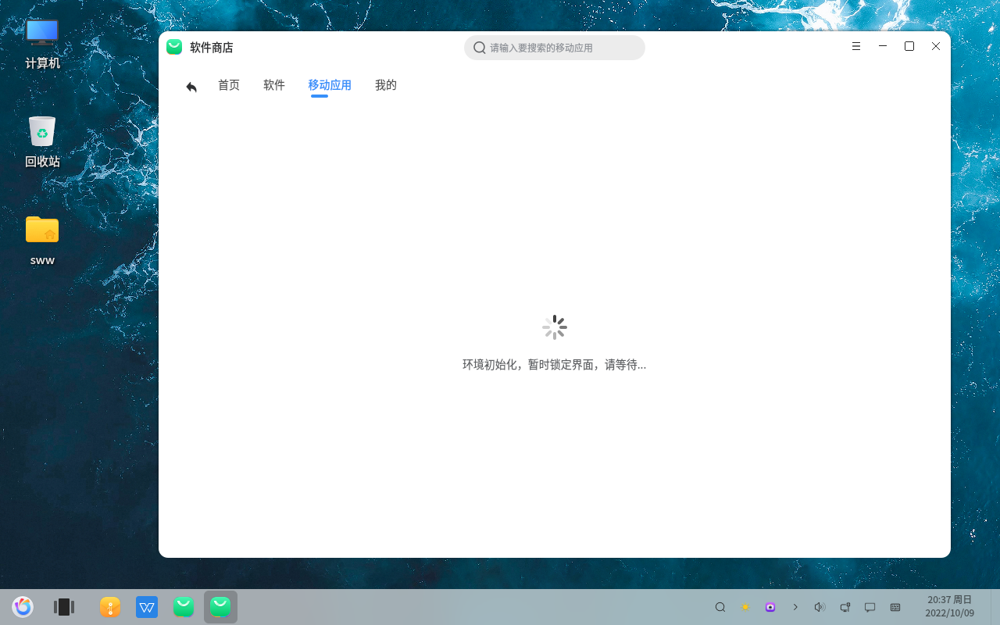

# Bases d'openKylin : Présentation du bureau
#### Auteur : Shi Wanwu
#### 21-11-2022 22:38:16
#### openKylin-0.7.5-x86_64

&emsp;

Menu Démarrer

Boutique de logiciels - Applications mobiles

J'utilise une machine virtuelle, l'installation d'applications mobiles nécessite l'initialisation de l'environnement d'exécution mobile, mais l'environnement d'exécution mobile ne prend pas en charge les machines virtuelles, donc la tentative a échoué. J'essaierai à nouveau sur une machine physique quand j'en aurai l'occasion.

Menu d'alimentation

Il y a les options : Hibernation, Mise en veille, Verrouillage de l'écran, Déconnexion, Redémarrage, Arrêt

&emsp;