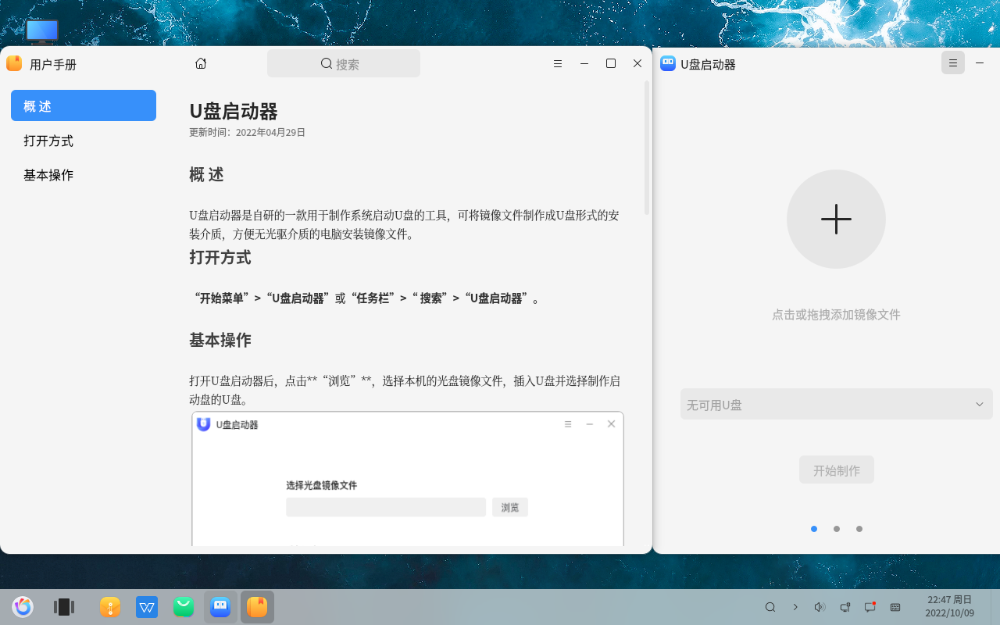

# Créateur de clé USB - Création d'une clé USB de démarrage système
#### Auteur : Shi Wanwu
#### 2022-11-21 22:38:16
#### openKylin-0.7.5-x86_64
&emsp;
Utilisation du créateur de clé USB pour fabriquer une clé USB de démarrage système

La clé USB sera formatée, donc assurez-vous de sauvegarder toutes les données de la clé USB à l'avance.
Maintenant que les clés USB sont devenues moins chères, préparez-en une avec un port USB 3.0, de 16 Go ou 32 Go.
&emsp;