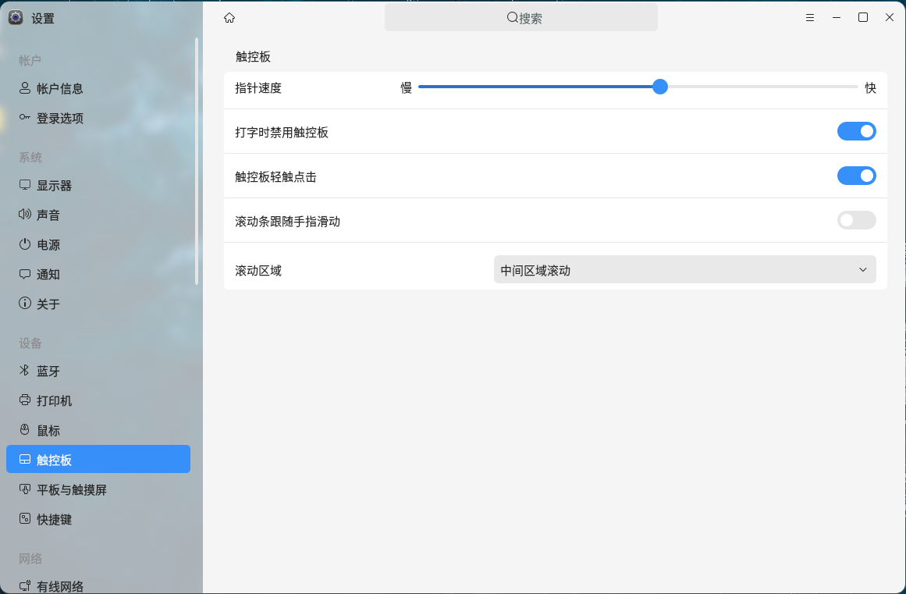
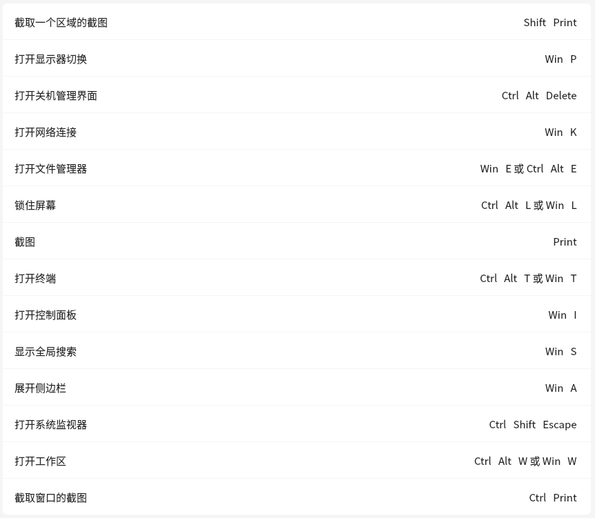
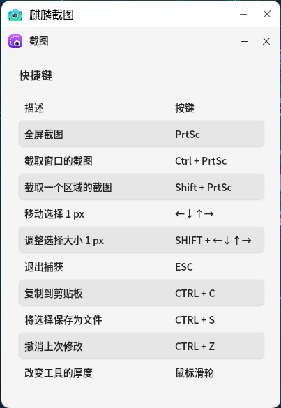
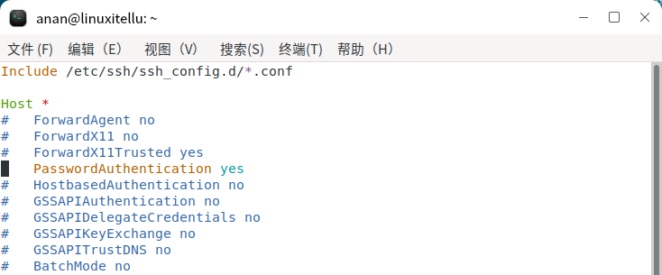
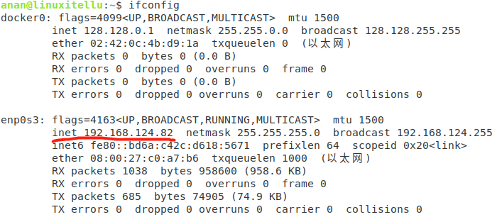
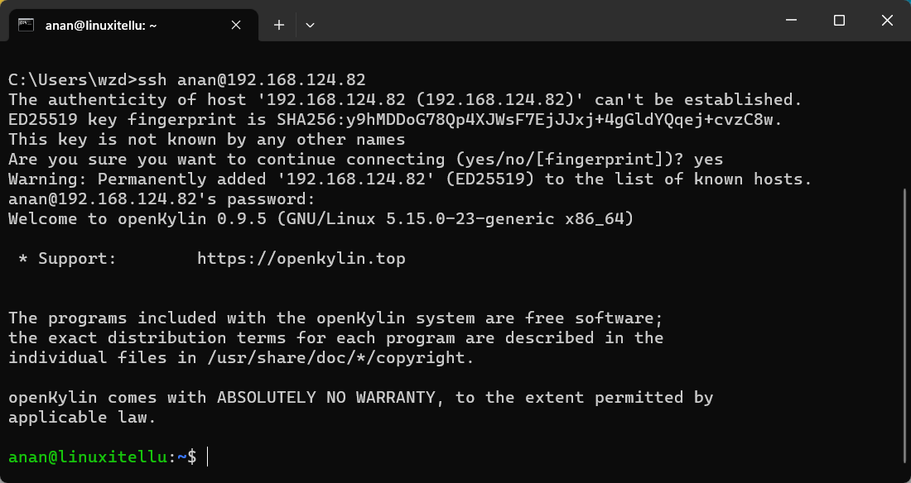

# Guide d'utilisation pour débutants OpenKylin
**Auteur : Anan**
**Date : 1er mars 2023**
### 1. Mise à jour du système
Utilisez le raccourci clavier <kbd>Ctrl</kbd> + <kbd>Alt</kbd> + <kbd>T</kbd> pour ouvrir le terminal et saisissez les commandes suivantes pour effectuer la mise à jour du système.
```shell
sudo apt update
sudo apt upgrade
```

### 2. Comment ajuster la vitesse du pointeur du pavé tactile si elle est trop lente ?
Utilisez le raccourci clavier <kbd>Win</kbd> + <kbd>I</kbd> pour ouvrir le Centre de paramètres, trouvez la fonction "Pavé tactile" dans "Périphériques".
Cliquez sur la barre d'état de la vitesse du pointeur dans le panneau de droite, vous pouvez essayer différentes vitesses jusqu'à trouver celle qui vous convient le mieux.


### 3. Raccourcis clavier système courants


### 4. Raccourcis clavier pour les captures d'écran


### 5. Activer la connexion SSH
- **Installer openssh-server**
```shell
sudo apt install openssh-server -y
```
- **Modifier le fichier de configuration `ssh_config`**
```shell
sudo vi /etc/ssh/ssh_config
```
>Trouvez `# PasswordAuthentication yes`, supprimez le # au début et sauvegardez

- **Redémarrer le service SSH**
```shell
sudo service sshd restart
```
- **Vérifier l'adresse IP**
```shell
ifconfig
ou
ip address
```

- **Connexion SSH à distance**
Dans le terminal Windows, utilisez la commande SSH pour vous connecter
```cmd
# Exemple ssh nom_utilisateur@adresse_IP
ssh anan@192.168.124.82
```


### 6. Commandes d'installation de logiciels avec Apt
Les commandes apt nécessitent des privilèges de super-utilisateur (root), donc il faut ajouter `sudo` devant
```shell
# Installer un logiciel
sudo apt install nom_du_paquet
# Désinstaller un logiciel
sudo apt remove nom_du_paquet
# Mettre à jour les logiciels
sudo apt upgrade
# Exemples
sudo apt install openssh-server
sudo apt install putty
```
- **Paramètres détaillés de la commande**
```shell
apt []
list - Liste les paquets par nom
search - Recherche dans les descriptions des paquets
show - Affiche les détails d'un paquet
install - Installe des paquets
reinstall - Réinstalle des paquets
remove - Supprime des paquets
autoremove - Supprime automatiquement tous les paquets inutilisés
update - Met à jour la liste des paquets disponibles
upgrade - Effectue une mise à jour en installant/mettant à niveau des paquets
full-upgrade - Effectue une mise à jour en supprimant/installant/mettant à niveau des paquets
edit-sources - Édite le fichier d'informations des sources logicielles
satisfy - Satisfait les chaînes de dépendances
```
- **Pour une aide détaillée, utilisez la commande**
```shell
apt -h
```

### 7. Commande de téléchargement wget
wget est un outil libre pour télécharger automatiquement des fichiers depuis le réseau, supportant les trois protocoles TCP/IP les plus courants : HTTP, HTTPS et FTP.
Pour les programmes ou paquets dont le chemin de téléchargement est déjà fourni sur le réseau, nous pouvons utiliser la commande wget pour les télécharger. Nous l'utilisons le plus souvent pour télécharger des paquets deb.
- **Utilisation :**
```shell
wget [options]... [URL].....
```
- **Exemple :**
```shell
wget http://www.xxx.com/download/putty.deb
```
- **Pour une aide détaillée, utilisez la commande**
```shell
wget -h
```

### 8. Commande d'installation dpkg
dpkg est un outil de gestion de paquets debian capable d'installer, désinstaller, obtenir des informations, etc. sur les paquets au format deb.
- **Utilisation :**
```shell
dpkg -i fichier_paquet
dpkg --install fichier_paquet
```
- **Exemple :**
```shell
# En suivant l'exemple précédent avec le fichier putty.deb téléchargé
dpkg -i putty.deb
```
- **Pour une aide détaillée, utilisez la commande**
```shell
dpkg --help
```

### 9. Utiliser une commande pour ouvrir le panneau de configuration
En cliquant sur chaque module fonctionnel, vous pouvez voir les messages d'erreur des problèmes
```
ukui-control-center
```
