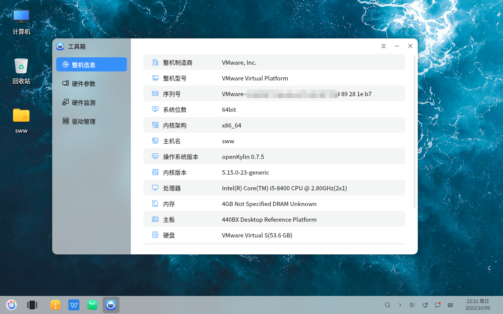
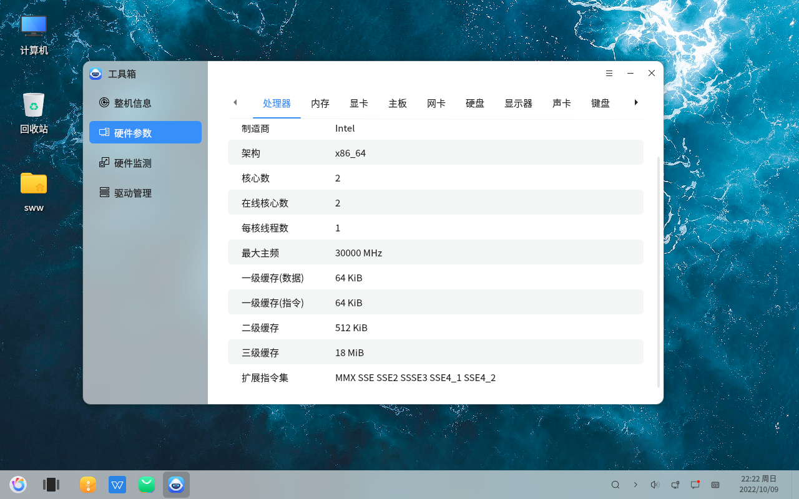
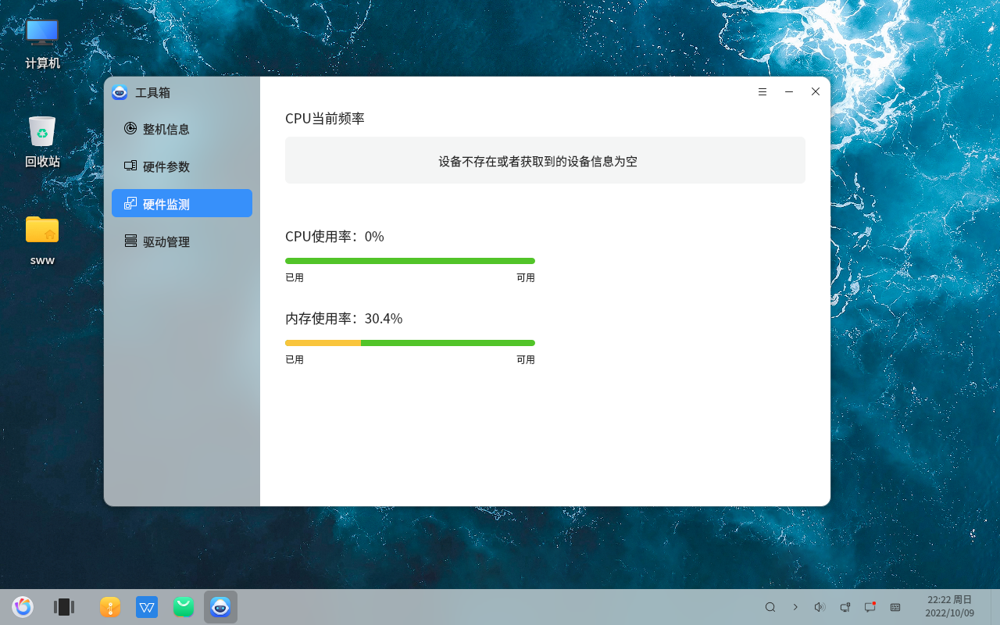
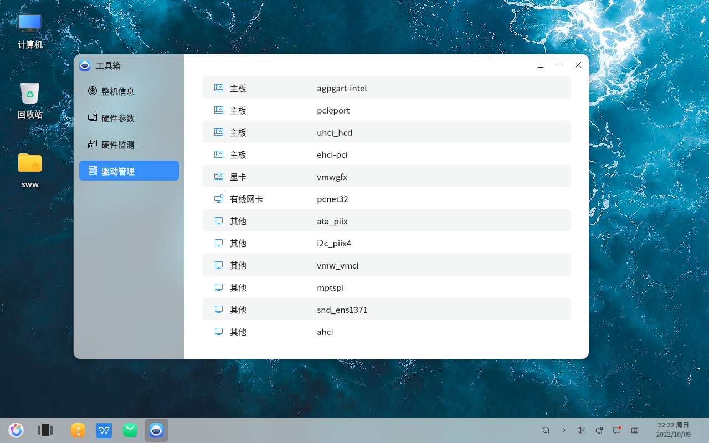

# Voir toutes les informations de la machine
#### 2022-11-21 22:38:16
#### openKylin-0.7.5-x86_64

&emsp ;

Toolkit Voir les informations de la machine Paramètres du matériel Surveillance du matériel Gestion des pilotes

Voir les informations sur la machine

Paramètres du matériel

Surveillance du matériel

Gestion des pilotes

J'ai installé openkylin dans une machine virtuelle, donc ce que vous voyez dans l'écran de gestion des pilotes sont les noms des pilotes pour le logiciel de la machine virtuelle

&emsp.