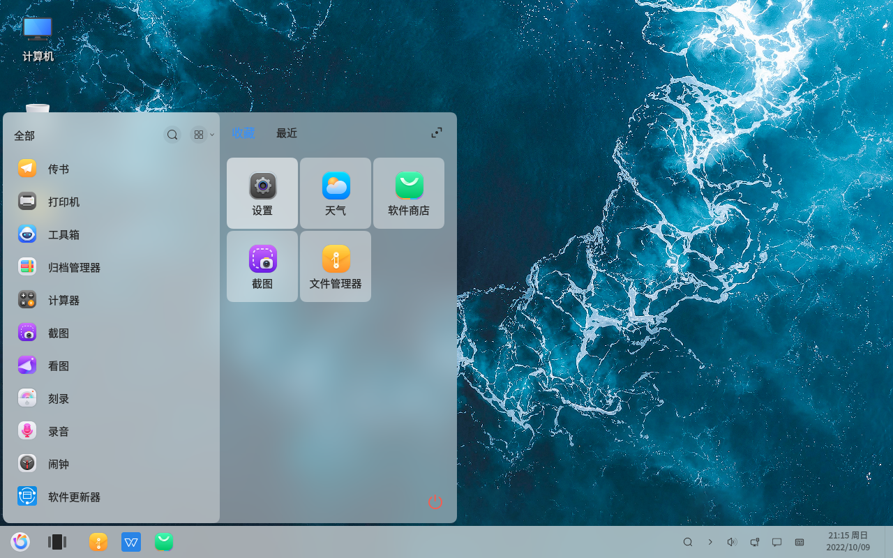
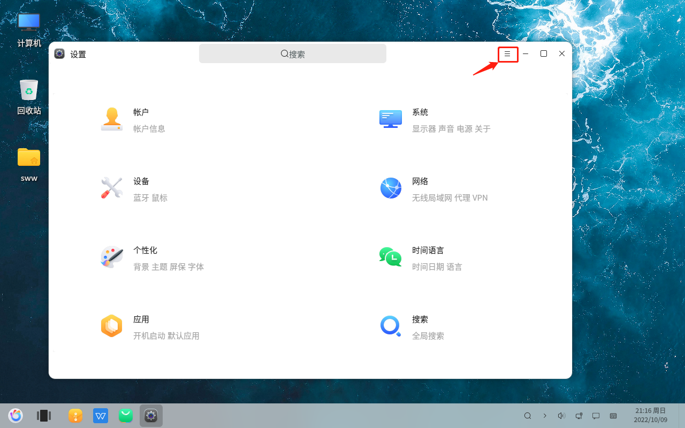
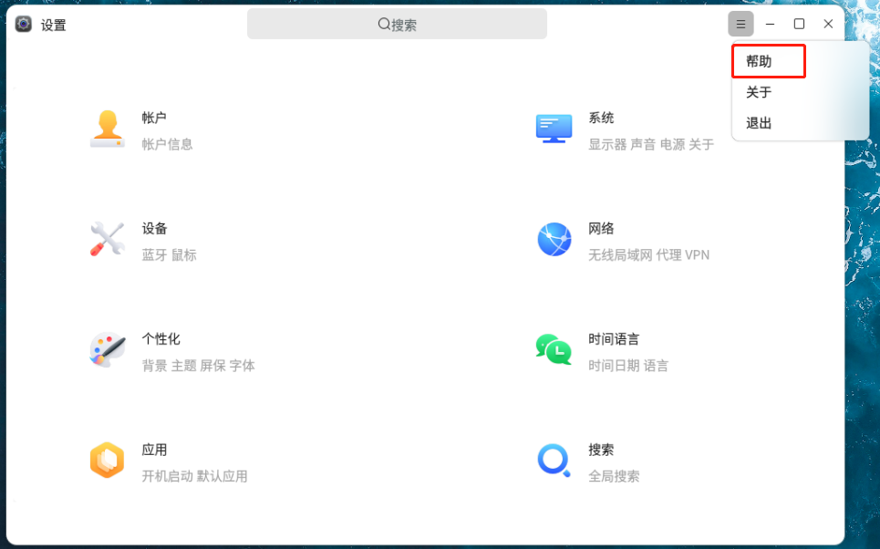
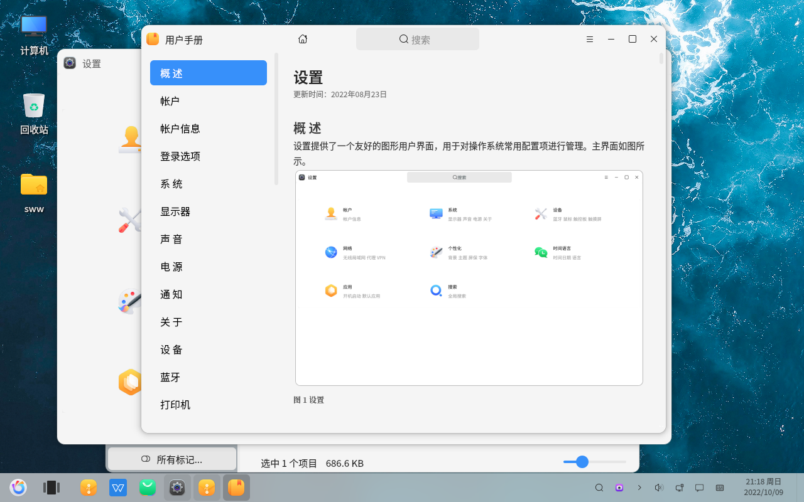

# Bases d'openKylin : F1 Consulter le manuel utilisateur
#### Auteur : Shi Wanwu
#### 21-11-2022 22:38:16
#### openKylin-0.7.5-x86_64

&emsp;

Je connais deux méthodes pour accéder au manuel utilisateur :
1. Utiliser le raccourci clavier F1
2. Via Paramètres - Aide

Je vais principalement expliquer les étapes de la deuxième méthode.

&emsp;

Logo en bas à gauche - Paramètres

Les trois lignes horizontales en haut à droite de l'interface des paramètres

Aide

Manuel utilisateur

En lisant le manuel utilisateur, on peut résoudre efficacement une partie des problèmes.

&emsp;