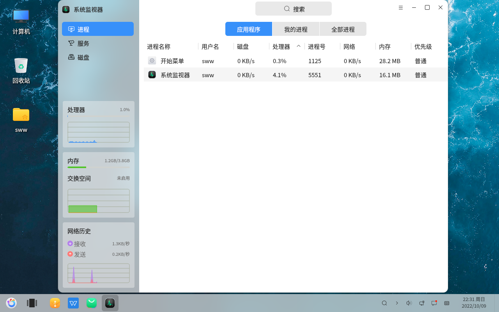
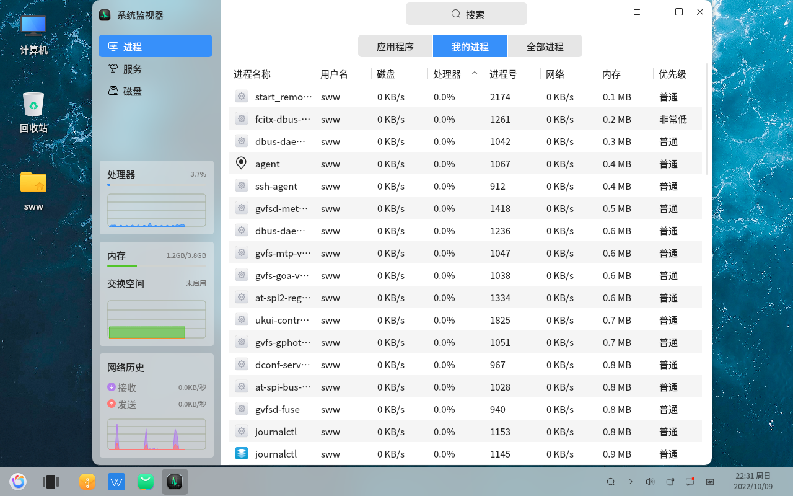
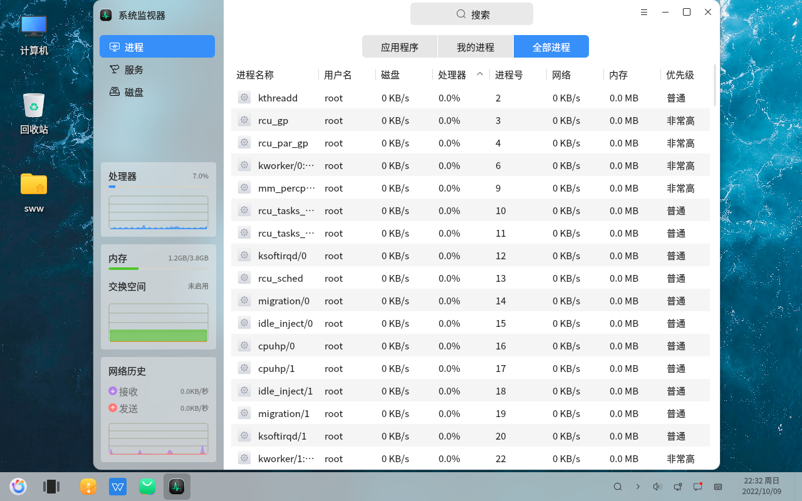
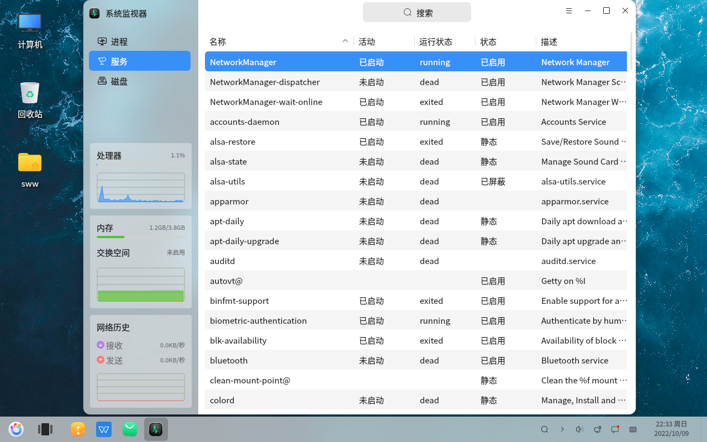
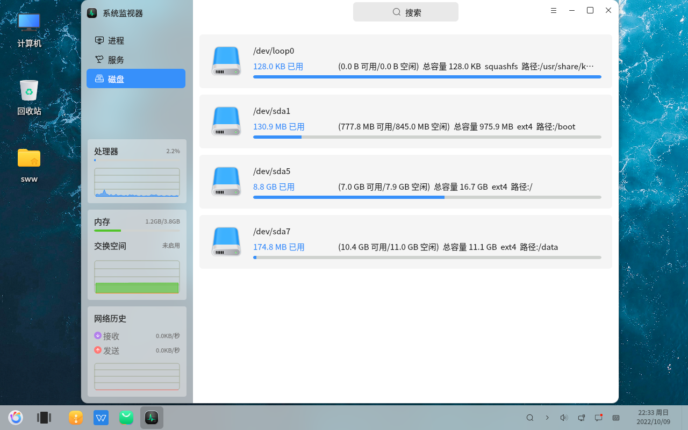

# Moniteur système - Visualisation des processus
#### Auteur : Shi Wanwu
#### 21-11-2022 22:38:16
#### openKylin-0.7.5-x86_64

&emsp;

Moniteur système - Processus - Applications

Moniteur système - Processus - Mes processus

Moniteur système - Processus - Tous les processus

Moniteur système - Services

Moniteur système - Disques

Notez que la dénomination des disques suit des règles spécifiques. Les étudiants intéressés peuvent se renseigner à ce sujet.

Les étudiants qui souhaitent apprendre les systèmes d'exploitation peuvent commencer par l'angle des processus, en comprenant l'état des processus, les algorithmes d'ordonnancement et les dépendances associées, entre autres informations.

&emsp;