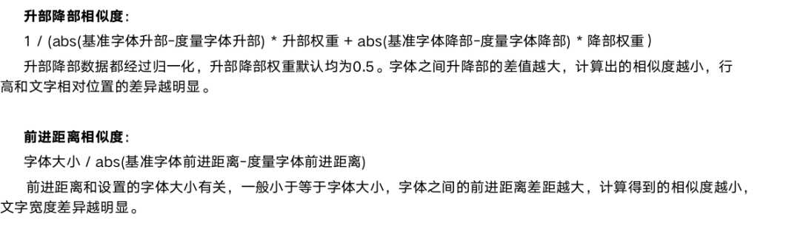
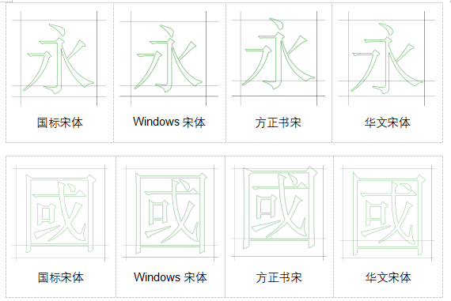
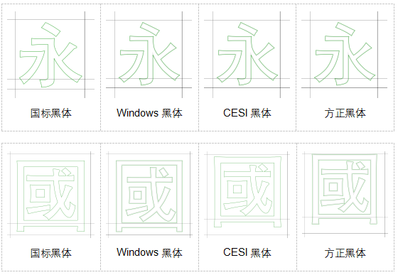
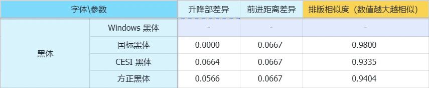
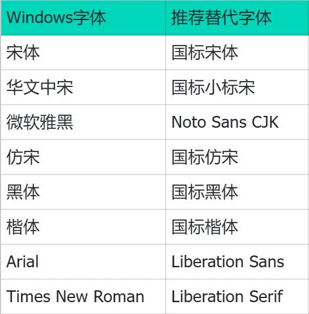

# Utiliser les polices GB pour aider à la migration du système

Lorsque vous migrez des applications et des documents de Windows vers openKylin, des différences de rendu de texte peuvent apparaître en raison des environnements de polices différents. Il est donc nécessaire de choisir des polices système appropriées pour l’adaptation de la migration, en trouvant les polices système les plus similaires aux polices d’origine en termes de mise en page, et en utilisant ces polices pour afficher les applications et documents migrés.

Dans le système openKylin, nous avons ajouté une série de polices GB fournies par l’Institut de normalisation électronique de Chine, comprenant cinq styles de polices : Song, Hei, FangSong, Kai et XiaoBiaoSong.

Comme indiqué ci-dessous, notre analyse montre que les polices de la série GB sont similaires aux polices correspondantes de Windows en termes de paramètres de mise en page et prennent en charge la norme GB18030-2022. Parmi elles, la série “GB Song - Super Large Character Set” prend en charge l’ensemble des caractères chinois de la norme et devrait être la principale police de migration.

1.  **Formule de migration des polices**

Si vous pouvez trouver des polices système similaires aux polices d’origine en termes de mise en page, utiliser ces polices similaires pour la migration peut résoudre au mieux les problèmes de texte lors de la migration du système.

Pour cela, nous avons proposé la formule de calcul de la similarité des polices ci-dessous, afin de quantifier l’effet de remplacement de la mise en page lors de la migration des polices, en recherchant des polices similaires en termes de hauteur d’ascendante, de hauteur de descendante et de distance d’avance.

2. **Analyse de la migration des polices**

Prenons comme exemples le caractère chinois simplifié “永” et le caractère chinois traditionnel “國”, et analysons la similarité des polices chinoises courantes et des polices spécifiées par Windows en termes d’effet visuel et de données quantifiées.

Tout d’abord, pour la police Song courante, on peut voir que visuellement, la police GB Song est la plus similaire à la police Song de Windows en termes de mise en page ; et après avoir quantifié les paramètres des polices, le meilleur résultat est également la police GB Song.

Les résultats pour la police FangSong sont similaires, que ce soit en termes de données ou d’effet visuel, la police GB FangSong reste le meilleur choix pour garantir la cohérence de la mise en page lors de la migration des documents.

Pour la police Hei, en combinant les effets visuels de “永” et “國”, la police GB Hei est le meilleur choix de migration pour la police Hei de Windows.

En termes d’effet visuel de la police HuaWen ZhongSong, la police GB XiaoBiaoSong est plus proche, tandis que la police CESI XiaoBiaoSong a une disposition globale plus haute.。

3. **Résumé de la migration des polices**

Comme le montre l’analyse ci-dessus, pour les polices courantes du système Windows, les polices de la série GB présentent une grande similarité avec ces polices en termes de chinois simplifié et traditionnel.

Nous pouvons donc conclure que : les polices GB ont une grande valeur d’utilisation lors de la migration du système. Utiliser les polices GB pour migrer des applications et des documents peut aider à maintenir une bonne cohérence de mise en page. La liste complète des polices de remplacement pour les polices courantes de Windows dans openKylin est illustrée ci-dessous.

