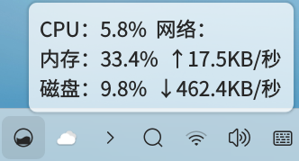
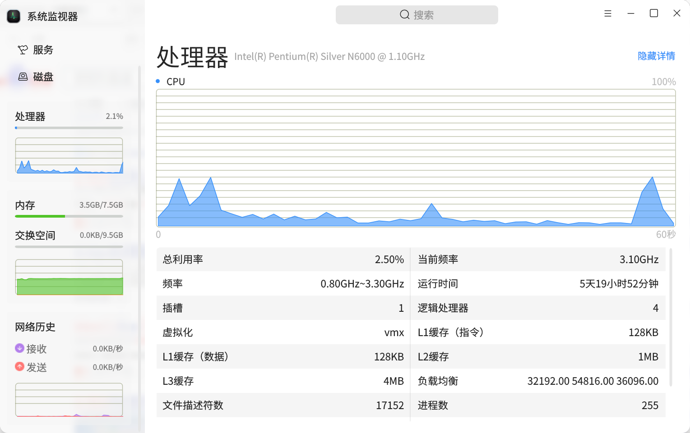
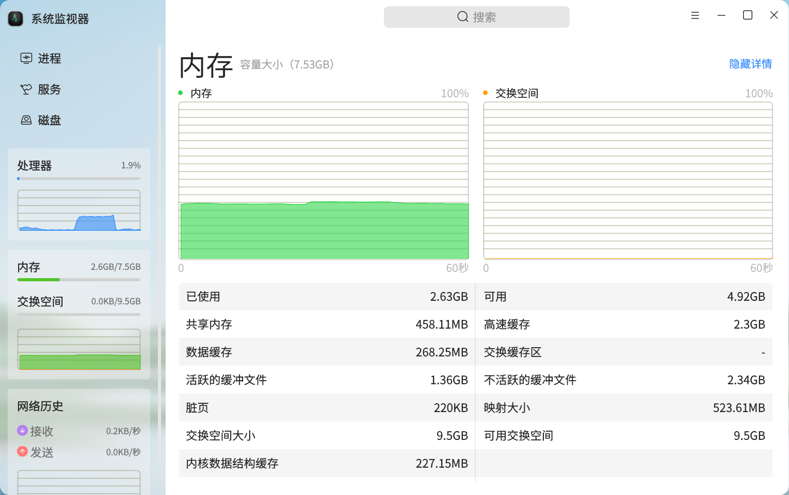
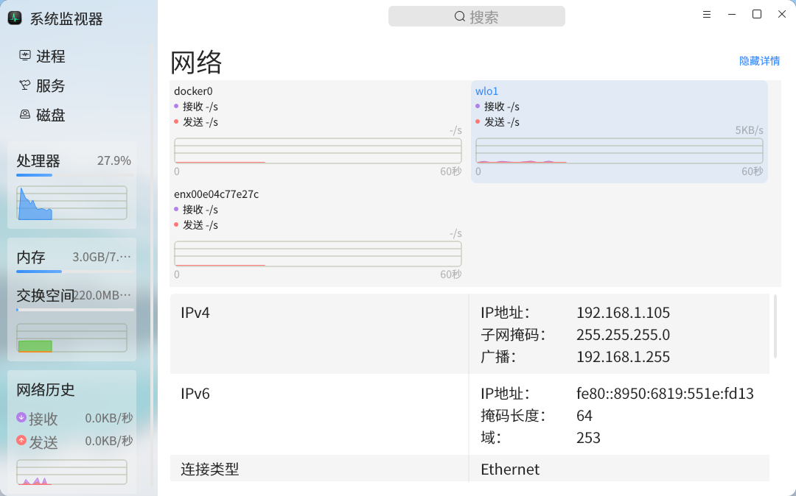

# Moniteur Systeme OpenKylin

# Nouvelles fonctionnalités du moniteur système openKylin 2.0 !

Le moniteur système openKylin est une application de bureau destinée aux utilisateurs du système d'exploitation openKylin, qui répond aux besoins de surveillance et de gestion de diverses ressources système. Dans les chapitres précédents, nous vous avons présenté les fonctions du moniteur système openKylin, y compris le processeur, l'espace d'échange, le réseau, le disque, les processus et les services. Aujourd'hui, nous allons vous parler des nouvelles fonctionnalités utiles qui seront bientôt disponibles dans la version 2.0 d'openKylin.

## I. Minimisation dans la barre d'état système

Auparavant, lorsque vous cliquiez sur le bouton "X" dans le coin supérieur droit, le moniteur système se fermait directement. Maintenant, l'équipe UKUI SIG a ajouté une fonction de minimisation dans la barre d'état système. En cliquant sur le bouton "X" dans le coin supérieur droit, une icône du moniteur système apparaîtra dans la barre des tâches. En survolant cette icône avec la souris, vous pourrez voir l'utilisation du CPU, les vitesses de téléchargement et d'envoi du réseau, l'utilisation de la mémoire et l'utilisation du disque.

Un clic droit sur le menu permet de quitter le moniteur système ou d'activer la fenêtre du moniteur système, tandis qu'un clic gauche active la fenêtre du moniteur système.

## II. Affichage détaillé de l'historique du processeur, de la mémoire et du réseau

Le moniteur système openKylin a ajouté des interfaces d'affichage détaillé pour trois modules : l'historique du processeur, de la mémoire et du réseau. Vous pouvez y accéder en cliquant sur les modules correspondants dans la partie gauche de l'interface principale, et les détails s'afficheront dans la partie droite. Vous pouvez revenir à la page des processus en cliquant sur le bouton "Masquer les détails" dans le coin supérieur droit.

* La nouvelle page de détails du processeur affiche l'utilisation totale du processeur, la fréquence actuelle, la fréquence, le socket, les processeurs logiques, la virtualisation, le cache L1 (instructions), le cache L1 (données), le cache L2, le cache L3, l'équilibrage de charge, le nombre de descripteurs de fichiers, le nombre de processus, le nombre de threads, le nom de l'ordinateur, etc.

* La nouvelle page de détails de la mémoire et de l'espace d'échange affiche la mémoire utilisée, la mémoire disponible, la mémoire partagée, le cache rapide, le cache de données, le cache d'échange, les fichiers tampons actifs, les fichiers tampons inactifs, les pages sales, la taille de mappage, la taille de l'espace d'échange, l'espace d'échange disponible, le cache des structures de données du noyau, etc.

* La nouvelle page de détails de l'historique réseau affiche des graphiques de fluctuation de la vitesse de réception et d'envoi pour chaque carte réseau, ainsi que 21 éléments d'information tels que IPv4 (connecté), IPv6 (connecté), type de connexion, nom du réseau (WiFi connecté), qualité du signal (WiFi connecté), force du signal (WiFi connecté), bruit de fond (WiFi connecté), MAC, débit, nombre de paquets reçus, total reçu, reçus (paquets erronés), reçus (paquets abandonnés), FIFO de réception, erreurs de trame, nombre de paquets envoyés, total envoyé, envoyés (paquets erronés), envoyés (paquets abandonnés), FIFO d'envoi, perte de porteuse, etc. Vous pouvez basculer entre les informations des cartes réseau en cliquant sur le graphique.

## III. Raccourcis clavier

Deux nouvelles fonctions de raccourci clavier ont été ajoutées pour améliorer l'utilisabilité du clavier :

* Activation rapide de la barre de recherche
  Dans l'interface du moniteur système, vous pouvez rapidement activer la barre de recherche en utilisant Ctrl + E

* Activation rapide du menu contextuel
  Dans le moniteur système, partout où il y a un menu contextuel, vous pouvez l'activer en utilisant Shift+F10 après avoir obtenu le focus

Voilà toutes les nouvelles fonctionnalités qui seront bientôt disponibles dans le moniteur système openKylin. Plus de fonctionnalités seront introduites ultérieurement pour améliorer l'efficacité de la gestion des ressources système par les utilisateurs.
