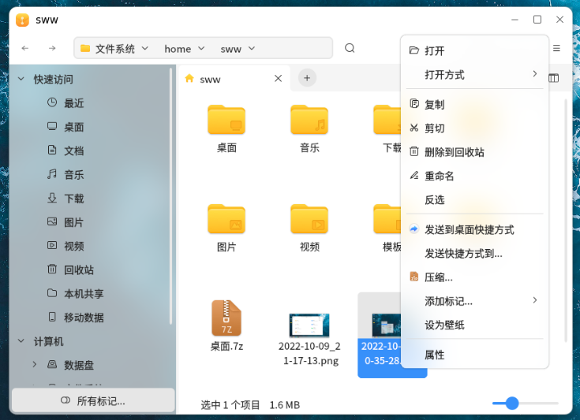
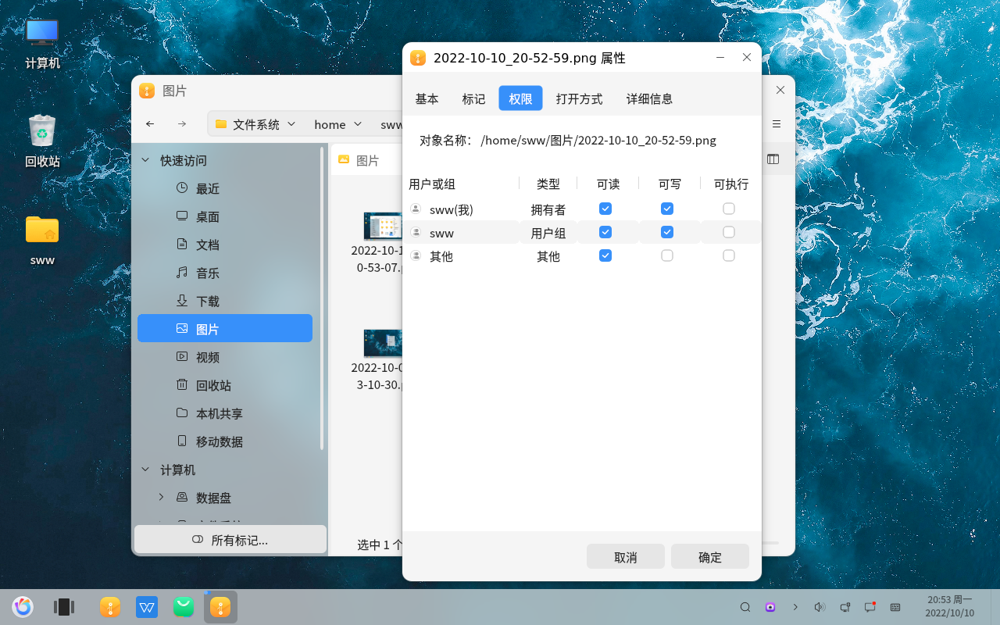

# Propriétés de base d'openKylin : Vérifier les permissions de lecture, écriture et exécution des fichiers
#### Auteur : Shi Wanwu
#### 2022-11-21 22:38:16
#### openKylin-0.7.5-x86_64

&emsp;

Cliquez avec le bouton droit sur le fichier - Propriétés

Vérifiez les permissions du fichier

Les permissions comprennent la lecture, l'écriture et l'exécution.

Les catégories sont : Utilisateur, Groupe de l'utilisateur, Autres
&emsp;

