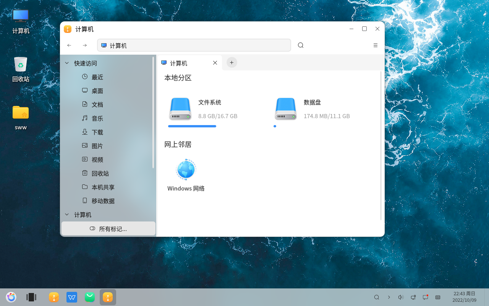
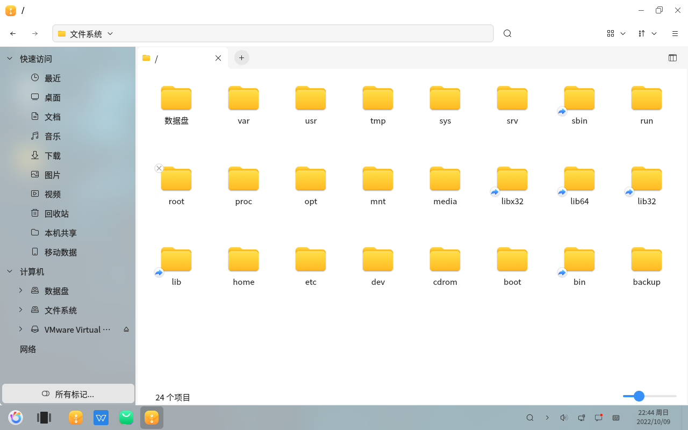
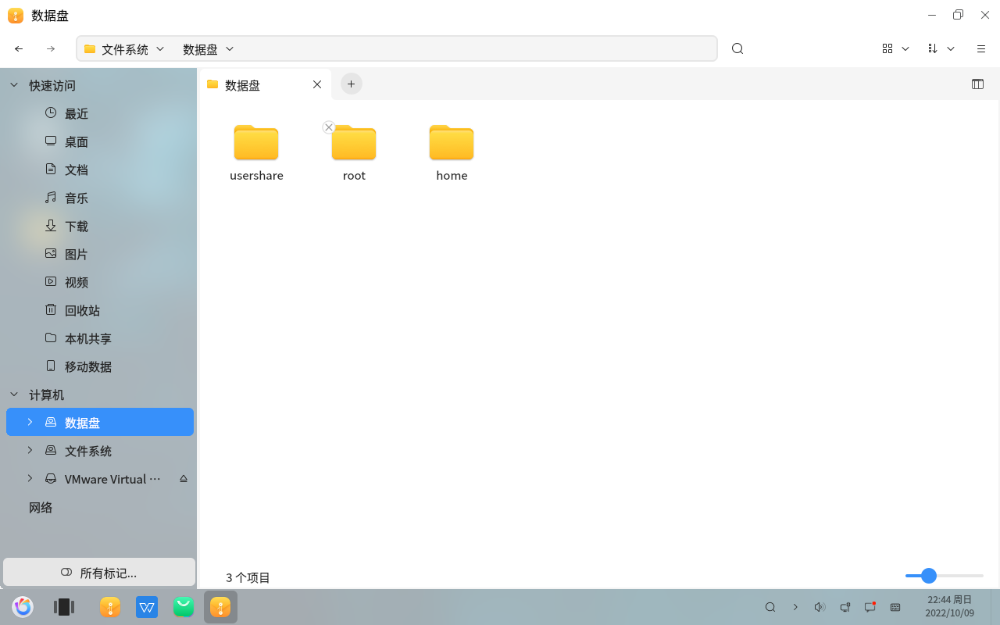

# openKylin : Vérifier les partitions par défaut de l'ordinateur
#### Auteur : Shi Wanwu
#### 2022-11-21 22:38:16
#### openKylin-0.7.5-x86_64

&emsp;

#### Ordinateur

Vous pouvez voir le disque du système de fichiers et le disque de données.

#### Vérifiez le répertoire racine

Dans le système de fichiers openKylin, chaque dossier a une fonction et une localisation spécifiques. Les personnes intéressées peuvent approfondir leurs connaissances.

#### Voir le contenu du disque de données

&emsp;

