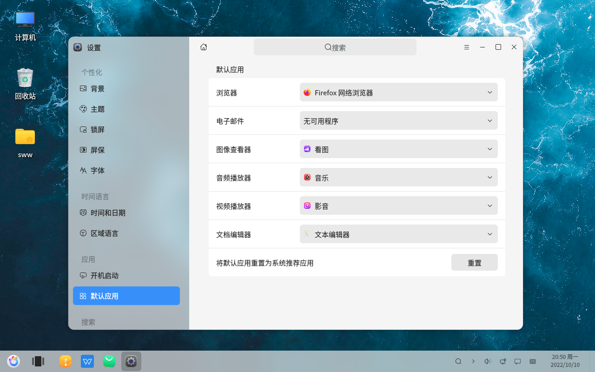

# Paramètres - Consulter les applications par défaut
#### Auteur : Shi Wanwu
#### 2022-11-21 22:38:16
#### openKylin-0.7.5-x86_64

&emsp;

Paramètres - Applications - Applications par défaut

Dans notre utilisation quotidienne, il arrive que nous installions un nouveau logiciel, mais que lors d'un double-clic sur un fichier pour l'ouvrir, nous constations que le programme utilisé est toujours l'ancien. Dans ce cas, nous pouvons résoudre ce problème en modifiant l'application par défaut pour ouvrir le fichier.

&emsp;