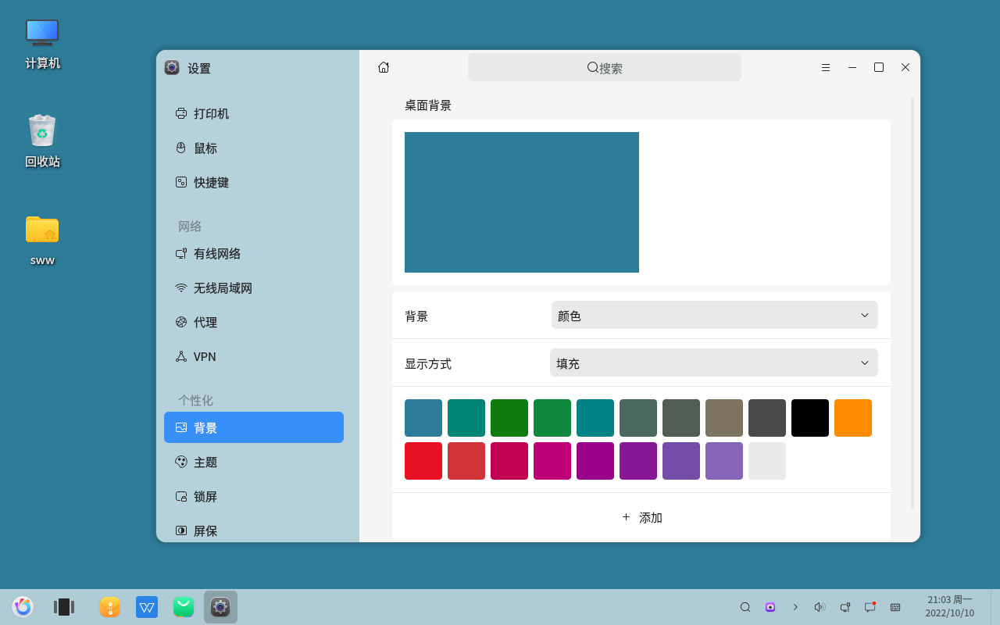

# Paramètres - Définir un arrière-plan de couleur unie
#### Auteur : Shi Wanwu
#### 2022-11-21 22:38:16
#### openKylin-0.7.5-x86_64

&emsp;

Paramètres - Personnalisation - Arrière-plan

Style rétro, imitation de XP.
Certains logiciels de détection de fuites de lumière sur les écrans utilisent également des arrière-plans de couleur unie.

&emsp;