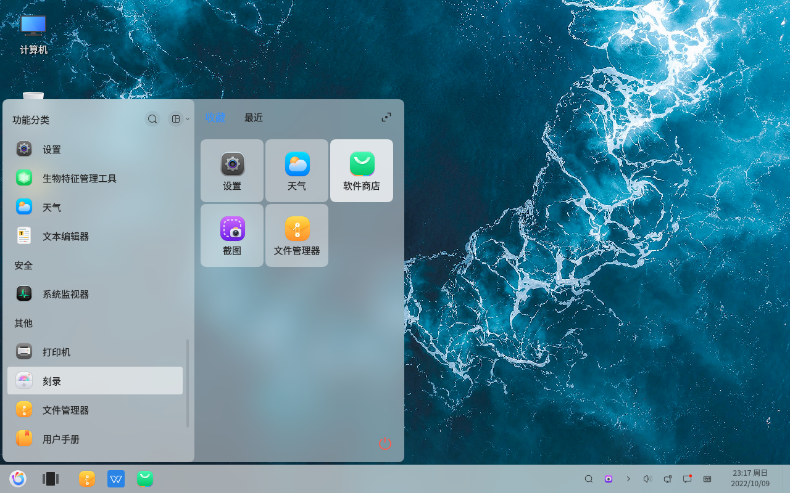
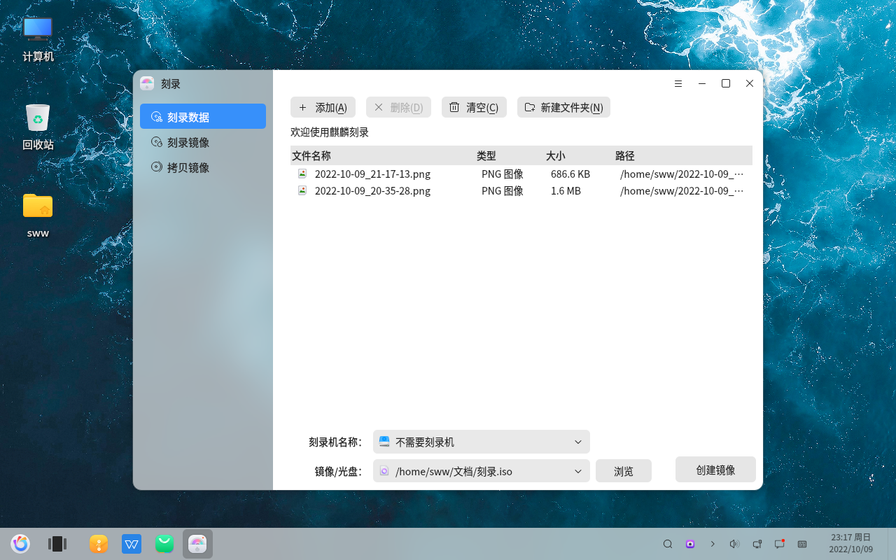
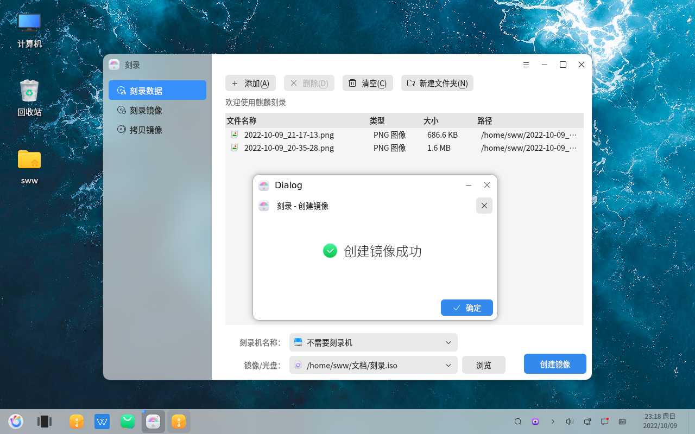
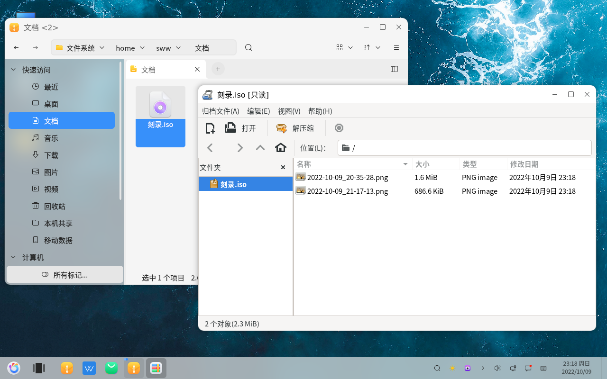

# Création d'images ISO
#### par Master of All Things
#### 2022-11-21 22:38:16
#### openKylin-0.7.5-x86_64

Logo en bas à gauche - Autre - Gravure

Ajouter des données de gravure

Créer une image

Vérifier l'objet créé

La forme de montage d'un fichier dans une ISO peut généralement être utilisée de la manière suivante : la machine virtuelle transfère le fichier en montant l'image

&emsp.