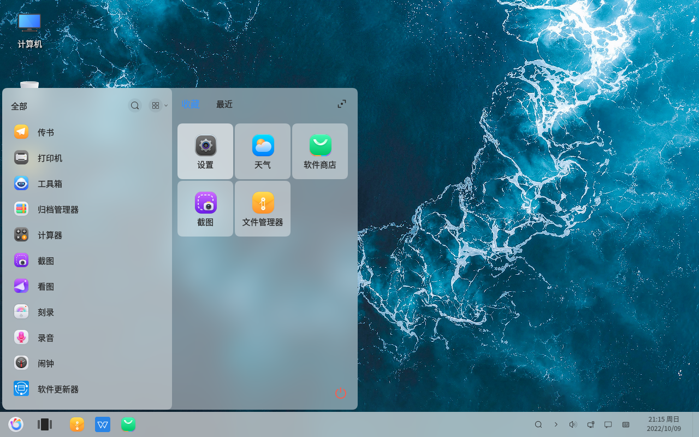
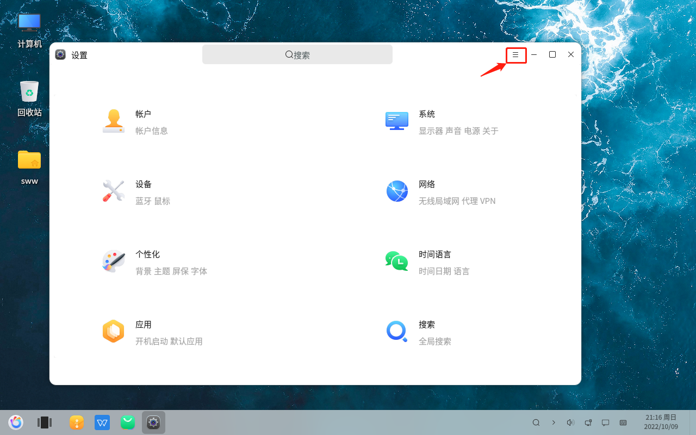
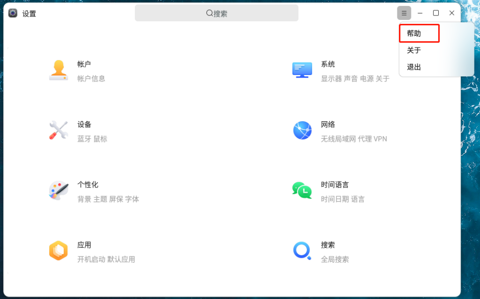
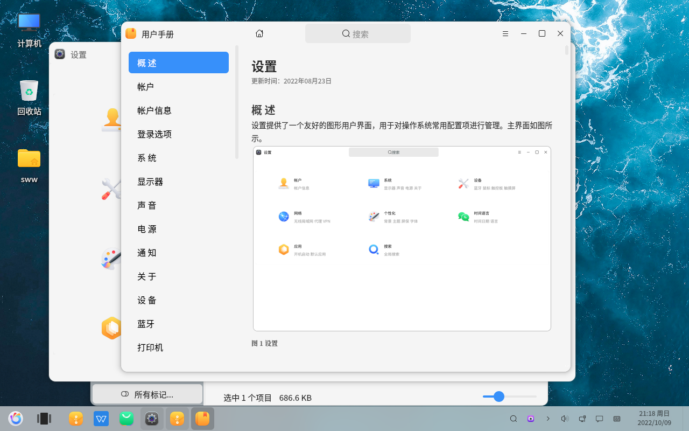

# openkylin基础 F1 查看用户手册
#### 作者：师万物
#### 2022-11-21 22:38:16
#### openKylin-0.7.5-x86_64

&emsp;

我知道两种调出用户手册的方法

1. 使用快捷键 F1
2. 通过设置-帮助

主要讲一下第二种方法的操作步骤。

&emsp;

左下角logo - 设置

设置界面右上角的三道横线

帮助

用户手册

通过阅读用户手册，能有效地解决一部分问题

&emsp;

