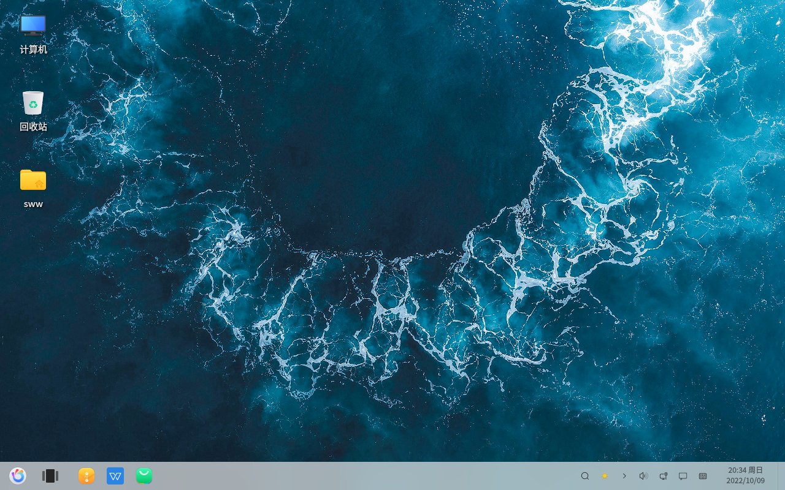
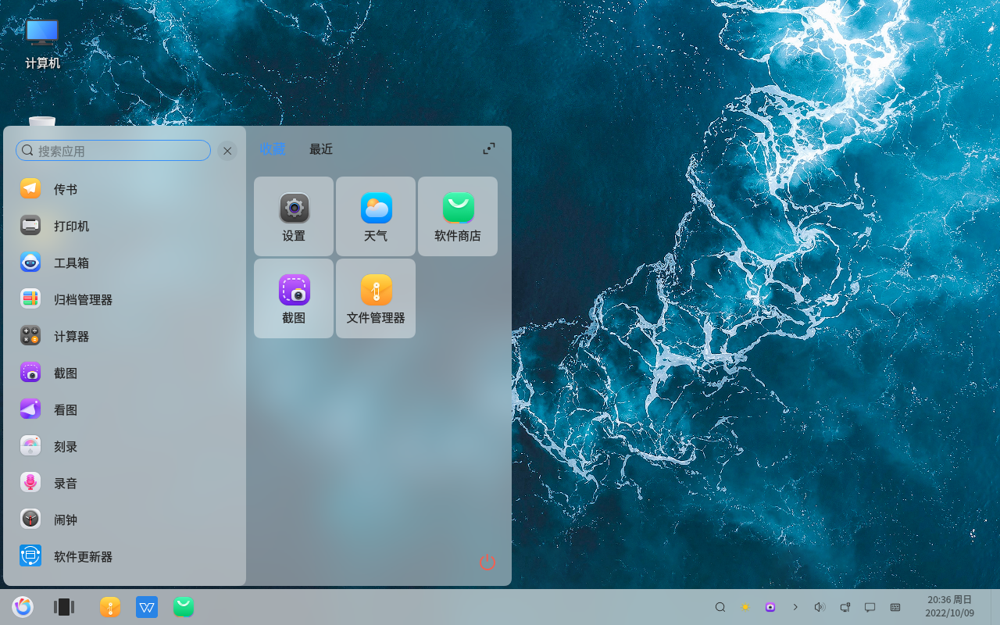
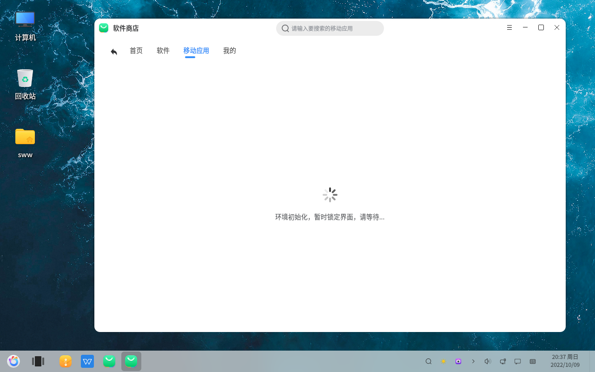
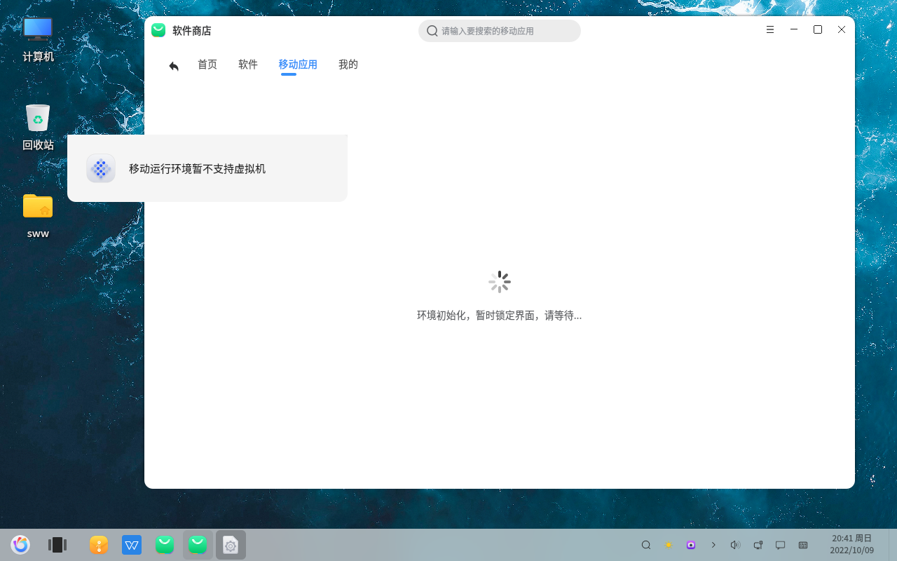
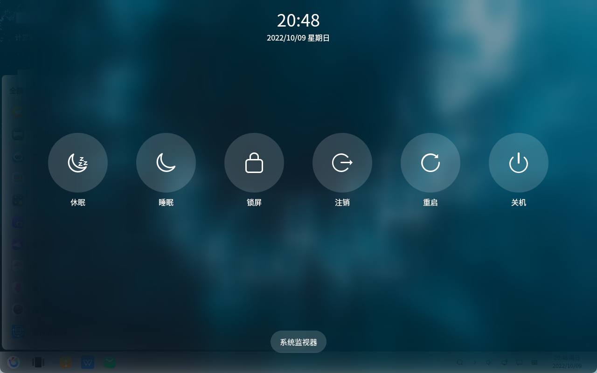

# openkylin基础 桌面展示
#### 作者：师万物
#### 2022-11-21 22:38:16
#### openKylin-0.7.5-x86_64

&emsp;

开始菜单

软件商店-移动应用

我用的是虚拟机，安装移动应用需要初始化移动运行环境，而移动运行环境是不支持虚拟机的，所以尝试失败了，以后有机会找个物理机再进行尝试。

电源菜单

有休眠 睡眠 锁屏 注销 重启 关机

&emsp;

