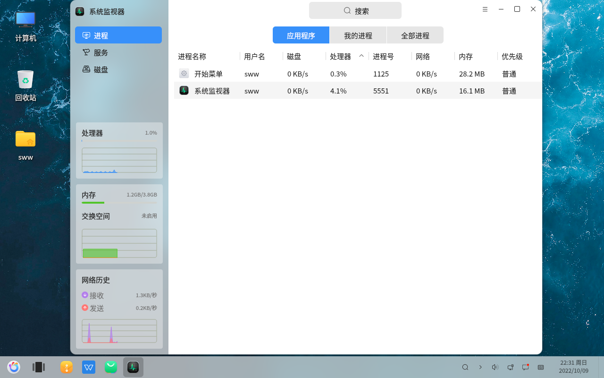
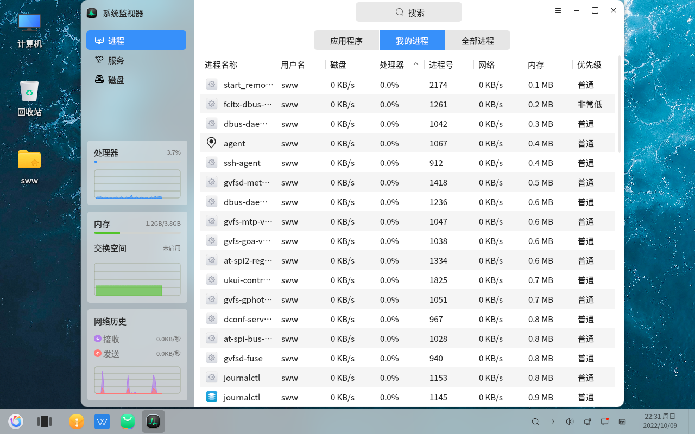
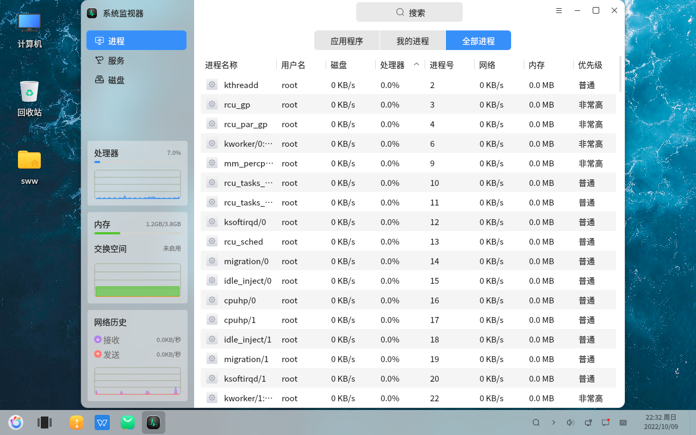
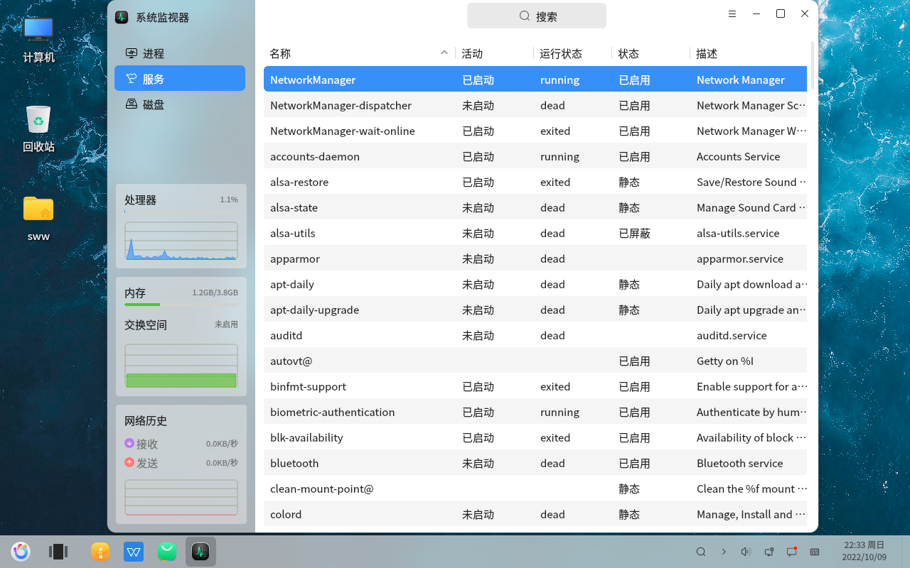
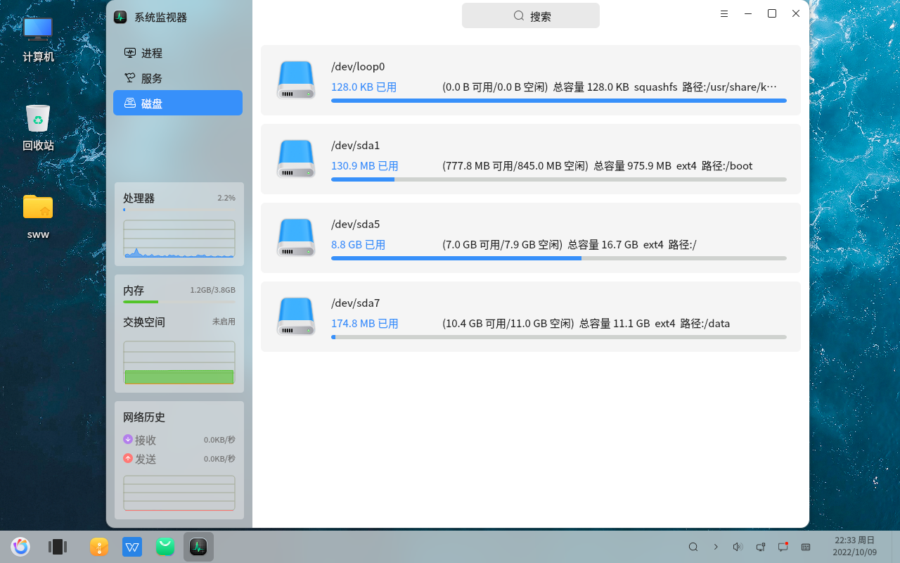

# openkylin基础 系统监视器 查看进程
#### 作者：师万物
#### 2022-11-21 22:38:16
#### openKylin-0.7.5-x86_64

&emsp;

系统监视器 - 进程 - 应用程序

系统监视器 - 进程 - 我的进程

系统监视器 - 进程 - 全部进城

系统监视器 - 服务

系统监视器 - 磁盘

注意磁盘命名是有规则的，感兴趣地同学可以了解一下。

想学习操作系统的同学，可以从进程的角度入手，了解进程的状态、调度算法和相关依赖等信息。

&emsp;

