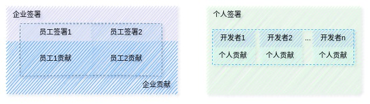
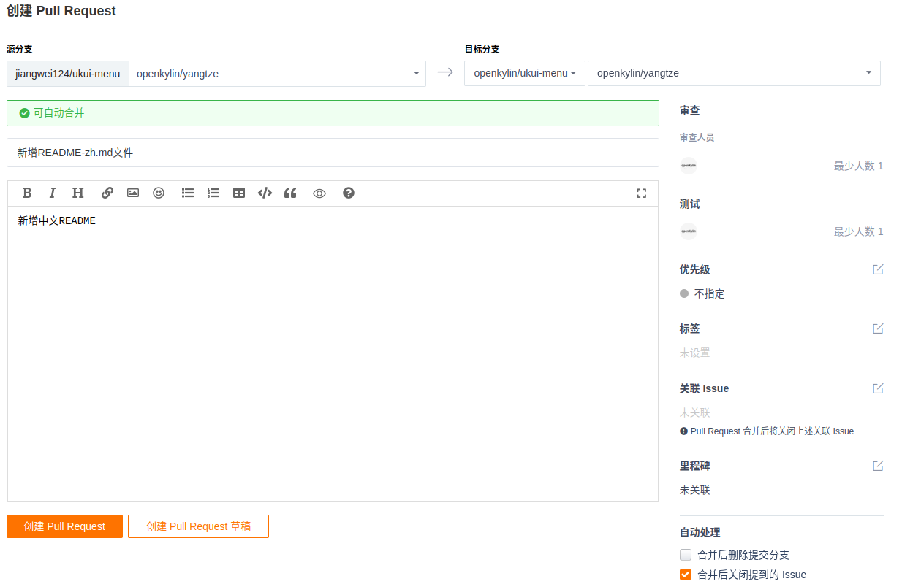
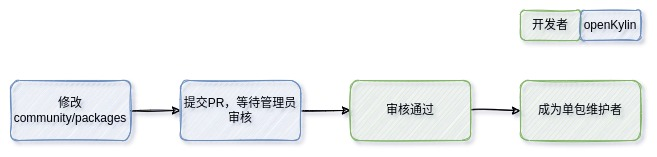

Voici la traduction en français du guide de participation à la communauté openKylin :

## Guide de participation à la communauté openKylin

Le 24 juin 2022, la conférence de lancement de la première communauté racine de système d'exploitation de bureau en Chine, openKylin, s'est tenue en ligne avec succès sous le thème "Créer l'open source, profiter d'un avenir sans limites". La communauté open source openKylin a été officiellement lancée. De nombreux experts ont participé à la conférence, attirant l'attention de nombreux développeurs et faisant à nouveau la une des actualités de CCTV et des plateformes de médias sociaux. Depuis le lancement d'openKylin, nous avons reçu de nombreuses questions de nos amis, dont les plus fréquentes concernent la manière de participer correctement à la communauté openKylin et comment soumettre des contributions individuelles à la communauté. Cet article présente la bonne approche pour participer à la communauté openKylin en répondant à ces deux questions.

### 1. Signer le CLA

CLA signifie "Contributor License Agreement" (Accord de licence du contributeur). Pour éviter des problèmes ou des conflits inutiles, que ce soit pour les entreprises, les employés ou les développeurs individuels, il est nécessaire de signer un CLA correspondant à leur identité avant de contribuer à la communauté openKylin. L'adresse de signature du CLA de la communauté openKylin est [https://cla.openkylin.top](https://cla.openkylin.top). Voici une brève introduction aux trois formes de signature CLA dans la communauté openKylin et aux processus de signature correspondants.

#### 1.1 Signature du CLA d'entreprise

Le processus de signature d'entreprise est plus complexe. La signature du CLA d'entreprise approuvée par la communauté openKylin permet de rejoindre le système de membres de la communauté. Les avantages des membres de la communauté sont les suivants :

- Postuler pour devenir membre du conseil d'administration, bénéficier de conseils sur l'orientation du développement de la communauté, la planification du développement et la mise en œuvre des directives ;
- Demander la [création](https://www.openkylin.top/join/application-cn.html) d'un groupe SIG, et pouvoir désigner le propriétaire du groupe SIG pour participer à l'élection du comité technique ;
- Demander à [rejoindre](https://www.openkylin.top/join/application-cn.html) un [groupe SIG](https://www.openkylin.top/join/sig-cn.html) existant, participer aux discussions et contributions sur le développement technique, le code, etc. ;
- Postuler pour devenir membre du comité écologique, participer aux activités opérationnelles de la communauté, à la promotion conjointe de la marque, à l'échange de cadeaux et autres avantages.

Le processus de signature du CLA d'entreprise est illustré dans l'image suivante :


1. Tout d'abord, soumettez les informations de base de la signature d'entreprise sur la [page de signature d'entreprise](https://cla.openkylin.top/cla/sign/corporation_cla/openKylin-f46f289e01bc11edb8990242ac110005). Les champs "Entreprise", "Contact", "Poste", "Email" et "Code de vérification" sont obligatoires, les autres informations peuvent être laissées vides ;
2. Après avoir cliqué sur le bouton de signature, vous recevrez un e-mail à l'adresse fournie à l'étape précédente. L'e-mail contiendra les informations de base saisies à l'étape précédente ainsi que trois fichiers en pièce jointe. Suivez les instructions dans l'e-mail pour compléter les étapes suivantes ;
3. Une fois que l'administrateur de la communauté openKylin aura reçu les documents envoyés, il examinera les informations fournies. Après approbation, il téléchargera les pièces jointes sur la plateforme CLA et ajoutera automatiquement un compte d'administrateur d'entreprise pour votre entreprise. Ce compte sera envoyé à l'adresse e-mail fournie à la première étape ;
4. Connectez-vous à la plateforme CLA avec le compte d'administrateur d'entreprise et modifiez le mot de passe. À ce stade, le processus de signature du CLA d'entreprise est terminé (cette étape n'est pas obligatoire, mais il est recommandé de la compléter pour éviter d'oublier ou de supprimer par erreur l'e-mail de l'administrateur d'entreprise).

> **CONSEILS !**
>
> Une fois la signature d'entreprise terminée, le compte reçu dans l'e-mail de l'entreprise est le compte d'administrateur d'entreprise. Ce compte est utilisé pour examiner les informations de signature des employés associés à l'entreprise. Si l'administrateur de l'entreprise doit également soumettre des contributions sur gitee, il doit également utiliser une adresse e-mail correspondant au suffixe de l'entreprise pour lier son identifiant gitee et signer le CLA employé. C'est seulement ainsi que la vérification CLA du CI pourra être passée !

#### 1.2 Signature du CLA employé

Une fois que votre entreprise a terminé la signature du CLA d'entreprise, vous pouvez procéder à la signature du CLA employé en utilisant une adresse e-mail correspondant au suffixe de votre e-mail d'entreprise. Le processus de signature des employés est illustré dans l'image suivante.


1. Ouvrez la [page de signature des employés](https://cla.openkylin.top/cla/sign/employee_cla/openKylin-f46f289e01bc11edb8990242ac110005), remplissez les informations de base, cliquez sur le bouton d'envoi du code de vérification, entrez le code de vérification reçu par e-mail dans le champ correspondant, cochez **J'ai lu l'accord et j'accepte de le signer**, cliquez sur le bouton de signature, une notification apparaîtra indiquant que la signature de l'employé a été soumise ;
2. Contactez l'administrateur de l'entreprise, qui activera votre demande de signature d'employé sur la page de gestion des employés ;
3. Une fois que l'administrateur de l'entreprise aura activé votre demande de signature, vous recevrez un e-mail de confirmation de la signature du CLA à l'adresse e-mail que vous avez fournie, indiquant que la signature du CLA employé est entièrement terminée.

#### 1.3 Signature du CLA individuel

Si vous êtes un développeur individuel ou si votre entreprise n'a pas signé de CLA d'entreprise, vous pouvez soumettre vos contributions à la communauté openKylin en signant un CLA individuel. Le processus de signature du CLA individuel est similaire à celui du CLA employé, comme illustré ci-dessous.


1. Ouvrez la [page de signature individuelle](https://cla.openkylin.top/cla/sign/person_cla/openKylin-f46f289e01bc11edb8990242ac110005), remplissez les informations personnelles de base, cliquez sur le bouton d'envoi du code de vérification, entrez le code de vérification reçu par e-mail dans le champ correspondant, cochez **J'ai lu l'accord et j'accepte de le signer**, cliquez sur le bouton de signature, une notification apparaîtra indiquant que la signature a réussi ;
2. Ouvrez votre boîte e-mail personnelle, vous recevrez un e-mail confirmant l'approbation de la signature du CLA individuel.

> **CONSEILS !**
>
> - Chaque adresse e-mail ne peut signer qu'un seul CLA
> - L'identifiant gitee dans les signatures d'employé et individuelles doit être correct. S'il est incorrect, la vérification CLA du CI échouera lors de la soumission d'une PR sur gitee, et votre PR sera étiquetée `openkylin-cla/no`.

#### 1.4 Différences entre les trois formes de signature

À ce stade, certains d'entre vous pourraient se demander pourquoi il existe trois formes de signature CLA. Ne vous inquiétez pas, examinons l'image ci-dessous :



La signature des employés doit être basée sur l'entreprise. Si l'entreprise du développeur a signé un CLA d'entreprise, tous les employés de cette entreprise peuvent signer le CLA employé appartenant à cette entreprise. Par conséquent, **les contributions soumises par les employés à la communauté openKylin (y compris, mais sans s'y limiter, les PR, les ISSUES, etc.) sont considérées comme des contributions de l'entreprise à la communauté openKylin**.

Si vous êtes un développeur individuel ou si l'entreprise du développeur n'a pas signé de CLA d'entreprise, vous pouvez signer le CLA sous forme individuelle. Par conséquent, **les contributions soumises à la communauté openKylin par les développeurs ayant signé le CLA individuel appartiennent au développeur individuel**.

### 2. Soumettre des contributions

Après avoir terminé la première étape de signature du CLA, vous pouvez commencer à soumettre vos contributions à la communauté openKylin. Nous allons utiliser un exemple simple de dépôt pour montrer comment soumettre votre propre "contribution PR".

openKylin utilise le "flux de travail git" populaire dans l'industrie, donc avant de contribuer, nous devons avoir une compréhension de base de `git`.

#### 2.1 Configuration de l'environnement git

Comme le dit le proverbe, "Un bon ouvrier a toujours de bons outils". Avant d'expliquer formellement comment soumettre vos contributions, nous devons configurer l'environnement git localement. Tout d'abord, nous devons installer git localement, ce qui peut être fait avec la commande suivante.

```bash
# debian
apt install git
# arch Linux
pacman -S git
```

Après l'installation, saisissez `git version` dans le terminal. Si la sortie correspond (similaire à l'image ci-dessous), cela signifie que l'installation a réussi.


Une fois l'installation de git confirmée, vous pouvez saisir des commandes dans le terminal pour configurer vos informations personnelles. Nous n'avons besoin de configurer que les informations utilisateur les plus basiques.

```bash
git config --global user.email "zhangsan@gmail.com" # Configurer l'e-mail de commit
git config --global user.name "zhangsan" # Configurer le nom d'utilisateur du contributeur
```

> **CONSEILS !**
>
> Il est recommandé que les informations de configuration `email, name` correspondent à l'`email lié` et à l'`ID utilisateur` de votre compte gitee. Ainsi, vous pourrez voir votre carte thermique de contributions sur votre page personnelle !

#### 2.2 Soumettre une PR

Dans la section précédente, nous avons terminé l'environnement `git` localement. Maintenant, passons au processus de contribution de code. Avant cela, nous devons d'abord créer un compte sur `gitee`. Si vous n'avez pas de compte `gitee`, vous pouvez cliquer sur ce lien pour en créer un : https://gitee.com/signup. Une fois que vous avez créé votre compte gitee, vous pouvez soumettre vos contributions personnelles à la communauté openKylin sur gitee. Le processus de soumission des contributions est illustré dans l'image ci-dessous. Nous allons utiliser le dépôt `openKylin/ukui-menu` comme exemple pour montrer comment soumettre une PR à la communauté openKylin sur gitee.


1. Sur gitee, forkez une copie du dépôt qui vous intéresse vers votre compte personnel (cet article utilise ukui-menu comme exemple). Comme le montre l'image ci-dessous, cliquez sur le bouton fork pour copier le dépôt sur votre compte personnel.


2. Après avoir forké le dépôt sur votre compte personnel, vous pouvez modifier le code dans votre environnement local. Utilisez la commande suivante pour cloner le code localement :

   ```bash
   cd /home/test/data/work/openkylin/code # Trouvez un chemin qui vous convient
   git clone https://gitee.com/jiangwei124/ukui-menu # Clonez le code ukui-menu localement
   ```

3. Grâce à la deuxième étape, nous avons cloné le code du dépôt `ukui-menu` de notre propre compte localement. Ensuite, trouvez un IDE que vous maîtrisez pour ouvrir le projet `ukui-menu` ou opérez directement en ligne de commande (si vous vous sentez à l'aise). Ici, nous allons faire une démonstration très simple en ajoutant un document `README-zh.md`. Si vous n'êtes pas un expert technique, il est généralement recommandé de commencer par contribuer à la `documentation` de la communauté, car c'est la méthode la plus simple et la plus facile à faire approuver par la communauté.

   ```bash
   cd /home/test/data/work/openkylin/code/ukui-menu
   touch README-zh.md # Créer
   vim README-zh.md # Saisir le contenu
   ```

   Après avoir traduit le fichier `README.md` et enregistré le contenu traduit dans le fichier `README-zh.md`, vous pouvez utiliser `git` pour soumettre notre nouveau contenu à notre `dépôt gitee` personnel. Si vous pouvez voir l'image suivante sur gitee, cela signifie que le push a réussi.

   ```bash
   cd /home/test/data/work/openkylin/code/ukui-menu
   git add README-zh.md # Ajouter le fichier à la zone de staging
   git commit -m "add README-zh.md file" # Commit les modifications
   git push # Push les modifications vers le dépôt distant
   ```
   
   

4. Après avoir poussé nos modifications, nous pouvons procéder à la soumission de la PR sur gitee. Cliquez sur l'option `Pull Requests` dans l'image ci-dessus, puis cliquez sur `Nouvelle Pull Request` à droite pour créer une nouvelle `Pull Request`. Remplissez les informations correspondantes sur la page, puis cliquez sur Créer Pull Request, et vous aurez réussi à soumettre votre première PR.

   

   > **CONSEILS !**
   >
   > 1. Lors de la sélection de la branche, veillez à ne pas sélectionner la mauvaise branche de votre dépôt personnel, et la branche du dépôt cible de la communauté openKylin doit être la branche `openkylin/yangtze` ;
   > 2. S'il y a un problème associé, vous pouvez lier cette Pull Request à l'issue. Ainsi, lorsque la PR sera acceptée et fusionnée, l'issue associée sera automatiquement marquée comme terminée !

5. À ce stade, votre première contribution à la communauté openKylin est essentiellement terminée. Ensuite, attendez que le CI compile automatiquement le code que vous avez soumis. Si l'exécution du processus CI échoue, cela signifie que la PR n'a pas passé certaines vérifications de normes et doit être modifiée selon les indications avant de rouvrir la PR ; si l'exécution du processus CI réussit, cela signifie que votre PR a été soumise avec succès, et vous n'avez plus qu'à attendre que l'administrateur du dépôt examine votre PR avant qu'elle ne soit automatiquement fusionnée dans la ligne principale. (**Note : L'examinateur de la PR et le soumetteur de la PR ne devraient pas être la même personne si possible, pour s'assurer que le contenu soumis a été vérifié avant d'être fusionné**)

#### 2.3 Vérifier l'état de la PR

Une fois la PR soumise, il y aura un enregistrement des informations de soumission sur votre page personnelle. En cliquant dessus, vous pouvez accéder à la page de détails de la PR, où vous pouvez voir les informations illustrées dans l'image ci-dessous.


En cliquant sur le lien dans le cadre vert de l'image ci-dessus, vous pouvez accéder aux logs de compilation pour voir les informations détaillées de compilation ! En bref, toutes les informations concernant la PR qui vous intéressent peuvent être vues sur la page de détails de la PR que vous avez soumise.

Si vous voulez vérifier si votre PR soumise a déjà été appliquée à la dernière version ISO, vous pouvez aller sur la [page de téléchargement ISO d'openKylin](https://www.openkylin.top/downloads/) pour télécharger la dernière ISO et vérifier.

#### 2.4 Soumettre un problème (issue)

Outre la méthode de contribution par PR, les issues sont également une forme de contribution. Par exemple, si vous découvrez accidentellement un bug lors de l'utilisation du `système openKylin`, vous pouvez soumettre une issue de défaut dans l'organisation `openKylin`.

- S'il s'agit d'un bug au niveau du système, vous pouvez soumettre une `issue de défaut` dans le dépôt [openKylin/community](https://gitee.com/openkylin/community/issues) ;
- S'il s'agit d'un bug au niveau de l'application, vous pouvez soumettre une `issue de défaut` dans le dépôt correspondant de la communauté openKylin. Par exemple, si vous découvrez parfois un bug de crash lors de la lecture de vidéos en utilisant Kylin Video, vous pouvez soumettre une issue de défaut dans le dépôt [openKylin/kylin-video](https://gitee.com/openkylin/kylin-video/issues) ;


> **CONSEILS !**
>
> Lors de la soumission d'une issue de défaut, décrivez le défaut aussi clairement que possible. S'il y a des fichiers de log, cliquez également sur le bouton de téléchargement de pièce jointe pour télécharger les fichiers de log dans l'issue !

### 3. Rejoindre un SIG

SIG est l'abréviation de Special Interest Group (Groupe d'intérêt spécial). Si vous souhaitez participer plus en profondeur à la communauté openKylin, vous pouvez demander à rejoindre un SIG dans un domaine qui vous intéresse. Vous pouvez consulter la liste actuelle des SIG de la communauté `openKylin` sur https://www.openkylin.top/join/sig-cn.html. Le processus pour qu'un développeur rejoigne un SIG est le suivant.


Voici un exemple pour montrer comment rejoindre un SIG, supposons que je veuille rejoindre le SIG `HTML5` :

1. Forkez le dépôt `openKylin/community` sur votre compte gitee personnel, en vous référant à la section 2.2 ;

2. Clonez le dépôt community de votre compte personnel localement, et modifiez les deux fichiers `community/sig/html5/sig.yaml` et `community/sig/html5/README.md`. Le contenu modifié des fichiers est le suivant :

   **sig.yaml**

   ```yaml
   name: html5
   description: html5 team
   owner:
   - pierre4long
   - insomnia_kylin
   maintainers:
   - name: oatoam
   - name: tylwj
   - name: wonschange
   - name: jiangwei124 # Ajouté
   packages:
   - gecko_b2g
   - gaia_homescreen
   - manifests
   - gaia_system
   - gaia-buildinkeyborad
   ```

   **README.md**

   ```mariadb
   ### Maintainers
   - Tao Mao(maotao@kylinos.cn)
   - Wenjie Li(liwenjie@yhkylin.cn)
   - Changqi Wang(wanghcangqi@kylinos.cn)
   - Jiang Wei(jiangwei1@kylinos.cn) # Ajouté
   ```

3. Une fois les modifications terminées, soumettez le contenu modifié à votre dépôt gitee personnel, puis soumettez une PR au dépôt `openKylin/community` conformément à la section 2.2. Ensuite, attendez patiemment que le propriétaire du SIG examine votre demande. Une fois approuvée, le processus CI fusionnera automatiquement votre demande dans le dépôt principal !

> **CONSEILS !**
>
> - Dans le fichier sig.yaml, les nouvelles informations ajoutées dans le champ name sont votre `gitee id` personnel, vous devez `vous assurer que ce gitee id existe réellement`. Sinon, même si le propriétaire du SIG approuve votre demande, l'exécution du processus CI échouera, ce qui entraînera l'impossibilité de fusionner correctement votre demande dans le dépôt `openKylin/community`.
> - La signature du CLA est une condition préalable à la demande d'adhésion à un SIG, vous devez signer le CLA avant de pouvoir demander à rejoindre un SIG.

### 4. Demander à devenir mainteneur de paquet unique

Étant donné que les membres du SIG de la communauté ont des autorisations trop élevées, si vous souhaitez rejoindre un SIG dans la communauté openKylin, vous devez avoir fait certaines contributions à la communauté avant que le comité technique ne puisse approuver votre demande d'adhésion au SIG. Par conséquent, pour les développeurs ordinaires, il est recommandé de commencer par demander à devenir mainteneur de paquet unique. Le processus pour devenir mainteneur de paquet unique est illustré dans l'image ci-dessous. Pour des explications détaillées sur les mainteneurs de paquet unique, vous pouvez consulter [ce document](https://gitee.com/openkylin/community/blob/master/packages/README.md).



#### 4.1 Demander à devenir nouveau mainteneur de paquet unique

Supposons que vous souhaitiez devenir le mainteneur du paquet unique `ukui-menu`, mais qu'il n'y ait pas d'informations sur ce paquet dans le répertoire `community/packages`. Vous pouvez suivre le processus ci-dessous pour demander à devenir un nouveau mainteneur de paquet unique :

1. Tout d'abord, forkez le dépôt community sur votre compte gitee personnel, puis clonez-le localement :

   ```bash
   cd /home/test/openkylin/community # Trouvez un chemin qui vous convient
   git clone https://gitee.com/jiangwei124/community.git
   ```

2. Ajoutez un nouveau fichier `ukui-menu.yaml` dans le chemin `community/packages`, et saisissez le contenu suivant selon la situation réelle :

   ```yaml
   name: ukui-menu
   path: ukui-menu 
   maintainers:
   - name: zhangsan # gitee id
     openkylinid: 
     displayname: Zhang San
     email: zhangsan@gmail.com
   ```

   > **CONSEILS !**
   >
   > Il faut noter que si le nom du chemin du dépôt est identique au nom du paquet logiciel, le contenu du champ `path` peut être omis. Considérant que le nom du paquet logiciel peut ne pas être conforme aux normes de nommage des dépôts gitee, pour éviter l'échec de création du dépôt, vous pouvez spécifier un chemin séparément !

3. Soumettez le contenu modifié ci-dessus à votre dépôt gitee personnel, puis soumettez une PR au dépôt community de la communauté openKylin. Une fois que l'administrateur aura approuvé votre demande, vous aurez les autorisations pour le dépôt `ukui-menu`, et votre demande pour devenir un nouveau mainteneur de paquet unique sera terminée !

#### 4.2 Demander à devenir mainteneur d'un paquet existant

Similaire à la section précédente sur la façon de devenir un nouveau mainteneur de paquet unique, demander à devenir mainteneur d'un paquet existant est encore plus simple. Vous devez d'abord forker le dépôt `openKylin/community` sur votre compte gitee personnel, puis il suffit de modifier le fichier yaml correspondant au paquet. Supposons que vous vouliez devenir le mainteneur du paquet `ukui-menu`, ajoutez simplement le contenu suivant dans le fichier `packages/ukui-menu.yaml` :

```yaml
name: ukui-menu
path: ukui-menu 
maintainers:
- name: zhangsan
  openkylinid: 
  displayname: Zhang San
  email: zhangsan@gmail.com
# Ajoutez vos informations personnelles
- name: lisi # gitee id
  openkylinid: 
  displayname: Li Si
  email: lisi@gmail.com
```

Avec cela, le guide de participation à la communauté openKylin est terminé. Si vous avez d'autres questions, n'hésitez pas à soumettre une issue ou à rejoindre le groupe WeChat des développeurs !