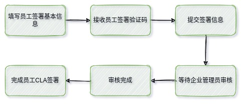
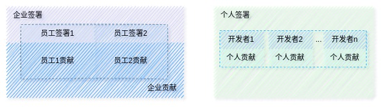
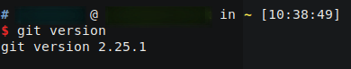
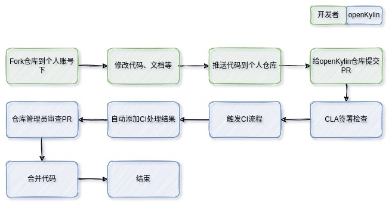
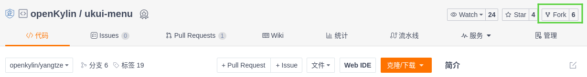
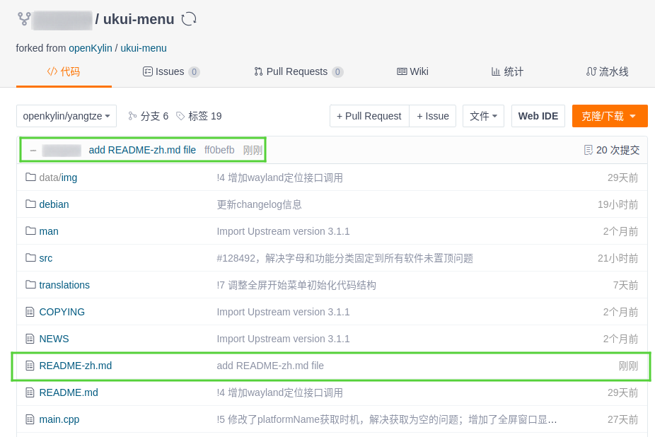
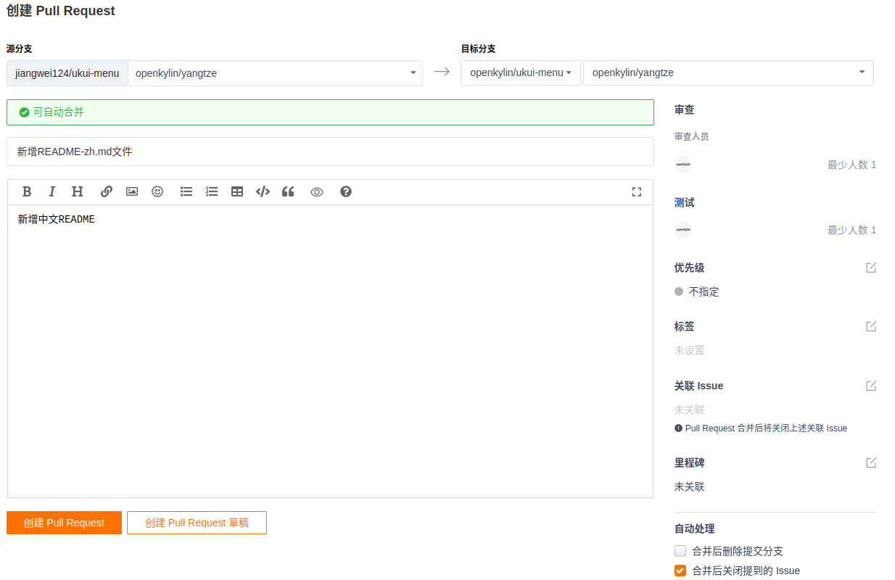
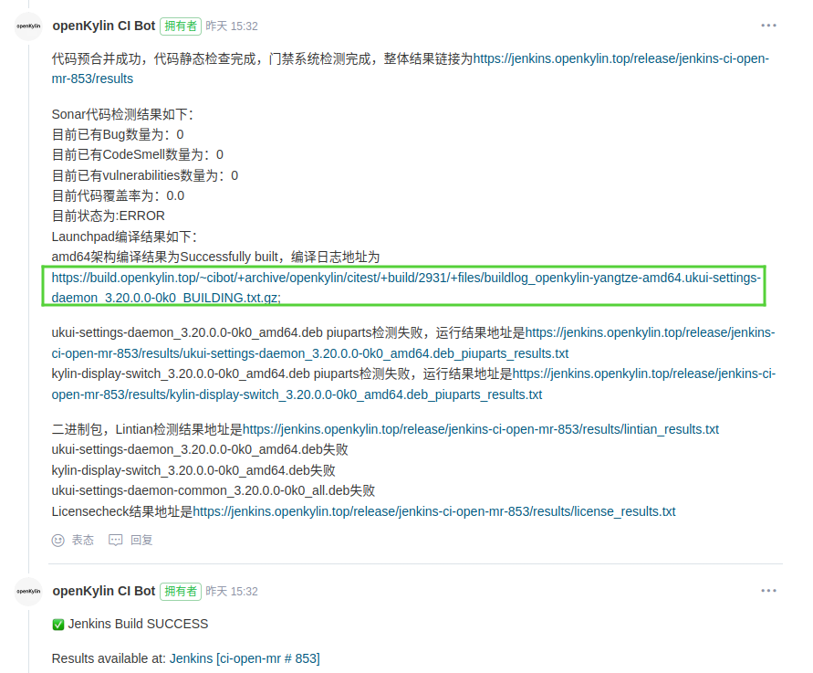
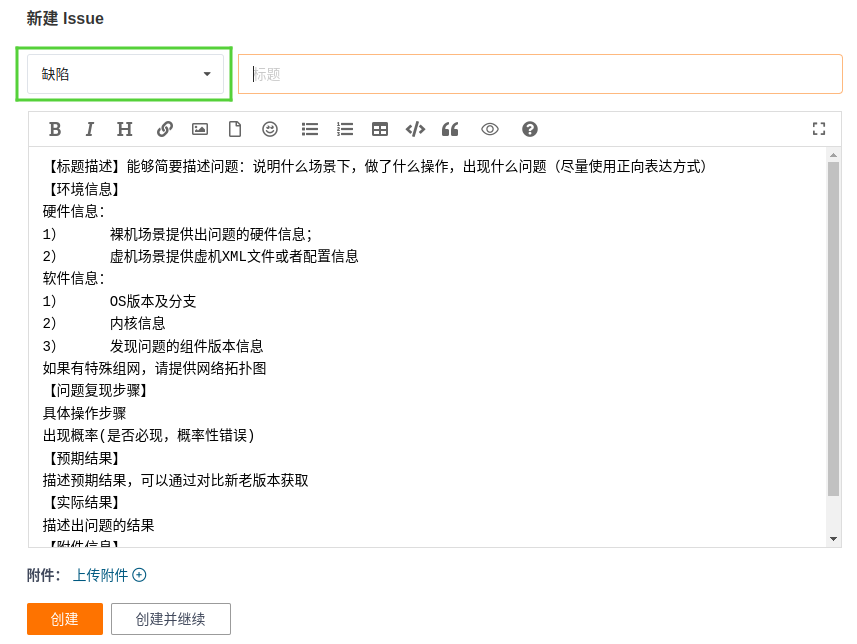
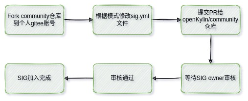

## openKylin社区参与指南

2022年6月24日，以“创开源之势 享无境未来”为主题的中国首个桌面操作系统根社区openKylin发布会在线上成功举行，openKylin开源社区正式发布。各路大咖坐镇发布会，吸引了无数的开发者围观，同时再一次登录央视新闻，多个社交平台热搜霸榜。在openKylin发布后的这段时间内，我们也陆续收到了很多小伙伴的提问，其中关注最多的就是如何正确的参与到openKylin社区，如何正确在社区提交个人贡献，本文就上述两个问题介绍参与到openKylin社区的正确姿势。

### 1. 签署CLA

CLA全称是`Contributor License Agreement`，翻译过来就是贡献者许可协议，为了避免一些不必要的麻烦或纠纷，不管是企业、员工或个人开发者，在为openKylin社区添砖加瓦之前都需要签署相应身份的CLA，openKylin社区CLA签署地址为[https://cla.openkylin.top](https://cla.openkylin.top)，下面就浅介一下openKylin社区的三种CLA签署形式以及相对应的签署流程。

#### 1.1 企业CLA签署

企业签署的流程较为复杂，通过openKylin社区审核的企业CLA签署，可以加入到社区会员体系中，社区会员的权益如下所示

- 申请参选理事会成员单位，享有指导社区发展方向、发展规划和实施指导意见；
- 申请[创建](https://www.openkylin.top/join/application-cn.html) SIG 组，并可指派 SIG 组 Owner 参选技术委员会；
- 申请[加入](https://www.openkylin.top/join/application-cn.html)已有[ SIG 组](https://www.openkylin.top/join/sig-cn.html)，参与技术代码等开发讨论与贡献；
- 申请参选生态委员会，参与社区运营活动、联合品牌宣发、礼品置换等权益。

企业签署CLA的流程如下图所示


1. 首先在[企业签署](https://cla.openkylin.top/cla/sign/corporation_cla/openKylin-f46f289e01bc11edb8990242ac110005)页面提交企业签署的基本信息，其中`企业`、`联系人`、`职位`、`邮箱`以及`验证码`为必填项，其他信息可以不填；
2. 点击签署按钮后，在上一步中所填写的邮箱中会接收到一份邮件，邮件里面包括了上一步所填写的基本信息以及三个附件文件，依照邮件内容中的提示去完成后续步骤；
3. openKylin社区管理员在接收到邮寄物品后，会审核所填写的信息，审核通过后，会在CLA平台上上传附件，并自动添加您所在企业的企业管理员账号，该账号会发送到第一步中所填写的邮箱中；
4. 在CLA平台登录企业管理员账号，并修改密码，到此就完成了企业CLA的签署流程了（这一步非必须，但是为了防止忘记或者错误删除了企业管理员邮件，建议还是完成这一步骤）；

> **TIPS!**
>
> 完成企业签署后，企业邮箱中所接收到的账号是企业管理员账号，该账号是用来审核关联企业员工签署信息的。如果企业管理员也需要在gitee上提交贡献，也需要使用与企业匹配的邮箱后缀绑定gitee id签署员工CLA，这样才能通过CI的CLA签署检查！

#### 1.2 员工CLA签署

当您所在的企业签署完成企业CLA后，您就可以使用与`您企业邮箱后缀相匹配的邮箱`进行员工CLA签署了，员工签署的流程如下图所示。



1. 打开[员工签署](https://cla.openkylin.top/cla/sign/employee_cla/openKylin-f46f289e01bc11edb8990242ac110005)页面，填写基本信息后，点击发送验证码按钮，将邮箱中的验证码输入到验证码框中，勾选**我已阅读协议并同意签署**，点击签署按钮，弹出提示员工签署已提交；
2. 联系企业管理员，企业管理员在员工管理页面，激活您提交的员工签署请求；
3. 企业管理员激活您的签署请求后，您申请的邮箱将会收到CLA签署完成的提示邮件，支持员工CLA签署全部完成；

#### 1.3 个人CLA签署

如果您是个人开发者或者您所在的企业没有签署企业CLA，那么您可以通过签署个人CLA，提交自己在openKylin社区的贡献，个人CLA签署流程与员工CLA签署的流程类似，如下图所示。


1. 打开[个人签署](https://cla.openkylin.top/cla/sign/person_cla/openKylin-f46f289e01bc11edb8990242ac110005)页面，填写个人基本信息，点击发送验证码按钮，将邮箱中的验证码输入到验证码框中，勾选**我已阅读协议并同意签署**，点击签署按钮，弹出提示签署成功；
2. 打开个人签署邮箱，可以收到一份个人CLA签署审核通过邮件；

> **TIPS!**
>
> - 每个邮箱仅能签署一次CLA
> - 员工签署与个人签署中的`gitee id`需要填写正确，如果填写错误，那么在gitee上提交PR时也不能通过CI的CLA检查，您提交的PR将会被打上`openkylin-cla/no`的标签

#### 1.4 三种签署形式的区别

说到这里，可能就会有小伙伴提问了，都是CLA签署为什么要搞出这三种形式来呢？不要急，让我看下面这幅图片



员工签署是必须以企业为载体，如果开发者所在的企业签署了企业CLA，那么该企业的所有员工可以签署属于该企业的员工CLA，因此**员工在openKylin社区所提交贡献（包括但不限于PR、ISSUE等）都归结于该企业对openKylin社区的贡献**。

如果是个人开发者或者开发者所在的企业未签署企业CLA，那么就可以通过个人签署的形式签署CLA，因此通过个人CLA签署形式的开发者**在openKylin社区所提交的贡献都属于开发者个人**。

### 2. 提交贡献

在完成了第一步的CLA签署后，就可以开始在openKylin社区提交您的贡献了，下面通过一个简单的仓库来演示如何提交自己的`PR贡献`。

openKylin采用的业界流行的`git工作流`，因此在贡献之前，我们需要对`git`有一点点基础的了解。

#### 2.1 git环境配置

俗话说，工欲善其事，必先利其器。在正式介绍如何提交自己的贡献之前，我们需要现在本地配置好`git环境`，首先需要在我们的本地安装好git环境，可以通过下面的命令安装。

```bash
# debian
apt install git
# arch Linux
pacman -S git
```

在安装完成后，在终端中输入`git version`如果对应（类似下图）的输出这说明安装成功。



确认git安装完成后，就可以在终端输入命令来配置我们的个人的信息了，我们只需要配置最最最最简单的用户信息即可。

```bash
git config --global user.email "zhangsan@gmail.com" # 配置提交邮箱
git config --global user.name "zhangsan" # 配置提交者用户名
```

> **TIPS!**
>
> 建议`email、name`的配置信息与您gitee账号`绑定邮箱`以及`用户ID`相匹配，这样您就可以在您的个人主页中看到您的贡献记录热力图了！

#### 2.2 提交PR

在上一小节中，我们在本地完成了`git`环境，接下来就是代码贡献流程了，在此之前我们需要先到`gitee`上创建一个账号，如果没有`gitee`账号的小伙伴，可以点击这个链接进行创建https://gitee.com/signup， 创建好gitee账号后，就可以在gitee上向openKylin社区提交个人的贡献了，提交贡献流程如下图所示，下面通过`openKylin/ukui-menu`仓库来作为示例，如何在gitee上向openKylin社区提交PR



1. 在gitee上fork一份您感兴趣的仓库到个人账号的仓库（本文使用ukui-menu作为示例），如下图，点击fork按钮即可将仓库复制到个人账号



2. 将仓库fork到个人账号下后，就可以在我们本地环境进行代码修改了，通过下面的命令将代码clone到本地

   ```bash
   cd /home/test/data/work/openkylin/code # 找一个中意的路径
   git clone https://gitee.com/jiangwei124/ukui-menu # 克隆ukui-menu的代码到本地
   ```

3. 通过第二步，将我们自己账号下`ukui-menu`仓库代码克隆到了本地，接下来找一个您比较顺手的IDE打开`ukui-menu`项目或者直接命令行操作（如果您觉得比较熟悉的话），这里做一个最简单的演示，新增`README-zh.md`说明文档，如果您不是技术大佬的话，一般建议从`文档`开始提交自己的社区贡献，因为这是最简单的也是最容易通过社区审核的一种方式。

   ```bash
   cd /home/test/data/work/openkylin/code/ukui-menu
   touch README-zh.md # 新建
   vim README-zh.md # 输入内容
   ```

   在翻译完`README.md`文件并将翻译内容保存到`README-zh.md`文件后，就可以通过`git`将我们新建的内容提交到我们个人的`gitee仓库`中，在gitee上可以看到如下图片则说明推送成功了。

   ```bash
   cd /home/test/data/work/openkylin/code/ukui-menu
   git add README-zh.md # 将文件添加到暂存区
   git commit -m "add README-zh.md file" # 提交修改
   git push # 推送修改到远程仓库
   ```
   
   

4. 推送完我们的修改后，就可以在gitee上进行提交PR的操作了，点击上图中的`Pull Requests`选项，然后点击右侧的`新建Pull Request`，即可创建新的`Pull Request`，在页面中填入对应的信息后，点击创建Pull Request，就成功提交了您的第一个PR了。

   

   > **TIPS!**
   >
   > 1. 在选择分支的时候需要注意不要选错了个人仓库的分支，同时openKylin社区目标仓库的的分支需要选择`openkylin/yangtze`分支；
   > 2. 如果有关联的issue可以将此Pull Request关联到issue，这样当PR接受并合并后会自动将关联的issue设置为已完成状态！

5. 到此，您的第一个openKylin社区的贡献就基本完成啦，之后就等着CI自动编译您所提交的代码，如果CI流程执行失败，表示PR存在一些规范检查未通过，需要根据提示修改后重新打开PR；如果CI流程执行成功，表示您的PR提交成功，您只需要等待仓库管理员审核您的PR后自动合入到主线。（ **注：PR审核者和PR提交者尽量不为同一个人，保证提交内容都是被检查过再合入的** ）

#### 2.3 查看PR状态

PR提交完成后，会在个人主页有提交信息记录通过点击即可跳转到PR详情页面，在详情页面可以看到如下图所示的信息



点击上图中绿色框中的连接，既可以跳转到编译日志，查看详细的编译信息！总之，你所关心PR的一切信息都可以在你提交PR的详情页面看到。

如果想查看自己提交的PR是否已经应用到最新的ISO发行版中，可以到[openKylin ISO下载页面](https://www.openkylin.top/downloads/) 下载最新的ISO查看。

#### 2.4 提交issue

除了PR的贡献方式，issue也是一种贡献方式，比如您在使用`openKylin系统`的时候，偶然间发现了一个bug，就可以在`openKylin`组织提交缺陷issue。

- 如果是系统级bug，则可以在[openKylin/community](https://gitee.com/openkylin/community/issues) 仓库下提交`缺陷issue`;
- 如果是应用级bug，则可以在openKylin社区对应的仓库下提交`缺陷issue`，比如在使用麒麟影音的过程中，发现有时候会出现播放视频闪退的bug，就可以在[openKylin/kylin-video](https://gitee.com/openkylin/kylin-video/issues) 仓库提交缺陷issue；



> **TIPS!**
>
> 提交缺陷issue时，尽可能的将缺陷描述清楚，如果有日志文件也点击上传附件按钮，将日志文件上传到issue中！

### 3. 加入SIG

SIG全称为Special Interest Group（特别兴趣小组），如果您想深入参与到openKylin社区，可以申请加入您较为感兴趣的方向的SIG，目前`openKylin`社区SIG列表可以前往https://www.openkylin.top/join/sig-cn.html 查看，开发者加入SIG的流程如下。



接下来通过一个栗子来演示如何加入SIG，假如我想加入`HTML5` SIG

1. fork `openKylin/community`仓库到个人gitee账号下，参照2.2节；

2. clone个人账号下的community仓库到本地，并修改`community/sig/html5/sig.yaml`和`community/sig/html5/README.md`两个文件，文件修改内容如下

   **sig.yaml**

   ```yaml
   name: html5
   description: html5 team
   owner:
   - pierre4long
   - insomnia_kylin
   maintainers:
   - name: oatoam
   - name: tylwj
   - name: wonschange
   - name: jiangwei124 # 新增
   packages:
   - gecko_b2g
   - gaia_homescreen
   - manifests
   - gaia_system
   - gaia-buildinkeyborad
   ```

   **README.md**

   ```mariadb
   ### Maintainers
   - Tao Mao(maotao@kylinos.cn)
   - Wenjie Li(liwenjie@yhkylin.cn)
   - Changqi Wang(wanghcangqi@kylinos.cn)
   - Jiang Wei(jiangwei1@kylinos.cn) # 新增
   ```

3. 修改完成后将修改的内容提交到个人gitee仓库下，然后依照2.2部分向`openKylin/community`仓库提交PR即可，接下来就是耐心等待SIG owner审核，审核通过后，CI流程会自动将您的申请合并到主仓库中！

> **TIPS!**
>
> - 在sig.yaml文件中name字段中新增的信息为您个人`gitee id`，必须`确保该gitee id是真是存在的`，否则就算SIG owner审核通过，CI流程执行也会失败，从而导致无法正确的将您的申请合并到`openKylin/community`仓库中。
> - 签署CLA是申请SIG的先验条件，必须签署CLA后才能申请加入SIG

### 4. 申请单包维护者

由于社区的SIG成员权限过高，在openKylin社区中如果想要加入SIG，需要在社区有一定的贡献之后，技术委员会才可能会通过您的SIG加入申请，因此对于一般的开发者来说，建议最开始申请为单包维护者，单包维护者的流程如下图所示，单包维护者具体说明可以查看[此链接文档](https://gitee.com/openkylin/community/blob/master/packages/README.md)


#### 4.1 申请成为新的单包维护者

假设您想成为`ukui-menu`的单包维护者，但是在`community/packages`目录下没有该包的信息，您可以通过下面的流程来申请成为新的单包维护者

1. 首先将community仓库fork到自己个人的gitee账号下，然后将其克隆到本地

   ```bash
   cd /home/test/openkylin/community # 找一个您中意的路径
   git clone https://gitee.com/jiangwei124/community.git
   ```

2. 在`community/packages`路径下新增`ukui-menu.yaml`文件，并按照实际情况输入如下内容

   ```yaml
   name: ukui-menu
   path: ukui-menu 
   maintainers:
   - name: zhangsan # gitee id
     openkylinid: 
     displayname: 张三
     email: zhangsan@gmail.com
   ```

   > **TIPS!**
   >
   > 需要注意的是，如果仓库路径名称与软件包的名称一致，`path`字段的内容是可以省略的，考虑到软件包的名称不一定符合gitee仓库命名规范，为避免创建仓库失败，可以另外指定路径！

3. 将上述修改的内容提交到个人的gitee仓库中去，然后向openKylin社区的community仓库提交PR既可以，等待管理员审核通过后，您就拥有了`ukui-menu`仓库的权限了，申请为新的单包维护者就已完成了！

#### 4.2 申请已有的单包维护者

与上一节成为新的单包维护者类似，申请成为已有的单包维护者更加简单，首先还需要将`openKylin/community`仓库fork到自己的gitee账号下，然后只需要修改对应的包的yaml文件即可，假设您想成为`ukui-menu`的包维护者，在`packages/ukui-menu.yaml`文件中新增如下内容即可

```yaml
name: ukui-menu
path: ukui-menu 
maintainers:
- name: zhangsan
  openkylinid: 
  displayname: 张三
  email: zhangsan@gmail.com
# 新增你的个人信息
- name: lisi # gitee id
  openkylinid: 
  displayname: 李四
  email: lisi@gmail.com
```

到此，openKylin社区参与指南就完结了，如果还有其他疑问，欢迎各位小伙伴提交issue，或者加入开发者交流微信群！