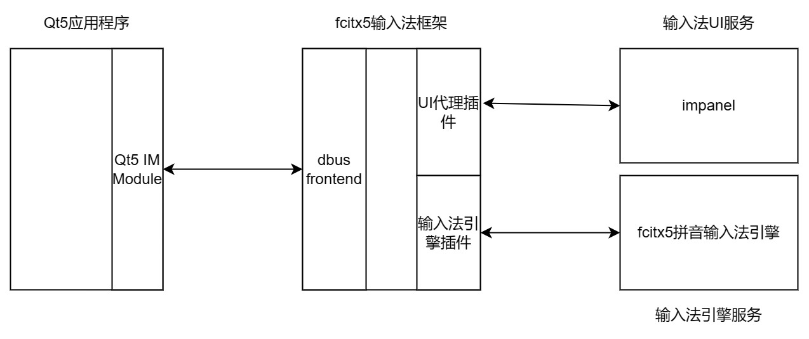

__麒麟操作系统输入法适配指南__

# 1\. __背景__

本文档提供了麒麟操作系统中内置的fcitx5输入法框架的简介以及输入法引擎适配到fcitx5所需要做的工作的详细介绍。

# 2\. __fcitx5输入法框架__

## 2\.1 __简介__

### 2\.1\.1 __整体设计架构__

fcitx5输入法框架采用插件化设计。在该设计中，包含一个fcitx5输入法框架服务和若干个插件动态库。下面介绍一下主要模块。

#### 2\.1\.1\.1 __fcitx5输入法框架服务__

fcitx5输入法框架服务是由fcitx5可执行程序提供的一个服务。该服务负责加载各个插件动态库并与其他模块进行通信。

#### 2\.1\.1\.2 __前端插件模块__

fcitx5输入法框架拥有多个前端插件模块，分别为dbusfrontend, fcitx4frontend, ibusfrontend, waylandim, xim。用于兼容不同的系统环境和应用。

#### 2\.1\.1\.2\.1 __dbusfrontend__

dbus前端插件是fcitx5自己的协议实现的，Qt/GTK输入法模块使用该前端插件和fcitx5进行通信。

#### 2\.1\.1\.2\.2 __fcitx4frontend__

#### fcitx4前端插件提供了对使用了fcitx4 dbus协议的输入法模块的应用的支持。

#### 2\.1\.1\.2\.3 __ibusfrontend__

ibus前端插件实现了ibus协议。

#### 2\.1\.1\.2\.4 __waylandim__

waylandim实现了Wayland提供输入法协议的服务端协议。

#### 2\.1\.1\.2\.5 __xim__

xim实现了X11的输入法协议的服务端协议。

#### 2\.1\.1\.3 __UI插件模块__

fcitx5输入法框架提供了三种UI插件，分别是classic UI插件，kimpanel UI插件，virtualkeyboard UI插件。

#### 2\.1\.1\.3\.1 __classic UI__

fcitx5默认使用并且已经集成在输入法框架中的UI插件。

#### 2\.1\.1\.3\.2 __kimpanel UI__

fcitx5使用的物理键盘输入窗口UI代理插件。适配时需要实现kimpanel服务端。该插件使用DBus接口和服务端进行通信。

#### 2\.1\.1\.3\.3 __virtualkeyboard UI__

fcitx5使用的虚拟键盘UI代理插件。适配时需要实现虚拟键盘服务端。该插件使用DBus接口和服务端进行通信。

#### 2\.1\.1\.4 __输入法引擎插件模块__

fcitx5输入法框架定义了输入法引擎插件使用的接口。任何输入法引擎只要实现了该接口并且按照一定的格式将输入法引擎对象导出，那么，fcitx5输入法框架可以正确加载并使用该输入法引擎。

### 2\.1\.2 __基本工作原理__

fcitx5输入法框架多个前端插件模块实现了支持多种输入法协议和GUI框架，包括XIM、Wayland、ibus等输入法协议和Qt、GTK等GUI框架。

其中，dbus前端插件（dbus frontend）模块负责跟Qt和GTK等GUI框架的输入法插件进行dbus通信。

下面以Qt5应用程序为例，简要介绍一下Qt5程序通过fcitx5输入法框架与输入法引擎的交互过程。基本原理示意图如下所示：



#### 2\.1\.2\.1 __Qt5输入法模块__

fcitx5\-qt项目实现了Qt5定义的输入法接口以及跟fcitx5输入法框架的dbus前端插件进行通信的接口，使得Qt5程序中的事件可以发送到fcitx5输入法框架中

#### 2\.1\.2\.2 __dbus前端插件__

通过dbus接收从Qt或GTK程序发送过来的dbus信号或者调用

#### 2\.1\.2\.3 __fcitx5输入法框架__

dbus前端插件将事件或函数调用进行若干处理后调用fcitx5输入法框架中的函数，一般是调用InputContext对象的方法，向fcitx5输入法框架发送一个事件

#### 2\.1\.2\.4 __UI代理插件__

fcitx5输入法框架支持多种UI显示方式，包括使用X11 API的classic UI插件和使用远程显示服务的kimpanel插件。示意图中的UI代理插件说的就是kimpanel插件，而impanel则是相应的远程显示服务。该服务可以显示物理键盘输入法的输入窗口。

#### 2\.1\.2\.5 __输入法UI服务__

如果输入法框架使用了UI代理插件，则UI代理插件会与对应的输入法UI服务进行通信。

#### 2\.1\.2\.6 __输入法引擎插件__

fcitx5输入法框架收到按键事件后，经过若干处理后，会调用实现了fcitx5定义的输入法引擎API InputMethodEngine的输入法引擎插件的函数。通过插件中的函数实现与输入法引擎服务的通信

#### 2\.1\.2\.7 __输入法引擎__

输入法引擎实现了输入法的真正逻辑。输入法引擎既可以直接封装在输入法引擎插件中，也可以通过IPC通信的方式实现输入法引擎和输入法引擎插件之间的通信。

## 2\.2 __对物理键盘输入法引擎的支持__

### 2\.2\.1 __UI支持__

fcitx5提供了基于DBus协议的物理键盘输入法UI代理插件：kimpanel。该模块位于fcitx5/src/ui/kimpanel目录。

#### 2\.2\.1\.1 __DBus服务__

#### 2\.2\.1\.1\.1 __DBus服务名称__

org\.kde\.kimpanel\.inputmethod

##### 2\.2\.1\.1\.2 __DBus对象路径__

/kimpanel

##### 2\.2\.1\.1\.3 __DBus接口名称__

org\.kde\.kimpanel\.inputmethod

#### 2\.2\.1\.2 __DBus信号__

kimpanel提供的dbus信号可以由kimpanel进行调用，从而实现从kimpanel到impanel的通信。impanel UI服务负责响应这些信号。

#### 2\.2\.1\.2\.1 __ExecDialog__

显示对话框

#### 2\.2\.1\.2\.2 __ExecMenu__

显示菜单

#### 2\.2\.1\.2\.3 __RegisterProperties__

注册菜单项

#### 2\.2\.1\.2\.4 __UpdateProperty__

更新菜单项

#### 2\.2\.1\.2\.5 __RemoveProperty__

移除菜单项

#### 2\.2\.1\.2\.6 __ShowAux__

是否展示Aux提示文本

#### 2\.2\.1\.2\.7 __ShowPreedit__

是否展示预编辑串

#### 2\.2\.1\.2\.8 __ShowLookupTable__

是否展示候选结果

#### 2\.2\.1\.2\.9 __UpdateLookupTableCursor__

更新输入位置光标

#### 2\.2\.1\.2\.10 __updatePreeditCaret__

更新预编辑串光标

#### 2\.2\.1\.2\.11 __UpdatePreeditText__

更新预编辑文本

#### 2\.2\.1\.2\.12 __UpdateAux__

更新aut辅助文本

#### 2\.2\.1\.2\.13 __UpdateSpotLocation__

#### 2\.2\.1\.2\.14 __UpdateScreen__

#### 2\.2\.1\.2\.15 __Enable__

启用或者禁用输入窗口

#### 2\.2\.1\.3 __DBus方法__

kimpanel提供的dbus方法可以由impanel UI服务进行调用，从而实现从impanel到kimpanel的通信

#### 2\.2\.1\.3\.1 __Exit__

退出fcitx5输入法框架服务

#### 2\.2\.1\.3\.2 __ReloadConfig__

重启fcitx5上输入法框架服务

#### 2\.2\.1\.3\.3 __Configure__

启动fcitx5配置工具

#### 2\.2\.1\.3\.4 __LookupTablePageUp__

候选结果向上翻页

#### 2\.2\.1\.3\.5 __LookupTablePageDown__

候选结果向下翻页

#### 2\.2\.1\.3\.6 __SelectCandidate__

选择指定候选结果

#### 2\.2\.1\.3\.7 __PanelCreated__

物理键盘输入法输入窗口创建成功

#### 2\.2\.1\.3\.8 __PanelCreated2__

物理键盘输入法输入窗口创建成功

#### 2\.2\.2 __输入法引擎支持__

fcitx5提供了输入法引擎API：InputMethodEngine、InputMethodEngineV2、InputMethodEngineV3和InputMethodEngineV4。其中，InputMethodEngineV4增加了对虚拟键盘输入法按键事件的支持。

#### 2\.2\.2\.1 __输入法引擎API__

#### 2\.2\.2\.1\.1 __keyEvent__

功能：输入法处理按键事件的主要函数。

参数：const InputMethodEntry &entry,KeyEvent &keyEvent

返回值类型：void

#### 2\.2\.2\.1\.2 __activate__

功能：激活引擎

参数

返回值类型

#### 2\.2\.2\.1\.3 __deactivate__

功能：失活引擎

参数

返回值类型

#### 2\.2\.2\.1\.4 __reset__

功能：重置

参数

返回值类型

#### 2\.2\.2\.1\.5 __filterKey__

功能：处理key事件\(未被其他地方处理的key事件\)

参数：input method entry，key event

返回值类型：void

实现最简单的物理输入法只需要重写keyEvent函数即可。

## 2\.3 __对虚拟键盘输入法引擎的支持__

### 2\.3\.1 __UI支持__

fcitx5提供了基于DBus协议的虚拟键盘UI插件：virtualkeyboard UI，在fcitx5/src/ui/virtualkeyboard中。该插件的相关信息和接口如下所示。

#### 2\.3\.1\.1 __DBus服务__

#### 2\.3\.1\.1\.1 __DBus服务名称__

org\.fcitx\.Fcitx5\.VirtualKeyboardBackend

#### 2\.3\.1\.1\.2 __DBus对象路径__

/virtualkeyboard

#### 2\.3\.1\.1\.3 __DBus接口名称__

org\.fcitx\.Fcitx5\.VirtualKeyboardBackend1

#### 2\.3\.1\.2 __DBus信号__

#### 2\.3\.1\.2\.1 __ShowVirtualKeyboard__

功能：向虚拟键盘发送的显示信号。

参数：无。

#### 2\.3\.1\.2\.2 __HideVirtualKeyboard__

功能：向虚拟键盘发送的隐藏信号。

参数：无。

#### 2\.3\.1\.2\.3 __UpdatePreeditCaret__

功能：向虚拟键盘发送的设置预编辑文本光标位置信号。

参数：

int preeditCursor，光标所在位置的编号。

#### 2\.3\.1\.2\.4 __UpdatePreeditArea__

功能：向虚拟键盘发送的设置预编辑文本信号。

参数：

string preeditText，预编辑文本。

#### 2\.3\.1\.2\.5 __UpdateCandidateArea__

功能：向虚拟键盘发送的设置候选词信号

参数：

vector<std::string> &candidateTextList，当前页的候选词集合，每个元素都是一个候选词。

bool hasPrev，是否存在上一页候选词。

bool hasNext，是否存在下一页候选词。

int pageIndex，当前候选词页的页码。

#### 2\.3\.1\.2\.6 __NotifyIMActivated__

功能：向虚拟键盘发送当前输入法激活信号。

参数：

string uniqueName，当前输入法的名称。

#### 2\.3\.1\.2\.7 __NotifyIMDeactivated__

功能：向虚拟键盘发送当前输入法失活信号。

参数：

string uniqueName，当前输入法的名称。

#### 2\.3\.1\.2\.8 __NotifyIMListChanged__

功能：向虚拟键盘发送当前输入法列表改变通知信号。

参数：无。

#### 2\.3\.1\.3 __DBus方法__

#### 2\.3\.1\.3\.1 __ProcessKeyEvent__

功能：接收虚拟键盘发送的按键事件，将其转发给输入法框架。

参数：

uint32\_t keyval, 当前键盘布局下当前按键的所代表的值，英文时为按键对应的ASCII码。

uint32\_t keycode, 所有键盘布局中当前按键的唯一标记值，在Linux系统中定义。

uint32\_t state, 按键的修饰符状态，如Shift，Caps Lock等按键，详情可见fcitx5/src/lib/fcitx\-utils/keysym\.h。

bool isRelease, 按键是否按下，true为抬起，false为按下。

uint32\_t time, 按键按下时的时间戳，默认为0。

#### 2\.3\.1\.3\.2 __ProcessVisibilityEvent__

功能：接收虚拟键盘发送的虚拟键盘可见性事件，更新后端模块中的可见性信息。

参数：

bool visible, 虚拟键盘的可见性，true为正在显示，false为已经隐藏

#### 2\.3\.1\.3\.3 __SelectCandidate__

功能：接收虚拟键盘选择的候选词序号，上屏该候选词。

参数：

int index, 用户选择的候选词序号。

#### 2\.3\.1\.3\.4 __PrevPage__

功能：接收虚拟键盘发送的候选词翻页请求，切换到上一页候选词。

参数：无。

#### 2\.3\.1\.3\.5 __NextPage__

功能：接收虚拟键盘发送的候选词翻页请求，切换到下一页候选词。

参数：无。 

### 2\.3\.2 __输入法引擎支持__

fcitx5的输入法引擎InputMethodEngineV4增加了虚函数virtualKeyboardEventImpl，提供了对虚拟键盘输入法按键事件的支持，相关代码在fcitx5/src/lib/fcitx/inputmethodengine中。

如果输入法引擎想要提供对虚拟键盘按键事件的支持，则需要实现InputMethodEngineV4接口。否则，只需要考虑实现其他三个用于物理键盘输入法引擎的接口即可。

# 3\. __适配fcitx5输入法框架__

## 3\.1 __物理键盘输入法引擎适配__

### 3\.1\.1 __UI适配__

fcitx5提供了默认的物理键盘输入法输入窗口UI，在不考虑特殊的客户端侧输入法UI的情况下，可以简单的划分为两种：classic UI和kimpanel UI。

#### 3\.1\.1\.1 __classic UI__

该UI是fcitx5提供的使用底层API\(X11，wayland\)实现的输入窗口UI。

#### 3\.1\.1\.2 __kimpanel UI__

该UI是fcitx5提供的输入窗口UI代理，其定义了若干dbus API可以用来跟远端的物理键盘输入法UI服务进行通信。该模块最初用于解决Ubuntu上输入法窗口被全局搜索界面覆盖导致的无法看到输入窗口的问题而提供的。

为了简化适配，第三方输入法可以考虑直接适配该UI代理模块定义的dbus接口即可。

如果想要提供更全方位的定制，则还需要考虑提供跟kimpanel类似的UI代理模块。

### 3\.1\.2 __输入法引擎适配__

#### 3\.1\.2\.1 __输入法配置文件编写__

配置文件分为插件配置文件和输入法配置文件，每个配置文件中字段含义不同。

插件配置文件：插件配置文件安装在插件目录/share/fcitx5/addon/下。

举例拼音输入法插件配置文件：
```c++
[Addon]
Name[ca]=Pinyin
Name[da]=Pinyin
Name[de]=Pinyin
Name[he]=פיניין:
Name[ko]=병음
Name[ru]=Пиньинь
Name[zh_CN]=拼音
Name=Pinyin
Category=InputMethod
Version=5.0.11
//对应的拼音输入法so为libpinyin.so
Library=libpinyin
Type=SharedLibrary
OnDemand=True
Configurable=True

//插件依赖
[Addon/Dependencies]
0=punctuation
```

输入法配置文件：输入法配置文件保存在输入法目录/share/fcitx5/inputmethod/下。

举例拼音输入法引擎配置文件：

```c++
[InputMethod]
Name[ca]=Pinyin
Name[da]=Pinyin
Name[de]=Pinyin
Name[he]=פיניין:
Name[ko]=병음
Name[ru]=Пиньинь
Name[zh_CN]=拼音
Name=Pinyin
//拼音输入法对应的icon名称
Icon=fcitx-pinyin
Label=拼
LangCode=zh_CN
//输入法对应的插件
Addon=pinyin
//是否支持自定义
Configurable=True
```
#### 3\.1\.2\.2 __工程CMakeLists文件编写__

工程文件CMakeLists文件定义了输入法源码文件的编译行为。包括编译过程中链接的库以及配置文件安装路径等等。以pinyin输入法为例：

```sh
#pinyin
add_library(pinyin SHARED pinyin.cpp)
target_link_libraries(pinyin PRIVATE Fcitx5::Core)
set_target_properties(pinyin PROPERTIES PREFIX "")
install(TARGETS pinyin DESTINATION "${FCITX_INSTALL_LIBDIR}/fcitx5")

#拼音输入法插件配置文件转换与安装
#将pinyin-addon.conf.in输出为pinyin-addon.conf
configure_file(pinyin-addon.conf.in pinyin-addon.conf) 
install(FILES "${CMAKE_CURRENT_BINARY_DIR}/pinyin-addon.conf" RENAME quwei.conf DESTINATION "${FCITX_INSTALL_PKGDATADIR}/addon")

#定义了拼音输入法引擎配置文件安装路径
# Input Method registration file
install(FILES "pinyin.conf" DESTINATION "${FCITX_INSTALL_PKGDATADIR}/inputmethod")
```
#### 3\.1\.2\.3 __实现物理输入法引擎接口__

输入法引擎部分适配即要重写定义的引擎相关的接口，其中最主要的接口是InputMethodEngine::keyEvent\(\)。以pinyin输入法为例：

继承AddonFactory插件工厂类，创建一个拼音输入法引擎插件类

```c++  
class PinyinEngineFactory : public AddonFactory {
public:
    AddonInstance *create(AddonManager *manager) override {
        registerDomain("fcitx5-chinese-addons", FCITX_INSTALL_LOCALEDIR);
        return new PinyinEngine(manager->instance());
    }
};
```
拼音引擎插件类继承InputMethodEngineV3，实现相关的接口功能。如activate\(\)、deactive\(\)、keyEvent\(\)和reset\(\)接口等

```c++
class PinyinEngine final : public InputMethodEngineV3 {
public:
    PinyinEngine(Instance *instance);
    ~PinyinEngine();
    Instance *instance() { return instance_; }
    void activate(const InputMethodEntry &entry,
                  InputContextEvent &event) override;
    void deactivate(const InputMethodEntry &entry,
                    InputContextEvent &event) override;
    void keyEvent(const InputMethodEntry &entry, KeyEvent &keyEvent) override;
    void reset(const InputMethodEntry &entry,
               InputContextEvent &event) override;
   ...
  };
```
## 3\.2 __虚拟键盘输入法引擎适配__

### 3\.2\.1 __UI适配__

fcitx5提供了默认的虚拟键盘输入法输入窗口UI代理模块：virtualkeyboard UI。

为了简化适配，第三方输入法可以考虑直接适配该UI代理模块定义的dbus接口即可。

如果想要提供更全方位的定制，则还需要考虑提供跟virtualkeyboard类似的UI代理模块。

### 3\.2\.2 __输入法引擎适配__

虚拟键盘输入法引擎适配与物理键盘键盘输入法引擎适配基本类似，差别仅在于虚拟键盘输入法引擎需要实现InputMethodEngineV4类中的virtualKeyboardEventImpl虚函数。

# __参考文档__

输入法引擎相关代码文档：https://codedocs.xyz/fcitx/fcitx5/classfcitx_1_1InputMethodEngine.html

实现一个最简单输入法：https://fcitx-im.org/wiki/Develop_an_simple_input_method

