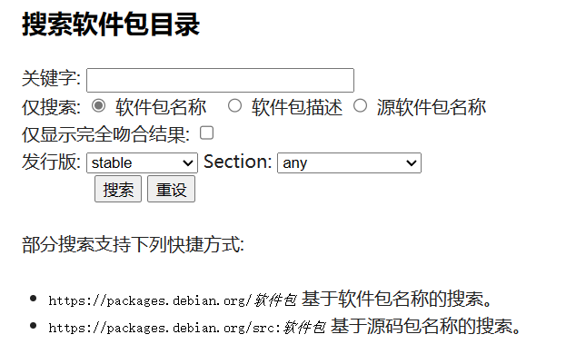
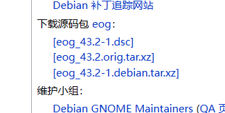

# openKylin桌面环境移植

## 1. 前言

为了满足用户对多种桌面环境的需求，主流的Linux发行版大多支持多个桌面环境，让用户有更多选择。在openKylin社区各个桌面环境SIG组的努力下，目前openKylin已经支持了KDE，Xfce，Cutefish，DDE等桌面环境和特色应用

这个文档将会简单介绍现有主流桌面环境，桌面环境的软件包和模块，以及进行移植演示，文档并不能包括所有桌面环境的移植方法，一些桌面环境可能与文档不同，一些问题需要根据实际情况判断处理

## 2. 主流桌面环境
知名Linux发行版Ubuntu以及debian官方支持以下桌面环境，以下为主流Linux桌面环境

- GNOME
- KDE
- LXQT
- Cinnamon
- Mate
- Xfce


## 3. 桌面环境的软件包和模块

Linux桌面环境一般包括以下组件：

- 桌面环境（Desktop Environment, DE）

  图形用户界面的主要部分，GNOME、KDE、XFCE等，桌面环境的核心

- 窗口管理器（Windows Manager, WM）

  图形用户界面的一部分，控制和管理着窗口的外观、桌面菜单、图标、虚拟桌面以及按钮样式等一切显示在屏幕上的样式

- 显示管理器（Display Manager, DM）

  显示管理器是提供图形登录功能的程序，控制用户会话并管理用户认证

  如果是Gnome桌面环境，默认登录管理器应该为GDM，如果是KDE桌面环境，默认登录管理器应该为SDDM，也有桌面环境使用LightDM作为登录管理器，LightDM（UKUI默认登陆管理器）是一个现代化的登录管理器，支持多个桌面环境，可以根据桌面环境要求选择登录管理器

- 应用程序（特色应用）

  一些桌面环境的特色应用，比如计算器，邮箱，特色浏览器（如KDE的Konqueror）等，这些软件包建议作为可选组件安装

- 系统工具

  如终端，设置等实用工具，移植桌面环境必须提供这些工具的软件包

- 主题

  桌面环境一般会自带一些默认的主题包，比如icon，wallpaper，cursor和theme软件包，它们控制桌面图标，壁纸，光标和主题，这些软件包需要全部移植，否则桌面部分图标，光标无法正常显示，在默认主题移植完成的基础上，你也可以移植一些第三方主题包

- QT插件

  一些桌面环境需要的QT插件，需要移植，否则显示可能会出现问题，一些功能无法正常使用

在移植工作最开始，建议先确认上游源码包的具体软件包和组件以及其功能，对软件包进行分类，可以分为必须移植（桌面环境基础组件和软件包），可选移植（一些特色应用，比如计算器），无需移植（完全不需要的功能，比如启动动画，文档手册），当然也可以采用你喜欢的其他分类方式，目的是为了分清移植工作的主次

同时可以根据时间相近和主版本号来确定移植的软件包版本，如果某一版本的软件包本地打包失败，可以尝试其他版本是否能修复该问题

如果你移植的桌面有可以参考的Linux发行版，比如Deepin、Ubuntu、Linux Mint可以先在虚拟机安装一个，可以参考系统内桌面环境各个软件包的版本


## 4. 移植示例

接下来简单演示移植桌面环境的软件包，建议先移植一些简单的，有参考对象的桌面环境，建议先在本地练习打包和传包，成功后再传到openKylin的仓库

打包需要使用ci源，在软件发布后可以先在ci源中查看，可以验证打包是否成功。软件包依赖问题建议解决一个传一个，否则依赖容易乱

换源
```bash
deb http://archive.build.openkylin.top/openkylin yangtze main
deb http://archive.build.openkylin.top/openkylin yangtze-security main
deb http://archive.build.openkylin.top/openkylin yangtze-updates main
deb http://archive.build.openkylin.top/openkylin yangtze-proposed main
```
换完源后更新一下软件包

```bash
sudo apt update && sudo apt upgrade
```

安装打包和传包需要的软件包
```bash
sudo apt install git devscripts git-buildpackage pristine-tar build-essential
```
### 1. 获取上游源码

我们首先需要找到桌面环境上游的源码仓库，下载对应版本的源码包，也可以克隆仓库对应的tag，下载全部桌面环境需要的源码包，并进入到源码目录，删除一些不需要的目录和文件
```bash
rm -rf .github .gitlab .obs
```
### 2. 修改debian/changelog文件，修改对应的版本号，版本信息描述等

通过 dch -m "Build for openkylin" 指令生成新的 changelog，并手动修改版本加上`-ok1`，信息修改成自己的维护者名称以及邮箱

```bash
package-name (0.1-ok1) yangtze; urgency=medium

  * Build for openkylin

 -- Maintainers <example@email.com>  Thu, 14 Sep 2023 08:55:53 +0800

```
### 3. 解决依赖问题

有了源码包之后，由于依赖关系问题，我们还需要知道应该先编译打包哪个源码包，一般我们可以先选择移植桌面环境的库（如libcutefish），进入到源码目录后，通过以下命令检查和安装依赖
```bash
sudo apt build-dep .
```
如果这一步依赖出现问题，首先需要检查openKylin是否缺少这个包的源码仓库，通过以下命令获取软件包信息并找到源码名，然后在Gitee上找到对应的仓库，如果没有需要提交issue给对应的SIG组补充或修复依赖

依赖可以到在 `debian/control` 中查看，通过以下命令查找依赖包名称的软件包
```bash
apt show package
```
注意，补全依赖时通过debian上游，这里演示GNOME桌面环境的EOG，社区鼓励从upstream拉取源码 GNOME的上游代码在：download.gnome.org/sources 可跳过下面步骤，直接到修改changelog步骤开始

也可以在 https://packages.debian.org 找到源码包



在页面的右侧找到 下载源码包 通过dget下载dsc文件（需要安装devscripts），如下

```bash
dget http://deb.debian.org/debian/pool/main/e/eog/eog_43.2-1.dsc
```
这会在当前目录下载三个文件 `eog_43.2-1.debian.tar.xz` `eog_43.2-1.dsc`  `eog_43.2.orig.tar.xz`

如果你希望通过wget下载，则需要手动下载以上全部源码包

```bash
wget http://deb.debian.org/debian/pool/main/e/eog/eog_43.2-1.dsc
wget http://deb.debian.org/debian/pool/main/e/eog/eog_43.2.orig.tar.xz
wget http://deb.debian.org/debian/pool/main/e/eog/eog_43.2-1.debian.tar.xz
```

下载完成后，通过`dpkg-source -x`解压出源码

```bash
dpkg-source -x <package-name>.dsc
```
然后在当前目录会解压出一个源码目录，修改，构建和测试后可将源码传到openKylin的仓库


### 4. 本地打包测试


进入到源码目录，生成规范化格式文件
```bash
dpkg-buildpackage -S -nc --no-sign
```
编译打包并在上级目录生成软件包，可以通过`dpkg -i`安装，一些软件包可能会存在配置文件路径冲突的问题，需要修改源码包
```bash
dpkg-buildpackage -us -uc -b
```
编译完成后不要忘记清除，防止污染源码，同时你也可以选择拷贝一份源码进行编译测试

```bash
dh clean
```
> 注意：有时okbs构建错误时首先检查是否清除了编译生成的文件

### 5. 从dsc文件导入源码到Git仓库

在源码目录上级目录，会找到生成的dsc文件，通过以下命令构建Git仓库，注意dsc文件名称和仓库生成路径
```bash
gbp import-dsc --pristine-tar --debian-branch=openkylin/yangtze --upstream-branch=upstream example.dsc example_dir
```
其中：

--pristine-tar

保留原始的 tar 文件的元数据。这包括保留原始的许可证信息、版本号等。这样可以使源代码在导入后保持原版，不丢失任何与原始 Debian 包相关的信息，pristine tar 分支（ Git 存储库中使用的默认分支名称是 pristine tar ）包含必要的附加信息，以从上游分支重新创建原始tarball

要使用此功能，您需要安装 pristine-tar 软件包。

--debian-branch=openkylin/yangtze

指定打包分支名称，openkylin/yangtze （yangtze是1.0的版本代号，nile是2.0的版本代号）。debian branch Git 存储库中使用的默认分支名称是 master ）保存当前的开发工作。 这是通常用来发布版本的分支，并且新的上游版本会合并到该分支上

--upstream branch=upstream

指定上游分支名称，需为upstream

--example.dsc

通过源码生成的dsc文件

--example

生成的目标目录

接下来进入源码构建目录，推送到Git仓库

```bash
# 创建quilt的分支，用于正式打包
git branch packaging/openkylin/yangtze

# 上传到源码仓库
git remote add origin git@gitee.com:openkylin/example.git
git push --tags
git push --all
```

推送完成后，查看issue是否有okbot的构建失败提示，等待okbs构建完成后，建议找一个干净的系统通过apt安装桌面环境的包来测试是否仍存在依赖问题，如果仍存在依赖问题需要修复依赖，或者修改源码包并重复上述步骤


## 7. 参考文献

https://userbase.kde.org/

https://www.debian.org/distrib/packages

https://wiki.deepin.org/zh/%E5%BE%85%E5%88%86%E7%B1%BB/02_deepin%E6%B7%B1%E5%85%A5/02_DDE%E7%9B%B8%E5%85%B3/00_DDE%E6%A1%8C%E9%9D%A2%E7%A7%BB%E6%A4%8D/%E8%BD%AF%E4%BB%B6%E5%8C%85%E5%88%86%E7%B1%BB%E4%B8%8E%E7%AE%80%E4%BB%8B

https://www.debian.org/doc/manuals/debmake-doc/index.zh-cn.html