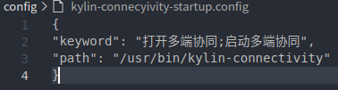

# kylin-asrassistant

#### 介绍
**麒麟语音助手**（kylin-asrassistant）是基于**百度开源模型库paddlespeech**开发的一款便于用户快捷操作的应用。

#### 主要功能
进行语音识别用户的语音输入。

目前支持快速打开应用。


#### 运行

默认开机自启，放置到系统托盘

#### 使用说明

例如：打开**麒麟语音助手**，说“打开计算器”，就可以快速打开计算器

#### 适配说明

在项目中新建一个**xxx-startup.config**文件，在安装应用时将config文件放入**/usr/share/kylin-asrassistant/config/**目录下。

**xxx-startup.config**文件格式如下：

```json
{

"keyword": "唤醒关键词1;唤醒关键词2",

"path": "可执行文件路径， 可加参数"

}
```

如：

需要拉起**多端协同**(kylin-connectivity)

在项目中新建**kylin-connectivity-startup.config**文件


**startup.config**文件添加如下json字段：



最后在install文件中添加如下项

```
config/kylin-connectivity-startup.config /usr/share/kylin-asrassistant/config/
```

或在CMakeLists.txt中添加

```
install(FILES ${CMAKE_CURRENT_SOURCE_DIR}/config/kylin-connectivity-startup.config DESTINATION  /usr/share/kylin-asrassistant/config/)
```

#### 语音助手安装

（1）软件源：

```
deb http://archive.build.openKylin.top/openkylin/ yangtze main cross pty

deb http://archive.build.openKylin.top/openkylin/ yangtze-security main cross pty

deb http://archive.build.openKylin.top/openkylin/ yangtze-updates main cross pty

deb http://archive.build.openKylin.top/openkylin/ yangtze-proposed main cross pty
```

（2）配置后更新源：

```
$ sudo apt update
```

（3）使用apt安装

```
$ sudo apt-get install kylin-asrassistant
```

