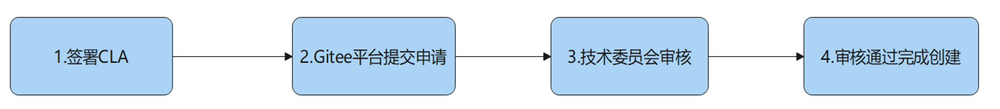
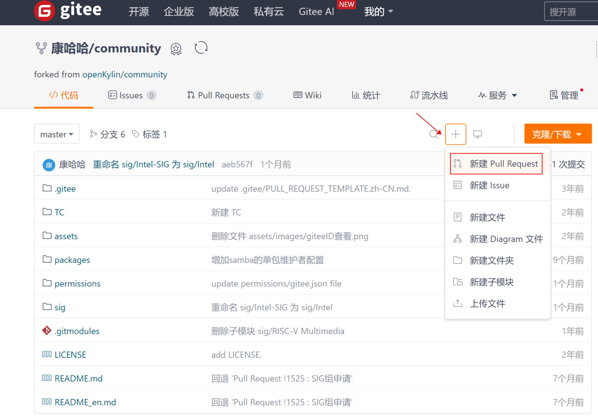
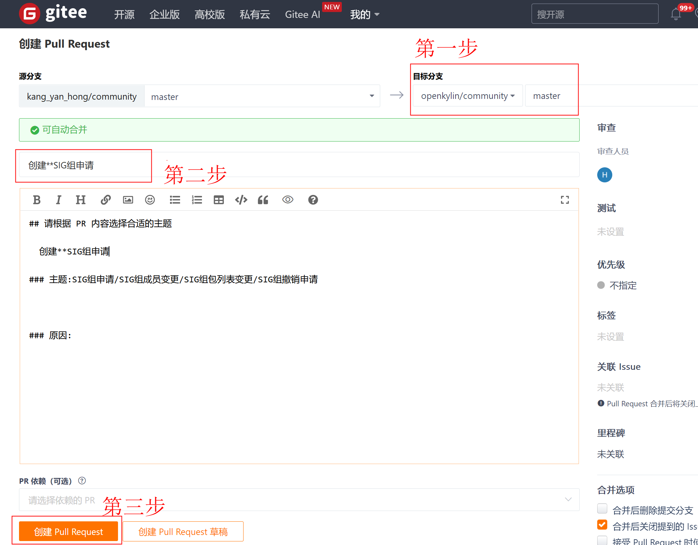

# 新SIG组的申请流程

## 企业&高校组织申请
**签署CLA**：
组织负责人 [签署组织cla](https://cla.openkylin.top) ，并邀请该组织下参与开源项目的成员[签署员工cla](https://cla.openkylin.top)

**提交申请**：
1. 由申请人 Fork 项目 [openKylin / community](https://gitee.com/openkylin/community) 到你的Gitee个人空间下。并在您的community项目下的 sig 目录下创建自己新的 SIG 目录（以新SIG组名称命名），并在创建的SIG目录下新增README.md文件和sig.yaml文件。
2. 根据 [SIG组章程模版](https://gitee.com/openkylin/docs/blob/master/07_%E5%85%B3%E4%BA%8E%E7%A4%BE%E5%8C%BA/SIG%E7%AE%A1%E7%90%86%E6%8C%87%E5%8D%97/SIG%E7%BB%84%E7%AB%A0%E7%A8%8B%E6%A8%A1%E7%89%88.md) 完成README.md文件的填写；根据 [sig.yaml 模版](https://gitee.com/openkylin/community/blob/master/sig/README.md) 完成 sig.yaml 文件的填写;
3. 完成以上两步后，将以上改动提交到 Gitee 上，并向[openKylin / community](https://gitee.com/openkylin/community) 项目提交创建 SIG 组PR申请，SIG组运营人员会整理相关信息并提交给技术委员会审核。

**审核**：
由技术委员会与会人员就 SIG 相关业务范围、维护目标等与负责人沟通并审核评议。

**批准**：
技术委员会审核通过后，会为您申请的 SIG 组创建对应邮件列表，并会通过邮件形式发送官方确认信息以及邮件列表账号至您签署cla时绑定的邮箱，同时基础设施 SIG 组负责人会完成相应 SIG 组仓库创建和权限处理。

**运作**：
SIG 正式运作，组内成员通过邮件列表、组内会议、SIG组交流群等进行沟通交流。新的 SIG 组运行初期，可以由技术委员会指定一个委员作为该 SIG 组的导师为 SIG 组进行指导，以确保该 SIG 组快速步入正轨。

## 个人/团队申请
**签署CLA**：
SIG 所有成员 [签署个人cla](https://cla.openkylin.top) 

**提交申请**：
1. 由申请人 Fork 项目 [openKylin / community](https://gitee.com/openkylin/community) 到你的Gitee个人空间下。并在您的community项目下的 sig 目录下创建自己新的 SIG 目录（以新SIG组名称命名），并在创建的SIG目录下新增README.md文件和sig.yaml文件。
2. 根据 [SIG组章程模版](https://gitee.com/openkylin/docs/blob/master/07_%E5%85%B3%E4%BA%8E%E7%A4%BE%E5%8C%BA/SIG%E7%AE%A1%E7%90%86%E6%8C%87%E5%8D%97/SIG%E7%BB%84%E7%AB%A0%E7%A8%8B%E6%A8%A1%E7%89%88.md) 完成README.md文件的填写；根据 [sig.yaml 模版](https://gitee.com/openkylin/community/blob/master/sig/README.md) 完成 sig.yaml 文件的填写;
3. 完成以上两步后，将以上改动提交到 Gitee 上，并向[openKylin / community](https://gitee.com/openkylin/community) 项目提交创建 SIG 组PR申请，SIG组运营人员会整理相关信息并提交给技术委员会审核。

**审核**：
由技术委员会与会人员就 SIG 相关业务范围、维护目标等与提议人沟通并审核评议。

**批准**：
技术委员会审核通过后，会为您申请的 SIG 组创建对应邮件列表，并会通过邮件形式发送官方确认信息以及邮件列表账号至您签署cla时绑定的邮箱，同时基础设施 SIG 组负责人会完成相应 SIG 组仓库创建和权限处理。

**运作**：
SIG 正式运作，组内成员通过邮件列表、组内会议、SIG组交流群等进行沟通交流。新的 SIG 组运行初期，可以由技术委员会指定一个委员作为该 SIG 组的导师为SIG组进行指导，以确保该SIG组快速步入正轨。

## PR提交方式如下

