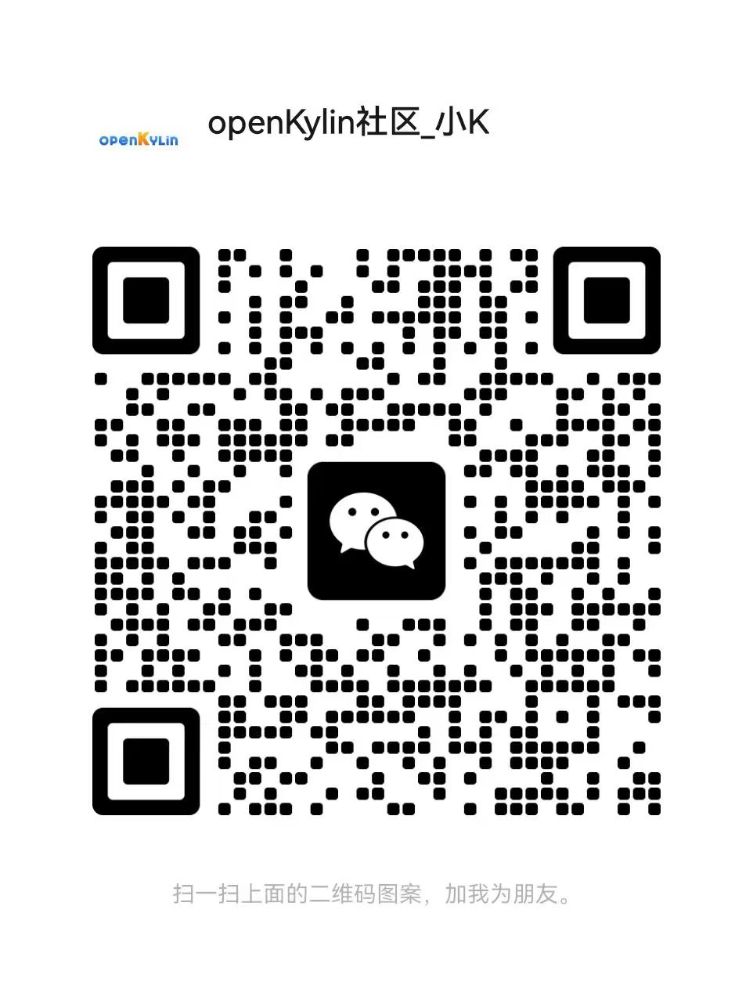

# 个人开发者加入SIG组流程

**参与SIG组贡献**：
1. 签署CLA https://cla.openkylin.top/
2. 通过SIG列表查看感兴趣的SIG https://www.openkylin.top/join/sig-cn.html ，直接进入该SIG项目链接进行代码贡献，或通过订阅邮件列表 https://mailweb.openkylin.top 、参与SIG会议 https://www.openkylin.top/sig/meeting-cn.html 等形式，参与对应SIG项目的技术讨论、社区维护等。
3. 加入各SIG组开发者交流群（加小K微信发送SIG组名称邀请入群）

**申请SIG组核心成员**：
前置条件：当开发者参与SIG组贡献满足以下2个及以上条件，可以申请SIG组核心成员:

1. 提交5个及以上有效commit。
2. 提出5个及以上有效issue。
3. 修复5个及以上issue。
4. 积极参与SIG会议，并在会议中多次提出建设性建议。

提交申请（主动申请或组内核心成员邀请加入）：
1. 由申请人 Fork 项目 [openKylin / community](https://gitee.com/openkylin/community) 到您的 Gitee 下。
2. 在您的 Gitee 项目下的 sig 目录下找到相应的SIG 名称，修改该SIG组的README.md和sig.yaml 文件，把自己的作为核心成员（Contributer或Maintainer）加入。
3. 提交PR申请，等待原SIG组核心成员审核通过，则加入成功并获得相应的仓库权限。