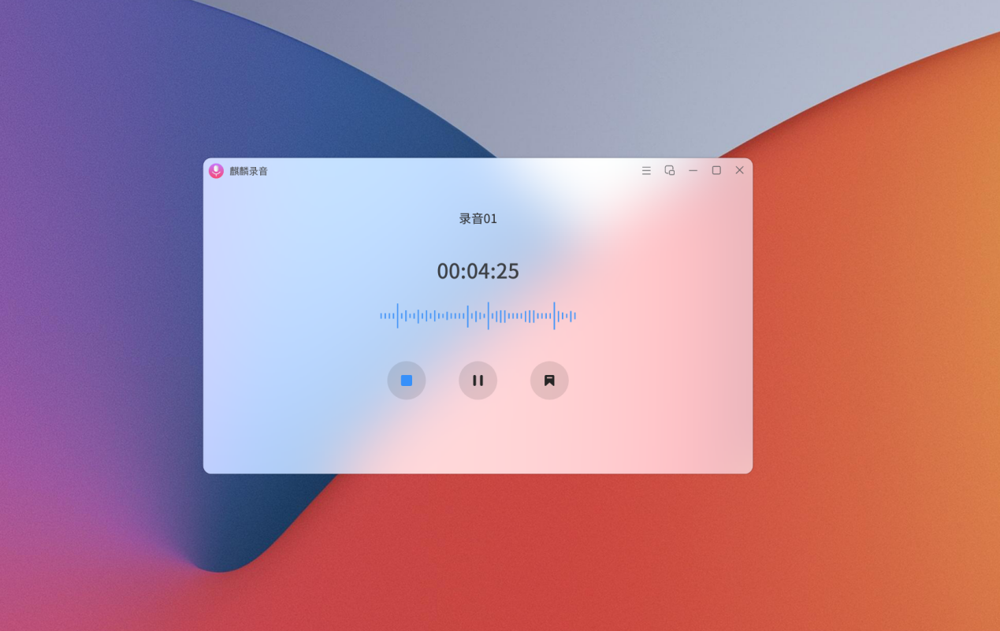

# 关于麒麟录音，你知道多少？
录音软件，是一个以个人电脑为背景下运行的以录音为目的的电脑软件。可将电脑内部或外部声音进行录制，将录音文件保存为数码音频格式，永久保存到硬盘上。
那么，问题来咯~
## 麒麟系统怎么录音？麒麟系统录音功能在哪？
随着工作和生活环境的不断变化，工作压力越来越大，工作会议越来越多，越来越多用户会使用到录音。但很用户并不了解麒麟系统录音功能，而去下载使用第三方应用。其实，麒麟系统是自带录音应用的，页面整洁，关键还操作简单。接下来教你如何正确打开&使用这款录音应用！

 
### 【录音】应用的正确打开方式
首先我们要有一台装有麒麟系统的电脑，点击右下角开始菜单，找到我们的录音应用:
 
 
 
打开录音应用后，只需在操作界面点击录音的按钮，即可开始录音。

 
录音过程中，点击[完成（蓝色）]按钮即可完成录音，也可点击[暂停]按钮暂停当前录音，点击[标记]按钮可对录音关键点就行标记，标记后的录音在播放时均有标记点展示，方便用户快速记录关键时刻。

 
如果您不想被页面打扰，还可以开启mini模式进行录音。

 
录制完成的录音会自动生在在录音列表里面，录制完成的音频还可以进行编辑，裁剪或重命名，非常方便实用。

 
右击录音文件话可以查看录音文件路径哦~，方便快速拷贝或发送文件！

### 【录音】——裁剪音频

如果您要删除部分无用的音频，请使用“裁剪”功能。
1. 打开录音应用，在列表中选择要裁剪的录音音频；
2. 点击“裁剪”按钮，然后拖移蓝色裁剪控制柄以设定要裁剪的范围；
3. 点按“播放”按钮 以检查您的编辑，然后根据需要调整裁剪控制柄；
4. 点击“完成”按钮存为新录音或者覆盖当前录音。

 
### 快速打开【录音】应用
如果系统软件太多，不能及时打开【录音】应用，可以尝试用下述 2 种方法来查找操作：
1. 打开【全局搜索】进行搜索【录音】应用；

 
 
2. 打开【开始菜单】，在顶部搜索框进行搜索【录音】应用。
 
 

麒麟录音是麒麟系统自研的一款应用，旨在为用户提供操作便捷、实用的轻量级应用。
以上，关于麒麟系统自带录音应用打开&使用的正确操作，你学会了吗？
操作简单，关键还不用下载，你不试试？
