# 【建议收藏】麒麟系统实用技巧之触控手势
不少使用麒麟系统的小伙伴一定会羡慕隔壁 Mac 笔记本的触控板功能，很好的实现了滑动操
作，切换虚拟桌面，切换多任务视图等功能，其手势操作反馈准确又操作丝滑，用后只想说，
真香！现在，Windows11 及其配套设备也可以很好的实现触控板手势，并且还增加了 Mac 没
有的触摸屏设备体验。今天优麒麟也解锁了触控交互，学会这些触控板手势，没有鼠标也可以
轻松办公～

今天我们主要介绍触控板操作的基础手势和进阶手势。
## 1、 基础操作手势
- 单指点击触控板，触发功能，例如：选择对象、打开菜单栏、执行按钮操作等。

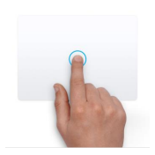

- 双指点击触控板，执行右键操作。

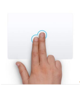
例如：
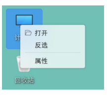

- 双指滑动，双指轻触后，上下左右滑动均可，双指向上或向下滑动执行滚动列表、滑动选择器，滑动条等组件，以及滑动查看页面。

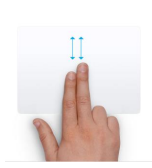
例如：
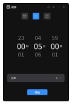

## 2、 进阶操作手势（小伙伴们密切关注版本更新哟～）
目前我们定义了高效易用的多指手势，基于用户对触摸板手势的认知，这些手势操作更加容易
上手，也容易被发现并使用。

- 三指轻点呼出全局搜索页面
快捷打开全局搜索页面，只需三指轻轻点击。

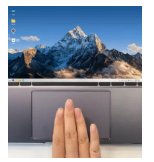

- 三指向上滑动唤醒多任务视图
只要将手指放在触控板上向上滑动即可唤醒多任务视图。

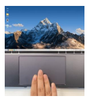

- 三指下滑最小化应用窗口
手指下滑，就可以缩小当前打开的所有应用，回到桌面。

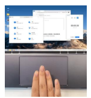

- 三指左右滑动切换应用窗口
三指左右任意滑动，即显示改桌面所有打开应用，再次滑动随意切换，

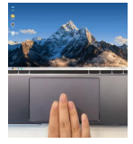

- 四指轻点呼出侧边栏
四指轻点，快速查看侧边栏通知好帮手。

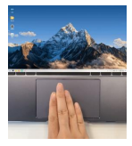
 
- 四指左右滑动切换虚拟桌面
想要一个桌面办公，一个桌面摸鱼游戏？四指滑动即刻切换工作桌面。

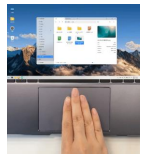

相信大多数小伙伴已经将集便携与生产力为一体的笔记本电脑用作主要工作和学习机器，建议
大家将触控板手势利用起来～一个简单的操作，不仅提高了效率，并且可以体会到即时反馈带
来的流畅体验～
另外，请小伙伴们密切关注版本更新哦，触控交互功能将陆续上线～