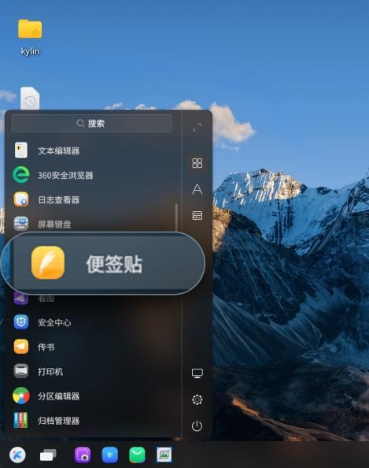
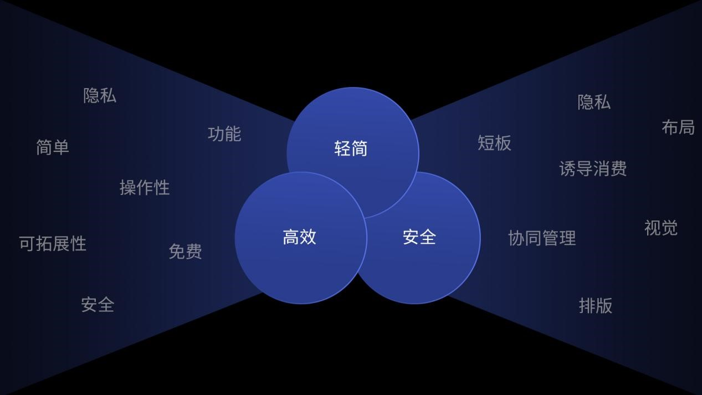
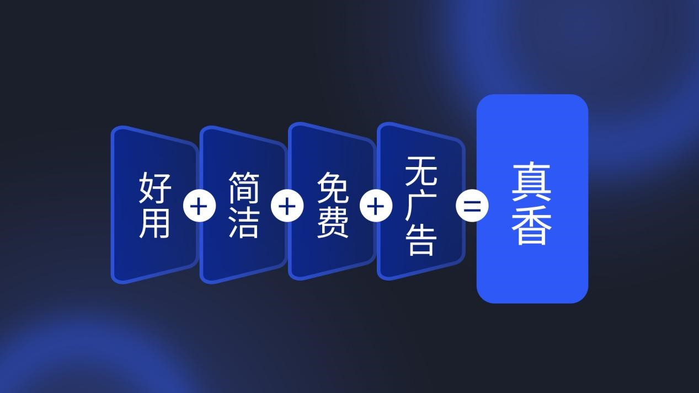
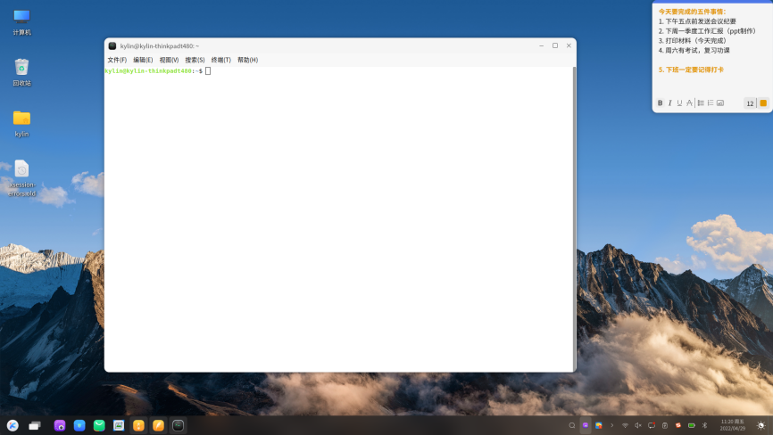
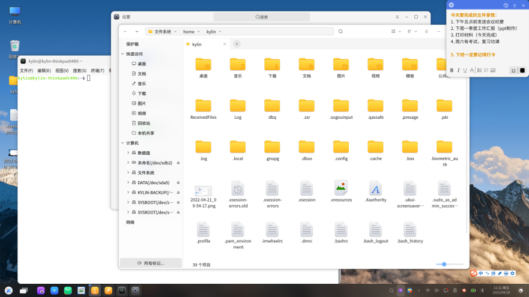
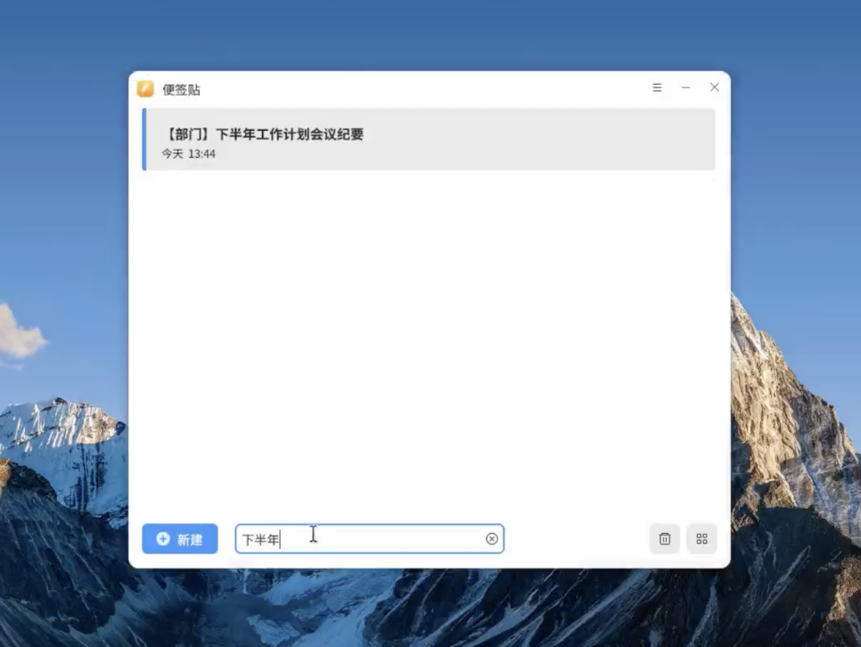
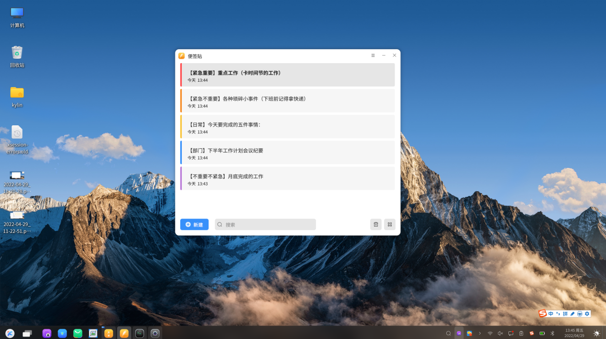
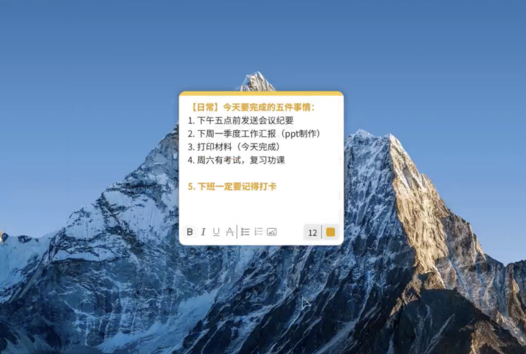

# 如何做到不忘事、不误事？麒麟便签贴真的太实用了！
在工作中，我们不可避免地会面对大大小小不同的事情。这些事情有些是当下必须要做的，有的是被临时塞进来的，有的是未来某个时间段要完成的......如果不能妥善处理好这些事情，可能会造成不必要的损失。

我们自身工作能力并不差，却记性不好，事情一多就容易忘。有时候较重要的事项会采用纸质记录规避这类低级错误，虽然短时间内有一定效果，但随着待办的增加，纸质记录就会存在零散，找寻困难的问题。而真正的职场老手都知道工作上的事需要留有痕迹，以便未来复盘自己工作时有迹可循。但是怎样才能把控住事件记录的时效性与价值呢？

最近使用麒麟系统时无意打开了一款超轻量的便签软件——便签贴，它是麒麟系统中自带的一款免费的软件，无需下载安装。

 
## 弥补同类软件的短板
当尝试记录几天的工作事项后，真的直接被它圈粉！
它与其他同类软件的区别，大致可以概括为轻简、高效和安全。这三点可以说是直接弥补了市场的大部分的同类软件的短板，为什么这么自信和肯定呢？下面听小编娓娓道来！

 
### 1.相比较word软件
无论是微软的Office Word还是金山的WPS Office，作为基础办公软件，其基础工易上手，强排版，强扩展性等优点使得其坐拥庞大的用户群体。而功能的庞大，虽是加分项，但也让用户烦闷，也因此成就了很多简洁的文本编辑软件。
而作为事项记录软件，其弊端也十分的明显。窗体太大，只能作为主操作区或辅助操作区，记录时干扰大，内容多时查询困难。

### 2.相较于备忘录
各个系统中的备忘录，简洁的操作，随时记录储存自己所学所想所悟，再加上其多端协同，也备受用户的青睐。但是记录个人事项的场景多于工作，多少还是会担心隐私问题。而且其窗体也较大，使用时干扰性也较大。

### 3.相较于纯文本类编辑器，如记事本、notepad
纯文本类软件有着共同的超强优势：信息可读性强，交换性强，读取速度快，设备兼容性强。但这些优点也使得其视觉感官、排版布局及图文信息成为其他软件分羹的短板。

### 4.相较于市面上其他的便签软件
任何一个软件的兴起，都满足了用户当下的新需求，弥补了主流软件的不足。而繁多软件他们都有一个共同特点：超强的协同性、易管理性。但是这些软件大多是第三方软件，会存在隐私顾虑、频繁更新、广告投放或收费服务等问题。

综上对比，我们可看出这款便签贴软件，在灵感记录、事项记录方面有相当高的垂直度。且属于系统自带软件，有着很好的隐私性，不需频繁下载更新，无广告，不会引诱开通vip等等

但超高的垂直度也使得它的缺点一览无余，那便是不适合庞大的文字编辑工作。总结概括就是：好用+简洁+免费+无广告=真香
 

## 悄悄分享几个便签的使用小技巧
### 1.桌面固定
逐条记录待办事项，然后让它固定在自己电脑桌面某个显眼的位置，每天上班一打开电脑随时能瞄到，对待办事项一清二楚，办一件打一个勾。

 

### 2.桌面置顶
日常多窗口办公在所难免，加上设备屏幕尺寸的限制，不得不存在软件间或多页面之间的切换烦恼。这时只需将便签贴设置为桌面置顶，便签将始终置于桌面所有窗口之上。因便签本身比较小巧，放置在不易操作的位置，查看与记录都非常方便。
 
 

### 3.便签列表太多，找不着往期便签怎么办？

记得便签个别内容，搜索一下搜索关键词，简直不要太方便。
- 即时结果。例如在输入「会议」等部分信息后，搜索框下方会即时反馈搜索结果。
- 关键词联想。通过关键词的修正、推荐来帮助用户快速的缩小搜索结果。

 
 
### 4.工作琐碎？试试分类法提升事件把控能力！
面对急需处理小事情或临时增加的工作，我们可以借助了“四象限”时间管理法。把待办的事项分成了“重要紧急”“重要不紧急”“紧急不重要”“不重要不紧急”四个分类，设置便签的颜色用以区分。再根据自己的工作内容进行填充。一开始比较麻烦，但是归好类之后就可以高效的管理待办事项了。 

另外，分享一下从职场大佬那学到的工作处理法则：
记当天的主要工作；记领导随时交办的事情；记自己参与的活动......特别要紧的事项详细记录，先急后缓，办完为止，大事小事，急事缓事，难事易事都可能遇到。把事办好，是职责；忘事误事，则有可能影响大局。 

 
 
最后分享一个用户体验超赞的小彩蛋，当我们鼠标焦点移出窗口时，所有可操作项直接隐藏，避免我们工作时误操作。这里真心为便签贴的细心点个赞！

 
 

