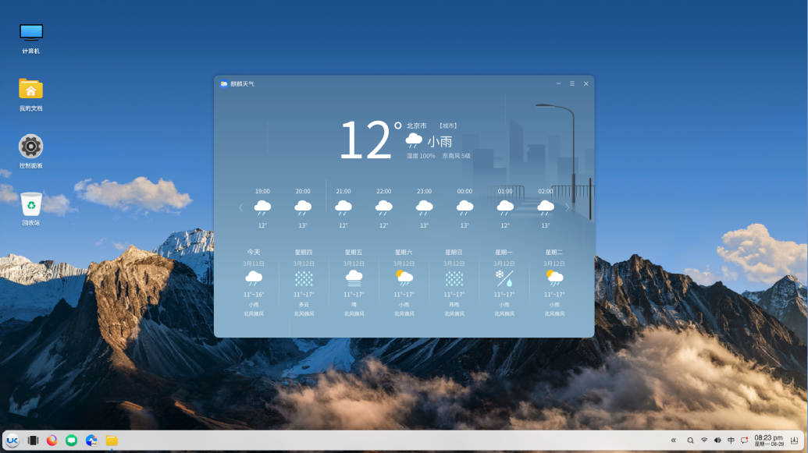
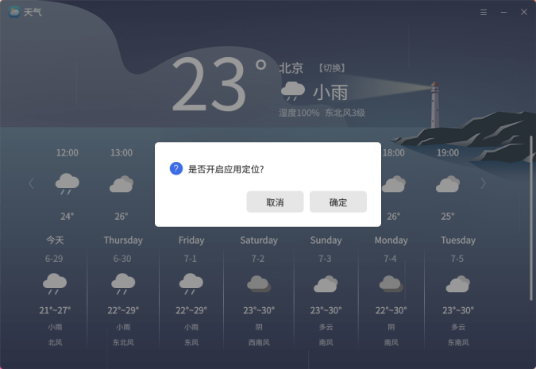
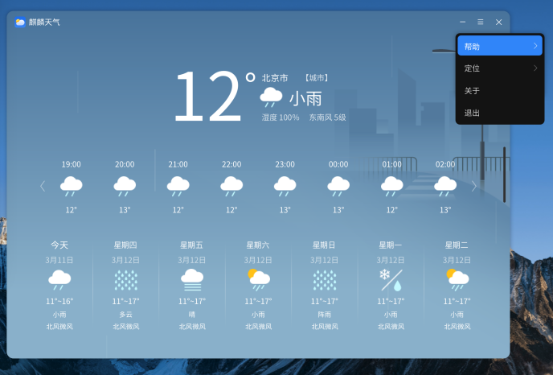
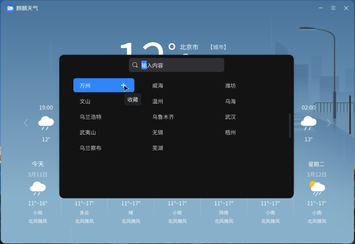
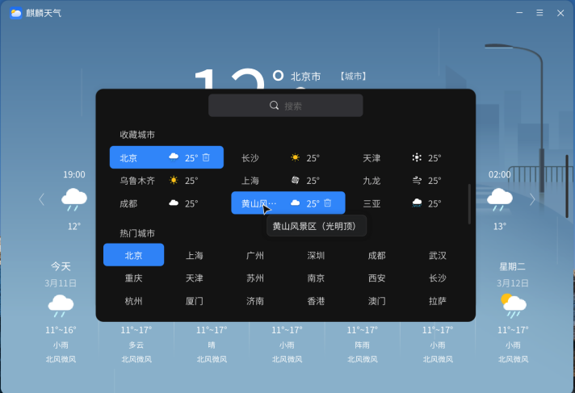

# 麒麟天气-您出行在外的贴心管家

我们出行不管是出门旅游还是出差第一件事情就是查看外当天气如何，现在麒麟操作系统的桌面天气应用就可以帮助你快速查看天气了，直接在电脑桌面上就能够查看天气是不是很方便呢？不必打开网页进行繁琐的操作，麒麟天气让您的出行不再因阴晴不定的气候而烦恼。那么接下来就让小编带大家一起了解熟悉麒麟天气吧。

## 一、麒麟天气的优势
首先小编会先通过对比当下主流的web端和PC端第三方天气查看渠道来列举出麒麟天气的三大优势

### 1.方便快捷

与当下主流的web端天气相比麒麟天气无需繁琐搜索流程，只需要打开开始菜单中的应用图标就能立即获取您想要的天气信息，而且比起web端过于复杂细致的内容，麒麟天气的界面内容显然更加简洁清晰。
麒麟天气同时兼具功能强大的搜索弹窗，无论您是想要查看其他城市的天气概要还是搜索添加多个收藏城市都可以在弹窗内完成相关操作。

### 2.安全绿色

用户在使用安装第三方软件时最大的顾虑便是安全问题，数据隐私保护及用户的安全一直是麒麟操作系统的行业主要优势及主打特色，作为附带应用的麒麟天气自然也遵循着这一原则：无广告、无收费、无需安装、不擅自修改主页、不频繁要求更新，更没有恼人且高危的捆绑软件。绝对安全绝对绿色绝对可靠的软件才是用户真正需要的好应用，同时为了针对不同用户的隐私需求麒麟天气还贴心的添加了开关定位功能，随时随地为您的位置隐私提供保护。

### 3.界面美观，功能贴心
作为一款天气应用就必定要考虑照顾用户的使用心情，而美观的界面则无疑会让这一体验大大提升，为此我们的设计师用心绘制了种类齐全的矢量插画作为背景图，让每位用户一打开应用就能在获得直观信息的同时也能收获一个好心情是我们的设计初衷。在功能层面麒麟天气新添加了24小时实时天气的功能，让您能够更清晰的了解当天的天气及温度变化，在此之外麒麟天气也提供了紫外线指数、空气指数、运动指数、穿衣指数推荐等人性化功能，让您的出行更具保障。

# 二、版本改进
1. UI界面优化调整
2. 100张全套背景图更新
3. 新增当日24小时天气查看功能
4. 新增开关定位功能
5. 搜索弹窗改版升级
6. 服务器优化，加载速度提升

# 三、如何使用麒麟天气
## 1.设置天气
首次打开天气应用请先按需求选择是否开启定位服务，开启定位天气会通过自动获取您的位置信息显示您所在位置的天气情况，如果选择不开启定位天气则会显示默认城市的天气情况，开关定位在首次设置过后也可在功能栏中随时更改设置。

## 2.收藏城市
收藏城市是个便捷的功能，将自己经常浏览的城市添加进收藏栏可以在今后更为便捷的查看当地的天气情况，那么想要将添加新的收藏城市我们首先需要点击【城市】按钮调出搜索弹窗，在弹窗上方搜索栏输入城市名称，随后点击搜索或敲动回车键进行搜索，将鼠标放置在搜索结果右侧的“➕”按钮上点击即可将城市添加至收藏栏（注：点击城市按钮其他区域仅会切换到搜索城市的天气主页并不会添加至收藏栏。）

今天的内容就到此为止，感谢您的观看，希望这篇文章能对您在应用使用上起到帮助。
