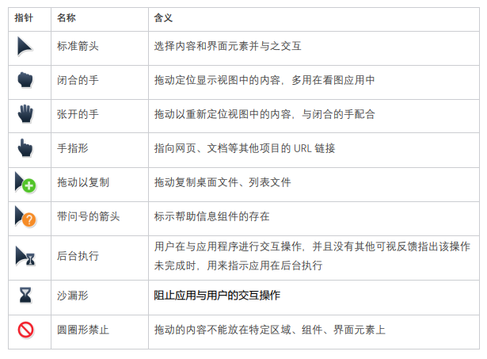
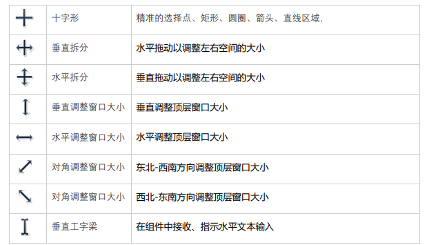
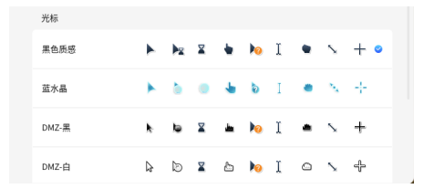
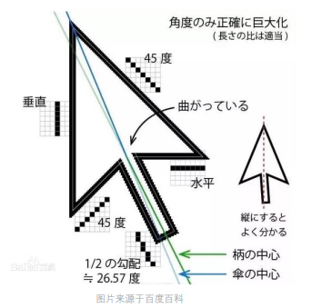

# 人机界面指南之鼠标指针交互

最近收到多名小伙伴反馈：系统中的鼠标指针交互反馈不清晰。麒麟整理了系统提供的标准指针样式，并对使用场景进行优化，应用可以使用这些样式来传达界面元素的交互状态或拖动操作的结果。下文除了给大家介绍目前系统提供的鼠标指针与反馈状态，还有鼠标指针设计的热知识哟～

## 1.鼠标指针与交互状态

		

随着应用功能、使用场景的丰富和完善，更多鼠标指针样式可以被用来传达用户的交互操作，指针渐渐包涵了更多的信息。精细化交互场景，提供更准确明了的交互指示，我们仍在前进！

## 2.麒麟鼠标指针样式

在如今的系统中，用户可选择和替换鼠标指针样式已经成为“基操”，麒麟系统现提供多种鼠标指针样式，大家可以按照喜好或是配合主题颜色来选择～

## 3.鼠标指针设计“热知识”
 
最后给大家来一波小科普，标准箭头光标居然是不对称的，大家有注意过吗？把箭头垂直放直很容易看出，箭头的尾巴向右倾斜。

引用网络上英特尔官方的解释是：光标右边箭头的小短线是水平的，这样可以保证给用户的视觉感受不会太过倾斜，虽然箭头视觉设计不是完全对称的，但是基本保证了视觉上的舒适性；此外，从设计的角度来看，如果中心对称的话，箭头的柄部像素很难对准，以早期的鼠标指针无反锯齿实现为标准，可能会造成边缘带有锯齿，影响美观～

写在最后：如果小伙伴们对系统的鼠标交互有任何疑问和需求，欢迎留言提出建议，麒麟重视大家的每一条反馈～
