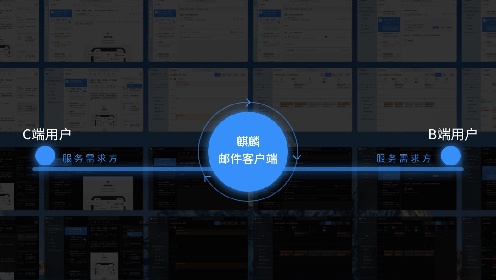
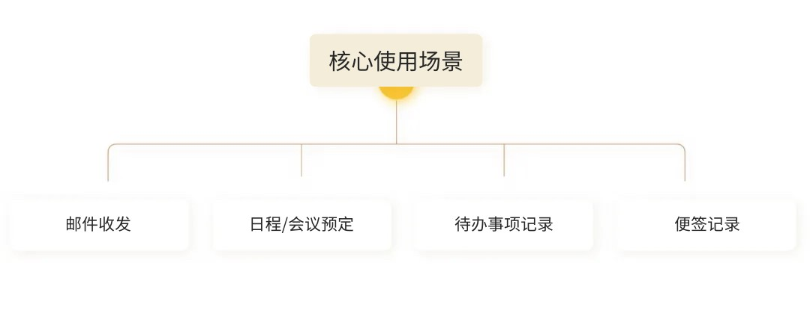
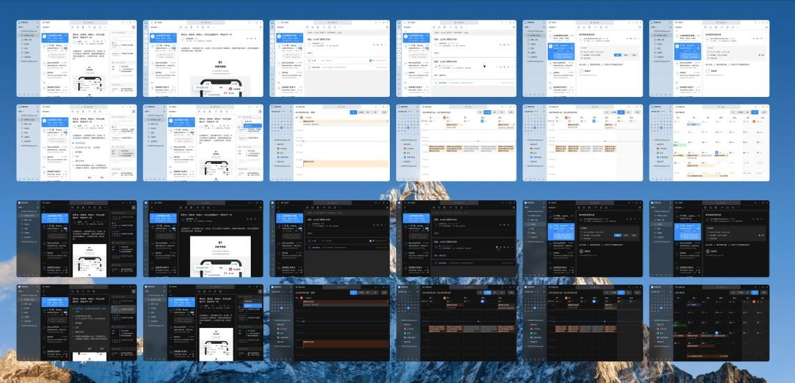
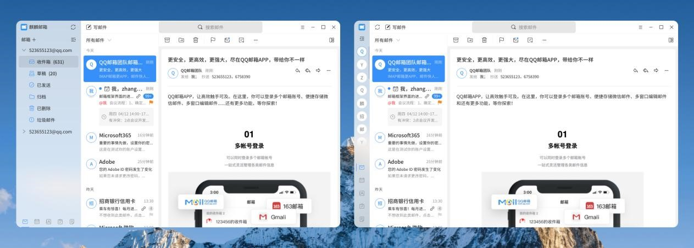
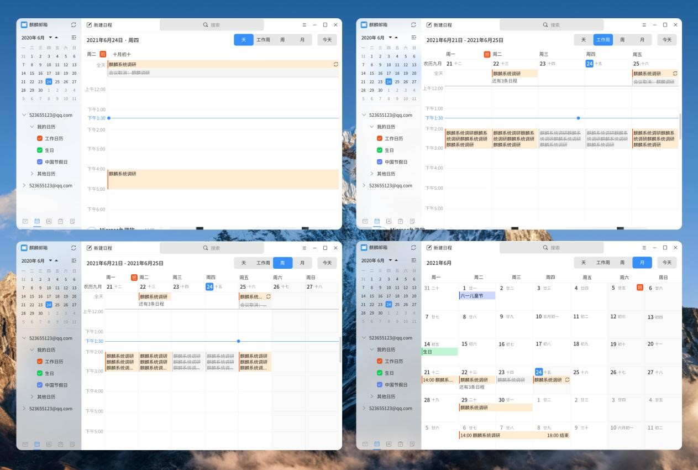
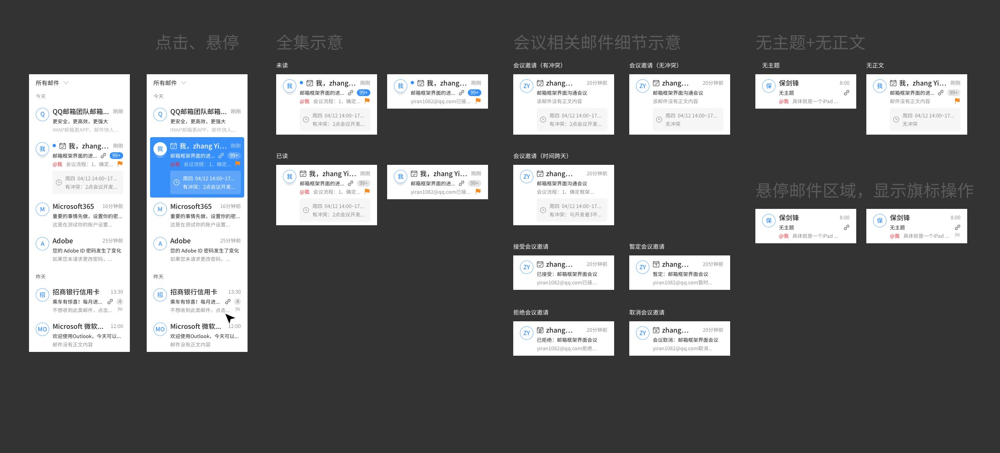
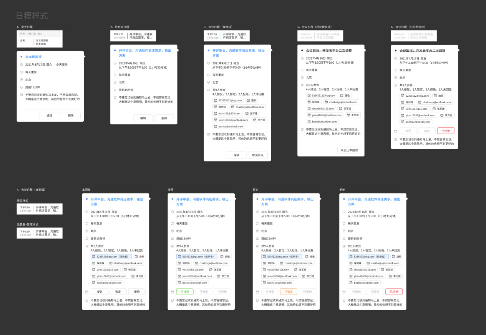

# 麒麟邮件客户端改版之道
## 前言
在麒麟桌面操作系统的生态中，我们所要服务的人群除了体量较大的企业用户，还有很多的个人用户，因此好用易用的邮箱，可以为企业和个人用户提升工作效率和使用体验，而为用户提供更好的体验是我们要持续去做的事情。

## 01. 背景
邮箱作为重要的沟通工具和生产力软件，几乎每天都要使用，是用户在日常生活中与系统交互的极高频的触点。在产品不断迭代的同时，我们拓展了很多的方向，赋予了产品非常多的功能，希望能通过软件帮助用户更好的工作、生活。但随着不断的使用体验，产品的旧有布局和UI设计风格已无法承载如此负重，不能提供给用户更好更高效的体验，同时也也不适用最新的系统设计规范。在以往收集的反馈中也透漏着类似“不好用”“不知道这些东西有什么用”的声音。由此，产品和设计同学希望能够对邮箱做一次改版，提高用户满意度。

## 02. 产品调研和问题分析
### ·用户调研 - 明确使用场景
深入了解我们的用户群体，和其真实的使用场景，得出用户使用的4大核心场景为「邮件收发」「日程/会议预定」「待办事项记录」「便签记录」。跟多的还是作为一个效率工具，快速解决问题。

 
### ·架构梳理
将邮箱页面的架构梳理出来后，结合前面调研总结出的核心场景，就会发现整体功能偏多且无逻辑摆放在页面上，功能入口小、分散，且有些不在一个层级上，对使用会有一定损耗，没有根据使用功能进行合理放置，使新用户对邮箱的使用产生难度。

### ·视觉交互梳理
1. 结构混乱，各种功能零散的摆放，没有根据功能的类别进行合理放置，需要对功能进行重新定义。
2. 整个UI视觉风格老旧，图标、输入框等控件老旧，严重跟不上时代，也不符合最新的V10设计规范要求

### 03. 回归本质设计
在做完大量的前期资料收集后，我们最终确定以调研中洞察到的用户最关注的两个点「效率」和「视觉」出发，做本次改版。

·回归工具产品的本质——使用效率

1. 简化顶部功能菜单列表，仅保留写信功能（最高频）。在正文部分的顶部，梳理所有邮件编辑的功能后，决定在这个位置只放置存档、移动邮件、删除、标记、待办功能，注重问题的解决，不做无谓的功能堆砌，分散用户精力。
2. 重新调整邮件列表的结构，增加邮件正文内容的露出及会议日程、旗标等功能的直接显示，方便用户直接查找重要邮件及会议等安排，而不用进入到正文部分去一一查找，提升用户使用效率
3. 重新调整邮件正文的结构，增加邮件标题、收发人等功能，将回复、回复全部、转发等常用功能从顶部导航栏移至邮件正文右上角，方便用户快速操作。
4. 重新调整右栏简版日程的结构，有两点变化:
一、将右栏由固定改变为可折叠，节省正文空间，优化小屏阅读效率。
二、内容全部展开，一目了然，减少用户展开操作。

典型界面

·回归更好的设计——视觉展现

根据产品改版“五步改版法”辅助邮箱进行质的输出，从视觉层面来说，我们从用户、设计风格角度出发，对产品重新设计梳理，进行改版升级（UI、功能重新定义），到最后的规范输出，直至软件上线，达到验收和最佳使用标准。

1. 调整整体布局，重构功能，增加毛玻璃效果，优化使用体验，提升效率重新绘制图标

首页

日程

2. 邮件列表重新绘制，增加头像图标、部分内容的露出及会议日程、旗标等功能，根据最新V10设计规范跟新了基础控件，保证了系统内置应用的视觉一致性

邮件列表控件

日程控件

### 04. 写在最后
随着用户需求不断增多，功能不断叠加，但邮件产品的设计始终需要基于场景，我们需要不断去磨合产品形态和功能迭代。邮箱要保持易用性、高效性，必须要能快速解决用户的日常生活、办公的邮件需求。邮箱会不断地迭代升级，也希望在今后大家能多反馈意见给我们，让我们能够更好的打磨产品，关注用户体验设计，打造出属于麒麟的设计风格。
